

    

<h1 align="center">
    Universidad Peruana de Ciencias Aplicadas
</h1>

<h3 align="center">
    Carrera: Ingeniería de Software
       
    Curso: 1ASI0730 - Aplicaciones Web
       
    Sección: 7426
       
    Profesor: Naldo Reupo Musayon Gastulo
       
    Ciclo: 2025-02 
       
    Informe de Trabajo Final
       
    Startup: ResiSeguro
       
    Producto: ResiCare  
</h3>

| 
Alumno
       | 
Código
 |
|:-------------------------------------------:|:-------------------------------------:|
|  Hermoza Quispe, Jude Alessandro            |              u202318220               |
|       Ríos Pacheco, Héctor Javier           |              u20231c540               |
| Choy Robles, Vanessa May Lang               |              u202317450               |
|       Ramirez Escalante, Carlo Patricio     |              u202210787               |
|       Pariona Lucas, Jose Manuel            |              u202119257               |

 Septiembre 2025 

## Registro de Versiones del Informe
| Versión | Fecha       | Autor(es)     | Descripción de modificación                                                                                                                                                                                                                                                                                                                                                                                           |
| Versión | Fecha      | Autor(es)                                                | Descripción de modificación                                                                                                                                                                                                                                     |
| ------- | ---------- | -------------------------------------------------------- | --------------------------------------------------------------------------------------------------------------------------------------------------------------------------------------------------------------------------------------------------------------- |
| 0.1     | 02/09/2025 | Héctor Ríos                                              | Añadido template, perfil de la startup, antecedentes y problemática; incorporación de Hypothesis Statements y Lean UX Canvas; segmentos objetivo.                                                                                                               |
| 0.2     | 03/09/2025 | Héctor Ríos                                              | Tabla de competidores y análisis competitivo; estrategias y tácticas contra la competencia.                                                                                                                                                                     |
| 0.3     | 04/09/2025 | Héctor Ríos                                              | Añadido diseño de entrevistas.                                                                                                                                                                                                               |
| 0.4     | 05/09/2025 | Héctor Ríos                                              | Incorporación de user personas al repositorio.                                                                                                                                                                                                                  |
| 0.5     | 06/09/2025 | Jude                                          | Añadidos problem statements para Lean UX, Lean UX Assumptions y User Task Matrix.                                                                                                                                                                               |
| 0.6     | 07/09/2025 | Carlo Ramirez; Jude                             | Subidas: user journey mapping, empathy mapping y As-Is scenario mapping; añadido lenguaje ubicuo.                                                                                                                                         |
| 0.7     | 08/09/2025 | Vanessa Choy; José Pariona; Carlo Ramirez                | Subida de correcciones del journey mapping y emphathy maps y Style Guidelines.                                                                                                                  |
| 0.8     | 09/09/2025 | José Pariona                                             |   Subida de wireframes y mockups de la landing page.                                                                                                                                                                     |
| 0.9     | 10/09/2025 | Héctor Ríos                                              | Añadidas entrevistas (1), To-Be Scenario Mapping y user stories; merges de feature/rios a develop.                                                                                                                                                              |
| 0.10    | 11/09/2025 | Héctor Ríos                                              | Añadido Impact Map al repositorio.                                                                                                                                                                                                                              |
| 0.11    | 12/09/2025 | Vanessa Choy; Héctor Ríos                                | Actualizaciones del Product Backlog; trabajo sobre 3.4 Product Backlog.                                                                                                                                                          |
| 0.12    | 13/09/2025 | Vanessa Choy                                             | Modificaciones en Epics y correcciones del Product Backlog.                                                                                                                                                                 |
| 0.13    | 14/09/2025 | Héctor Ríos                                              | Reemplazo y correcciones de wireflows; añadido de userFlows y mockups; fixes en wireframes.                                                                                                                                                                     |
| 0.14    | 15/09/2025 | Carlo Ramirez; Vanessa Choy; Héctor Ríos                 | Añadido class diagram y class dictionary; ajustes en sprint planning y backlog.                                                                                                                                                       |
| 0.15    | 16/09/2025 | Héctor Ríos; Vanessa Choy                                | Adición de entrevistas 2 y 3; uploads y subida de diagrmas.                                                                                                                                                                           |
| 0.16    | 17/09/2025 | Héctor Ríos; Carlo Ramirez; Vanessa Choy; Jude  | Día de integraciones finales: evidence de ejecución para Sprint Review, student outcome , database diagram , evidencias de servicios y despliegue , múltiples actualizaciones y limpieza del README. |
| 0.17     | 01/10/2025  | Héctor Ríos                                                | Eliminación de entrevistas duplicadas; añadido de bibliografía y corrección de enlaces del índice.                                                                                                                                                                                                                                                                                                                    |
| 0.18     | 02/10/2025  | Héctor Ríos                                                | Adición de Sprint Planning 2, aspectos de líderes y colaboradores, Sprint Backlog 2, introducción de evidencias de ejecución y servicios, y conclusiones de outcomes.                                                                                                                                                                                                                                                 |
| 0.19     | 04/10/2025  | Héctor Ríos; José Pariona                                  | Actualización del Sprint Backlog; registro de versiones actualizado en el repositorio.                                                                                                                                                                                                                                                                                                                                |
| 0.20     | 05/10/2025  | Héctor Ríos                                                | Subida de evidencias del Sprint Backlog 2 en Trello.                                                                                                                                                                                                                                                                                                                                                                  |
| 0.21     | 06/10/2025  | Héctor Ríos                                                | Corrección de la User Story US34 en el Sprint Backlog 2.                                                                                                                                                                                                                                                                                                                                                              |
| 0.22     | 07/10/2025  | Vanessa Choy; Carlo Ramírez                                | Actualización de diagramas de componentes y contenedores; agregado de tabla de evidencias de desarrollo y actualización del diagrama entidad-relación de la base de datos.                                                                                                                                                                                                                                           |
| 0.23     | 08/10/2025  | Vanessa Choy; José Pariona                                 | Corrección de conclusiones y recomendaciones; actualización del Student Outcome; mejoras en la documentación de Servicios y Evidencias para la Sprint Review (añadidos endpoints); múltiples actualizaciones de archivos README.md y subida de archivos complementarios.                                                                                                                                              |
| 0.24     | 7/11/2025  | Héctor Ríos; José Pariona; Carlo Ramirez; Jude                                |       5.2.3. Sprint 3: Spring Planning 3; Aspect Leaders and Collaborators; Sprint Backlog 3; Development Evidence for Sprint Review; Execution Evidence for Sprint Review; Services Documentation Evidence for Sprint Review; Software Deployment Evidence for Sprint Review; Team Collaboration Insights during Sprint. 5.3. Validation Interviews: Diseño de Entrevistas; Registro de Entrevistas; Evaluaciones según heurísticas. 5.4. Video About-the-Product. Avance de Conclusiones, Bibliografía y Anexos. Versión corregida y mejorada de artefactos previamente presentados, desplegadas nuevas versiones del Landing Page, Web Application y Web Services, así como publicación de los videos About-the-Product y About-the-Team.|
| 0.25   | 27/11/2025  | Héctor Ríos; José Pariona; Carlo Ramirez; Jude                                |   5.2.4. Sprint 4: 5.2.4. Sprint 4, 5.2.4.1. Sprint Planning 4.; 5.2.4.2. Aspect Leaders and Collaborators. 5.2.4.3. Sprint Backlog 4; 5.2.4.4. Development Evidence for Sprint Review; 5.2.4.5. Execution Evidence for Sprint Review; 5.2.4.6. Services Documentation Evidence for Sprint Review; 5.2.4.7. Software Deployment Evidence for Sprint Review.5.2.4.8; Team Collaboration Insights during Sprint. Ademas de: versión actualizada de Registro de Versiones del Informe; Project Report Collaboration Insights y Sección Student Outcome; Versión corregida y mejorada de artefactos previamente presentados; Incluye el informe la versión final y evidencias de la conclusión del ciclo de vida y el proyecto con todos los Capítulos. Desplegado la versión final de los productos digitales; Ademas de versión final de Conclusiones, Bibliografía y Anexos.|

## Project Report Collaboration Insights  
**TB1**
Todas las actividades asignadas para la entrega de la TB1 han sido completadas y se encuentran documentadas en el repositorio de GitHub de la organización del equipo, accesible en: https://github.com/Grupo-2-Aplicaciones-Web-ResiSeguro . En cuanto al informe, cada miembro del equipo participó redactando y elaborando gráficos en formato Markdown de acuerdo con los temas asignados, registrando su progreso mediante commits en el repositorio correspondiente, encontrándose en el siguiente enlace: https://github.com/Grupo-2-Aplicaciones-Web-ResiSeguro/Informe-ResiCare
Aqui se pueden aprecion todos los commits hechos en la TB1 evidenciando el trabajo colaborativo.

**Insights Readme**

  

  

**Network Readme**

  
      

**TP1**
Todas las actividades asignadas para la entrega de la TP1 han sido completadas tanto mejoras del informe, nueva version de Landing Page, Primera Vesion de Front End  y se encuentran documentadas en el repositorio de GitHub de la organización del equipo, accesible en: https://github.com/Grupo-2-Aplicaciones-Web-ResiSeguro . En cuanto al informe, cada miembro del equipo participó redactando y elaborando gráficos en formato Markdown de acuerdo con los temas asignados, registrando su progreso mediante commits en el repositorio correspondiente, encontrándose en el siguiente enlace: https://github.com/Grupo-2-Aplicaciones-Web-ResiSeguro/Informe-ResiCare
Aqui se pueden aprecion todos los commits hechos en la TB1 evidenciando el trabajo colaborativo.

**Insights Readme**

Front End: 

  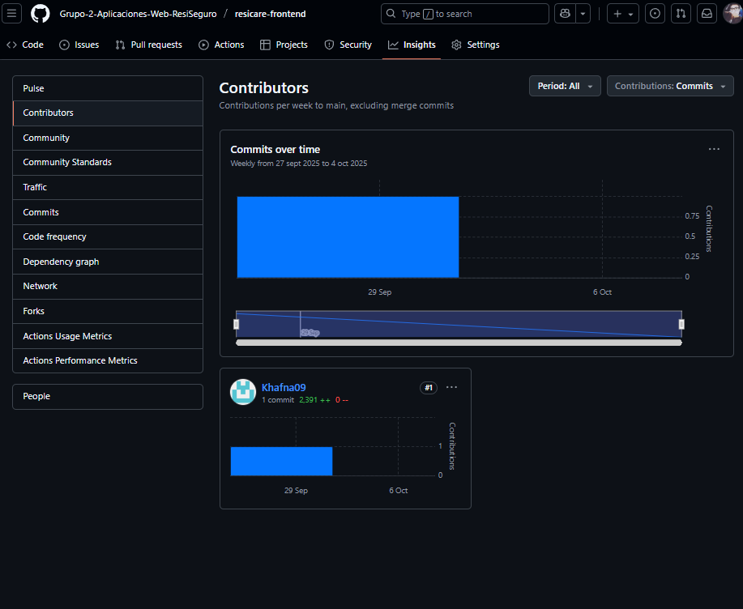

Informe: 

  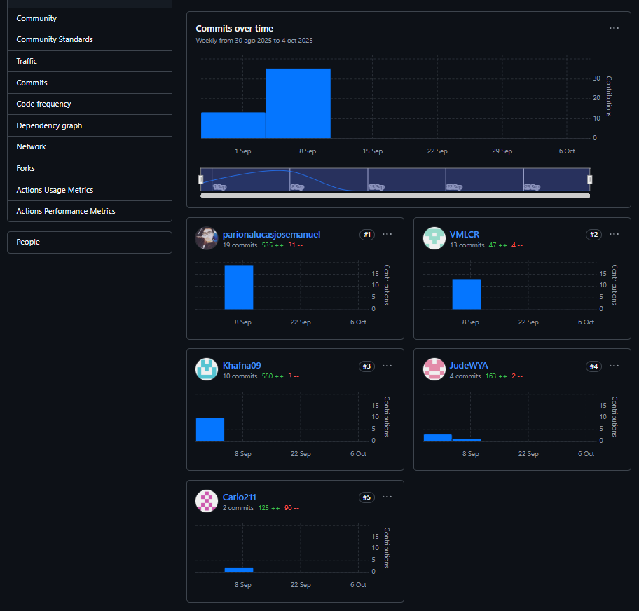

Landing Page: 

  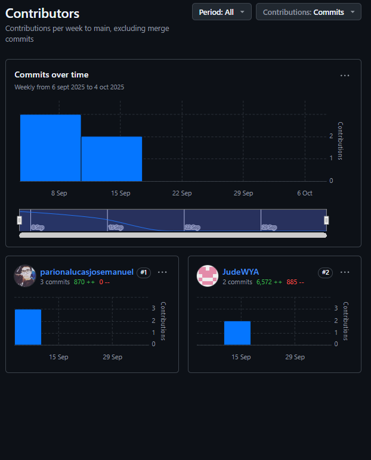

**Network Readme**

Front  End:

  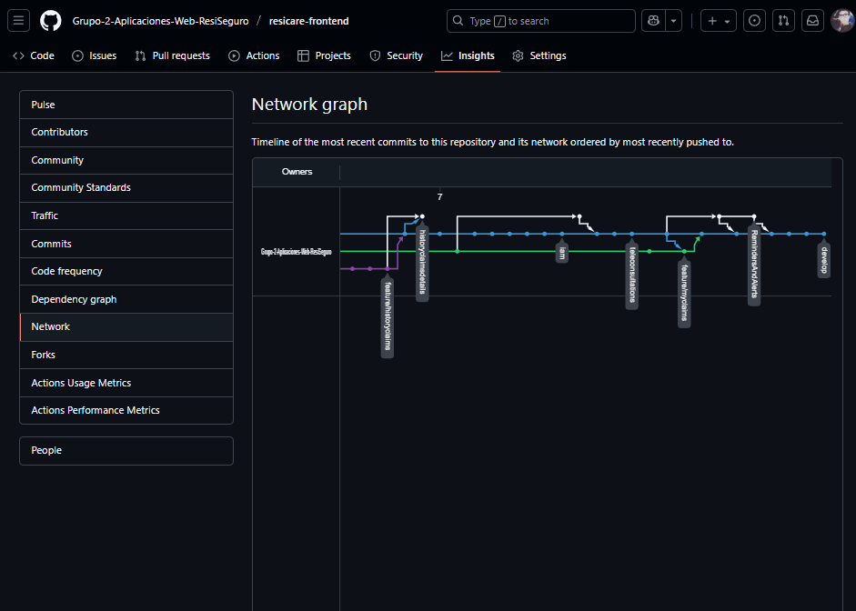

Informe: 

  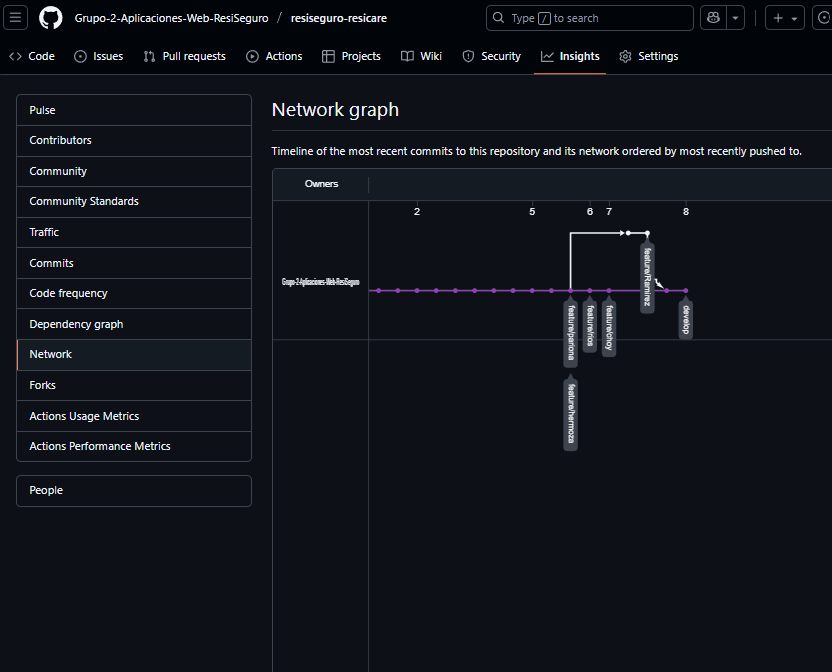

Landing Page: 

  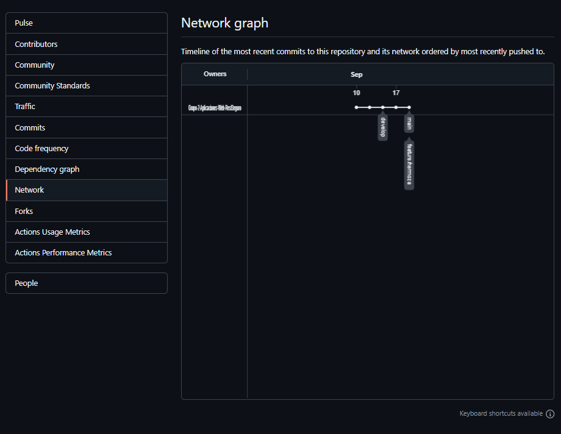

**TB2**
Todas las actividades asignadas para la entrega de la TB2 han sido completadas tanto mejoras del informe, nueva version de Landing Page, Nueva version de Front End y Primera version del Backend  y se encuentran documentadas en el repositorio de GitHub de la organización del equipo, accesible en: https://github.com/Grupo-2-Aplicaciones-Web-ResiSeguro . En cuanto al informe, cada miembro del equipo participó redactando y elaborando gráficos en formato Markdown de acuerdo con los temas asignados, registrando su progreso mediante commits en el repositorio correspondiente, encontrándose en el siguiente enlace: https://github.com/Grupo-2-Aplicaciones-Web-ResiSeguro/Informe-ResiCare
Aqui se pueden aprecion todos los commits hechos en la TB2 evidenciando el trabajo colaborativo.

**Insights Readme**

Front End: 

  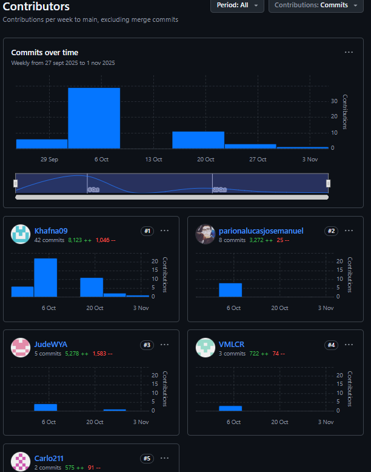

Informe: 

  

Landing Page: 

  

Backend:

  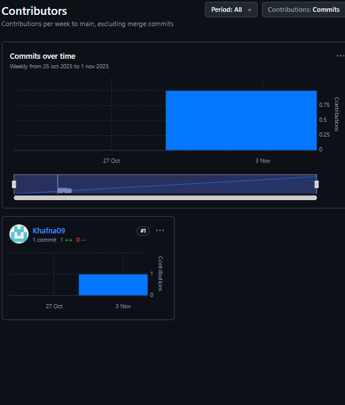

**Network Readme**

Front  End:

  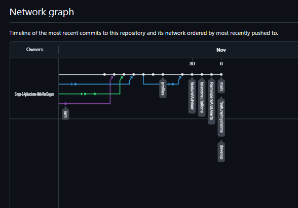

Informe: 

  

Landing Page: 

  

Backend: 

  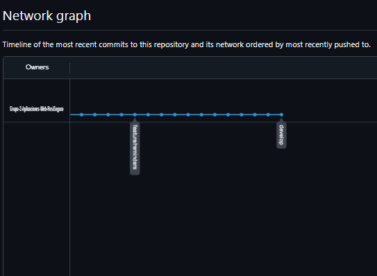

**TF1**
Todas las actividades asignadas para la entrega de la TF1 han sido completadas tanto mejoras del informe, versiones finales  de Landing Page,  Front End y de Backend  y se encuentran documentadas en el repositorio de GitHub de la organización del equipo, accesible en: https://github.com/Grupo-2-Aplicaciones-Web-ResiSeguro . En cuanto al informe, cada miembro del equipo participó redactando y elaborando gráficos en formato Markdown de acuerdo con los temas asignados, registrando su progreso mediante commits en el repositorio correspondiente, encontrándose en el siguiente enlace: https://github.com/Grupo-2-Aplicaciones-Web-ResiSeguro/Informe-ResiCare
Aqui se pueden aprecion todos los commits hechos en la TB2 evidenciando el trabajo colaborativo.

**Insights Readme**

**Informe:**

  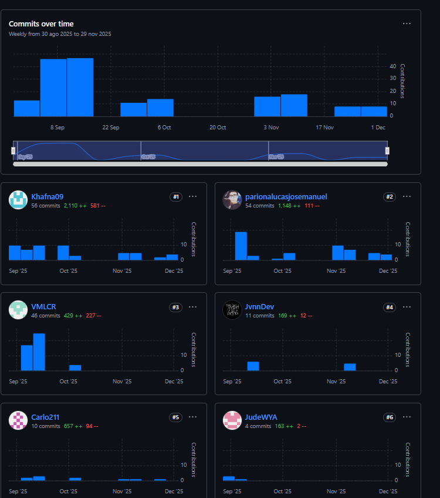

 

**Landing:**
 

  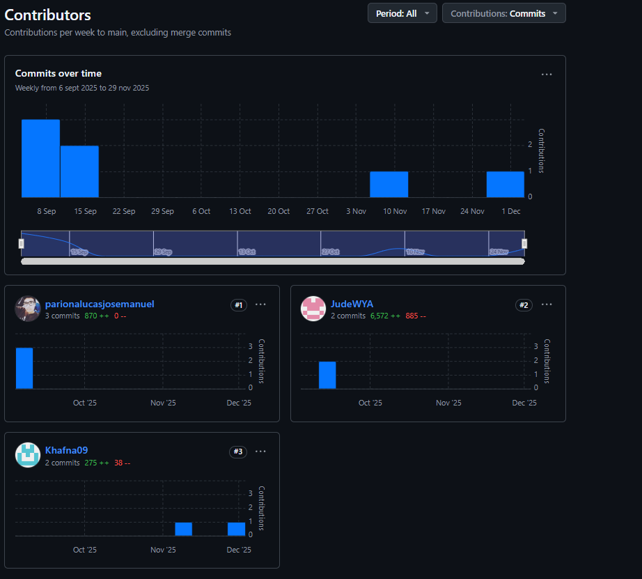

 

**Frontend:**
 

  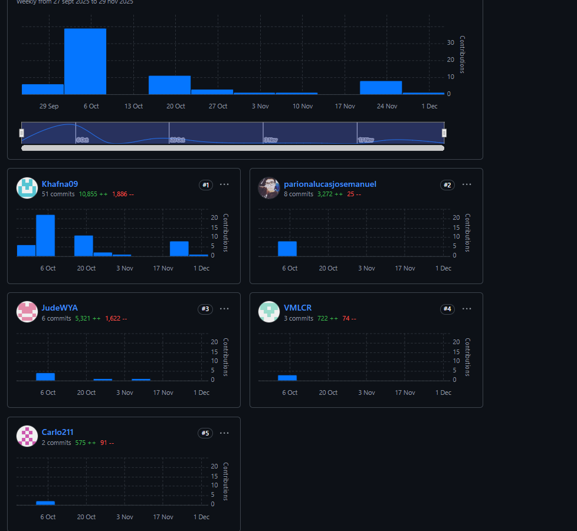

 

**Backend:**
 

  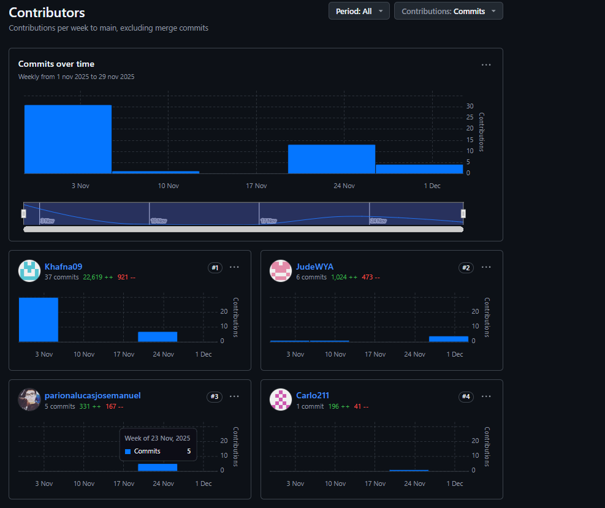

 

**Network Readme**
**Informe:**

  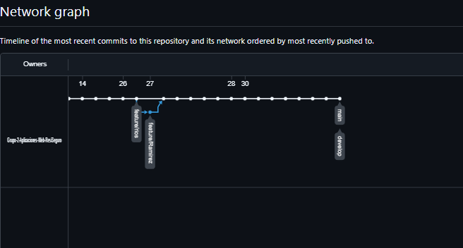

 

**Landing:**
 

  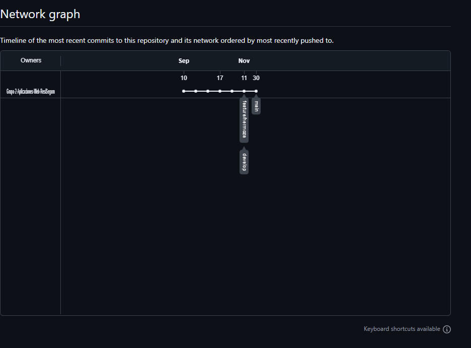

 
 

**Frontend:**

  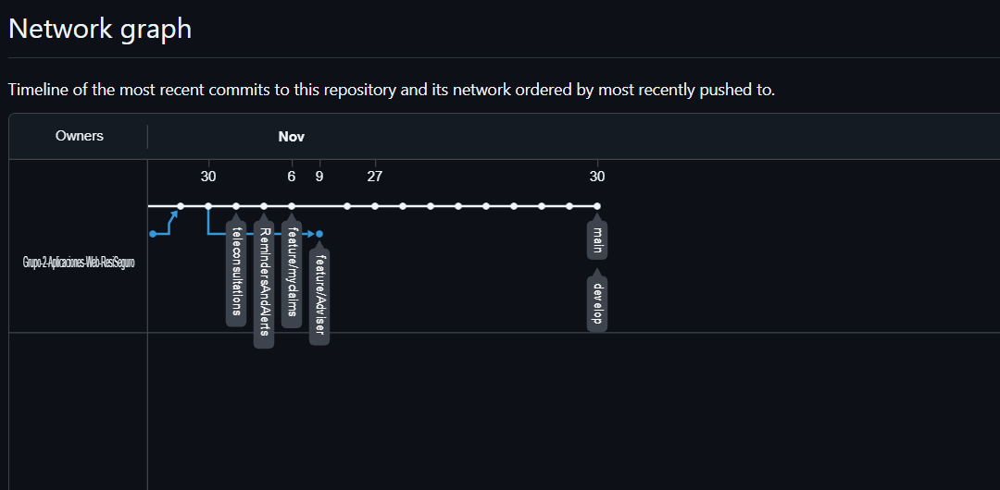

 
 
**Backend:**

  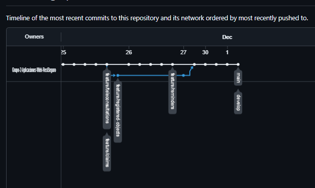

 
  

# Tabla de Contenidos

- Capítulo I: Introducción
  - [1.1 Startup Profile](#11-startup-profile)
    - [1.1.1 Descripción de la Startup](#111-descripcion-de-la-startup)
    - [1.1.2 Perfiles de Integrantes del Equipo](#112-perfiles-de-integrantes-del-equipo)
  - [1.2 Solution Profile](#12-solution-profile)
    - [1.2.1 Antecedentes y Problemática](#121-antecedentes-y-problematica)
    - [1.2.2 Lean UX Process](#122-lean-ux-process)
      - [1.2.2.1 Lean UX Problem Statements](#1221-lean-ux-problem-statements)
      - [1.2.2.2 Lean UX Assumptions](#1222-lean-ux-assumptions)
      - [1.2.2.3 Lean UX Hypothesis Statements](#1223-lean-ux-hypothesis-statements)
      - [1.2.2.4 Lean UX Canvas](#1224-lean-ux-canvas)
  - [1.3 Segmentos Objetivos](#13-segmentos-objetivos)

- Capítulo II: Requirements Elicitation & Analysis
  - [2.1 Competidores](#21-competidores)
    - [2.1.1 Análisis competitivo](#211-analisis-competitivo)
    - [2.1.2 Estrategias y tácticas frente a competidores](#212-estrategias-y-tacticas-frente-a-competidores)
  - [2.2 Entrevistas](#22-entrevistas)
    - [2.2.1 Diseño de entrevistas](#221-diseno-de-entrevistas)
    - [2.2.2 Registro de entrevistas](#222-registro-de-entrevistas)
    - [2.2.3 Análisis de entrevistas](#223-analisis-de-entrevistas)
  - [2.3 Needfinding](#23-needfinding)
    - [2.3.1 User Personas](#231-user-personas)
    - [2.3.2 User Task Matrix](#232-user-task-matrix)
    - [2.3.3 User Journey Mapping](#233-user-journey-mapping)
    - [2.3.4 Empathy Mapping](#234-empathy-mapping)
    - [2.3.5 As-is Scenario Mapping](#235-as-is-scenario-mapping)
  - [2.4 Ubiquitous Language](#24-ubiquitous-language)

- Capítulo III: Requirements Specification
  - [3.1 To-Be Scenario Mapping](#31-to-be-scenario-mapping)
  - [3.2 User Stories](#32-user-stories)
  - [3.3 Impact Mapping](#33-impact-mapping)
  - [3.4 Product Backlog](#34-product-backlog)

- Capítulo IV: Product Design
  - [4.1 Style Guidelines](#41-style-guidelines)
    - [4.1.1 General Style Guidelines](#411-general-style-guidelines)
    - [4.1.2 Web Style Guidelines](#412-web-style-guidelines)
  - [4.2 Information Architecture](#42-information-architecture)
    - [4.2.1 Organization Systems](#421-organization-systems)
    - [4.2.2 Labeling Systems](#422-labeling-systems)
    - [4.2.3 SEO Tags and Meta Tags](#423-seo-tags-and-meta-tags)
    - [4.2.4 Searching Systems](#424-searching-systems)
    - [4.2.5 Navigation Systems](#425-navigation-systems)
  - [4.3 Landing Page UI Design](#43-landing-page-ui-design)
    - [4.3.1 Landing Page Wireframe](#431-landing-page-wireframe)
    - [4.3.2 Landing Page Mock-up](#432-landing-page-mock-up)
  - [4.4 Web Applications UX/UI Design](#44-web-applications-uxui-design)
    - [4.4.1 Web Applications Wireframes](#441-web-applications-wireframes)
    - [4.4.2 Web Applications Wireflow Diagrams](#442-web-applications-wireflow-diagrams)
    - [4.4.3 Web Applications Mock-ups](#443-web-applications-mock-ups)
    - [4.4.4 Web Applications User Flow Diagrams](#444-web-applications-user-flow-diagrams)
  - [4.5 Web Applications Prototyping](#45-web-applications-prototyping)
  - [4.6 Domain-Driven Software Architecture](#46-domain-driven-software-architecture)
    - [4.6.1 Software Architecture Context Diagrams](#461-software-architecture-context-diagrams)
    - [4.6.2 Software Architecture Container Diagrams](#462-software-architecture-container-diagrams)
    - [4.6.3 Software Architecture Components Diagrams](#463-software-architecture-components-diagrams)
  - [4.7 Software Object-Oriented Design](#47-software-object-oriented-design)
    - [4.7.1 Class Diagrams](#471-class-diagrams)
    - [4.7.2 Class Dictionary](#472-class-dictionary)
  - [4.8 Database Design](#48-database-design)
    - [4.8.1 Database Diagram](#481-database-diagram)

- Capítulo V: Product Implementation, Validation & Deployment
  - [5.1 Software Configuration Management](#51-software-configuration-management)
    - [5.1.1 Software Development Environment Configuration](#511-software-development-environment-configuration)
    - [5.1.2 Source Code Management](#512-source-code-management)
    - [5.1.3 Source Code Style Guide & Conventions](#513-source-code-style-guide--conventions)
    - [5.1.4 Software Deployment Configuration](#514-software-deployment-configuration)
  - [5.2 Landing Page, Services & Applications Implementation](#52-landing-page-services-applications-implementation)
    - [5.2.1 Sprint 1](#521-sprint-1)
      - [5.2.1.1 Sprint Planning 1](#5211-sprint-planning-1)
      - [5.2.1.2 Aspect Leaders and Collaborators](#5212-aspect-leaders-and-collaborators)
      - [5.2.1.3 Sprint Backlog 1](#5213-sprint-backlog-1)
      - [5.2.1.4 Development Evidence for Sprint Review](#5214-development-evidence-for-sprint-review)
      - [5.2.1.5 Execution Evidence for Sprint Review](#5215-execution-evidence-for-sprint-review)
      - [5.2.1.6 Services Documentation Evidence for Sprint Review](#5216-services-documentation-evidence-for-sprint-review)
      - [5.2.1.7 Software Deployment Evidence for Sprint Review](#5217-software-deployment-evidence-for-sprint-review)
      - [5.2.1.8 Team Collaboration Insights during Sprint](#5218-team-collaboration-insights-during-sprint)
    - [5.2.2 Sprint 2](#522-sprint-2)
      - [5.2.2.1 Sprint Planning 2](#5221-sprint-planning-2)
      - [5.2.2.2 Aspect Leaders and Collaborators](#5222-aspect-leaders-and-collaborators)
      - [5.2.2.3 Sprint Backlog 2](#5223-sprint-backlog-2)
      - [5.2.2.4 Development Evidence for Sprint Review](#5224-development-evidence-for-sprint-review)
      - [5.2.2.5 Execution Evidence for Sprint Review](#5225-execution-evidence-for-sprint-review)
      - [5.2.2.6 Services Documentation Evidence for Sprint Review](#5226-services-documentation-evidence-for-sprint-review)
      - [5.2.2.7 Software Deployment Evidence for Sprint Review](#5227-software-deployment-evidence-for-sprint-review)
      - [5.2.2.8 Team Collaboration Insights during Sprint](#5228-team-collaboration-insights-during-sprint)

    - [5.2.3 Sprint 3](#523-sprint-3)
      - [5.2.3.1 Sprint Planning 3](#5231-sprint-planning-3)
      - [5.2.3.2 Aspect Leaders and Collaborators](#5232-aspect-leaders-and-collaborators)
      - [5.2.3.3 Sprint Backlog 3](#5233-sprint-backlog-3)
      - [5.2.3.4 Development Evidence for Sprint Review](#5234-development-evidence-for-sprint-review)
      - [5.2.3.5 Execution Evidence for Sprint Review](#5235-execution-evidence-for-sprint-review)
      - [5.2.3.6 Services Documentation Evidence for Sprint Review](#5236-services-documentation-evidence-for-sprint-review)
      - [5.2.3.7 Software Deployment Evidence for Sprint Review](#5237-software-deployment-evidence-for-sprint-review)
      - [5.2.3.8 Team Collaboration Insights during Sprint](#5238-team-collaboration-insights-during-sprint)
    
    - [5.2.4 Sprint 4](#524-sprint-4)
      - [5.2.4.1 Sprint Planning 4](#5241-sprint-planning-4)
      - [5.2.4.2 Aspect Leaders and Collaborators](#5242-aspect-leaders-and-collaborators)
      - [5.2.4.3 Sprint Backlog 4](#5243-sprint-backlog-4)
      - [5.2.4.4 Development Evidence for Sprint Review](#5244-development-evidence-for-sprint-review)
      - [5.2.4.5 Execution Evidence for Sprint Review](#5245-execution-evidence-for-sprint-review)
      - [5.2.4.6 Services Documentation Evidence for Sprint Review](#5246-services-documentation-evidence-for-sprint-review)
      - [5.2.4.7 Software Deployment Evidence for Sprint Review](#5247-software-deployment-evidence-for-sprint-review)
      - [5.2.4.8 Team Collaboration Insights during Sprint](#5248-team-collaboration-insights-during-sprint)
    
    - [5.3 Validation Interviews](#53-validation-interviews)
      - [5.3.1 Diseño de Entrevistas](#531-diseño-de-entrevistas)
      - [5.3.2 Registro de Entrevistas](#532-registro-de-entrevistas)
      - [5.3.3 Evaluaciones según heurísticas](#533-evaluaciones-según-heurísticas)
    - [5.4 Video About-the-Product](#54-video-about-the-product)

      
      
      
  - [6. Conclusiones](#conclusiones)
  - [7. Bibliografía](#bibliografia)
  - [8. Anexos](#anexos)

**ABET – EAC - Student Outcome 5**

La capacidad de funcionar efectivamente en un
equipo cuyos miembros juntos proporcionan liderazgo, crean un entorno de
colaboración e inclusivo, establecen objetivos, planifican tareas y cumplen objetivos. 
En el siguiente cuadro se describe las acciones realizadas y enunciados de conclusiones por parte del grupo,
que permiten sustentar el haber alcanzado el logro del ABET – EAC - Student Outcome 5.

| Criterio específico | Acciones Realizadas                                                                                                                                                                                                                                                                                                                                                                                                                                                                                                                                                                                                                                                                                                                                                                                                                                                                                                                                                                                                                                                                                                                                                                                                                                                                                                                                                                                                                                                                                                                                                                                                                                                                                                                                                                                                                                    | Conclusiones |
|---------------------|--------------------------------------------------------------------------------------------------------------------------------------------------------------------------------------------------------------------------------|--------------|
| Trabaja en equipo para proporcionar liderazgo en forma conjunta | **Jose Manuel Pariona Lucas**  **TB1** - Capítulo IV: Product Design    - 4.1. Style Guidelines     - 4.1.1. General Style Guidelines    - 4.1.2. Web Style Guidelines    - 4.2. Information Architecture        - Organization Systems        - Labeling Systems        - SEO Tags and Meta Tags        - Searching Systems        - Navigation Systems    - 4.3. Landing Page UI Design        - Wireframe        - Mock-up - Partes de Capítulo IV y V - Despliegue de la primera versión del Landing Page **TP:** Trabajé en constante colaboración y manteniendo el orden en el equipo para el desarrollo de los puntos principales delñ sprint2 y el desarrollo del frontend    **TB2** Realice lo siguiente: Durante el desarrollo del Sprint 3 asumí un rol activo dentro del equipo, contribuyendo de manera constante a la organización y ejecución de las actividades planificadas. Participé en la definición del Sprint Planning 3, colaborando en la estructuración del Sprint Backlog y en la identificación de tareas prioritarias. Mi aporte fue esencial para coordinar la integración de los distintos componentes, como la actualización del Landing Page, el despliegue de la Web Application y la primera versión de los Web Services. A lo largo del proceso, mantuve una comunicación fluida con mis compañeros, aportando ideas, resolviendo problemas técnicos y asegurando que cada entrega cumpliera con los objetivos establecidos. Esta experiencia me permitió fortalecer mi capacidad para ejercer un liderazgo compartido, orientado al cumplimiento conjunto de las metas del proyecto.    **TF1**:  Durante el Trabajo Final participé activamente en el Sprint 4 y en la elaboración de todos los entregables solicitados. Contribuí al liderazgo conjunto desde un rol colaborativo, apoyando la organización del Sprint Planning 4, la creación del Sprint Backlog 4 y la recopilación de evidencias como Development Evidence, Execution Evidence, Services Documentation Evidence y Software Deployment Evidence. También participé en la revisión y actualización del informe final, manteniendo la coherencia entre todos los capítulos y artefactos previos. Aporté con comunicación constante, coordinación y apoyo técnico al equipo sin asumir el rol de líder principal, fortaleciendo el liderazgo distribuido y el avance colectivo del proyecto  **Vanessa May Lang Choy Robles**  **TB1**  Durante el proceso de desarrollo del Domain-Driven Software Architecture promoví la participación activa del equipo para validar cada parte del diseño, asegurando que todas las perspectivas fueran consideradas. El desarrollo de los diagramas me permitió integrar las ideas y consolidar las aportaciones del equipo en una representación coherente del sistema lo que evidenció la importancia de coordinar y de tomar decisiones consensuadas para lograr los objetivos del proyecto.  **TP** Para esta entrega mantuve comunicacion con los miembro del equipo para el desarrollo de las secciones y asi no generar errores de integracion.  **Carlo Patricio Ramirez Escalante**  **TB1**  Durante el desarrollo del proyecto elaboré el diagrama de clases, que permitió representar de manera clara los objetos, atributos y relaciones principales del sistema, asegurando coherencia con el lenguaje ubicuo y las historias de usuario. Posteriormente, diseñé el diagrama de base de datos, transformando el modelo conceptual en una estructura relacional normalizada que garantiza integridad y consistencia en la información. Estos aportes facilitaron la integración entre el diseño orientado a objetos y la arquitectura de datos, contribuyendo a la solidez técnica del proyecto y apoyando la coordinación efectiva del equipo en la consecución de los objetivos planteados.  **TP:**En esta entrega se fortaleció el liderazgo compartido mediante la asignación equilibrada de responsabilidades y la comunicación constante entre los miembros del equipo. La coordinación efectiva permitió integrar los avances técnicos y de diseño en una versión más sólida del producto    **Jude Alessandro Hermoza Quispe**  **TB1**  Realicé el ReWork de la Landing Page, mejorando la interfaz y la experiencia de usuario. También desarrollé wireframes, documentación de servicios para la revisión del sprint, creación de user personas, definición del lenguaje ubicuo, elaboración de la matriz de tareas de usuario, planteamiento de supuestos Lean UX y redacción de problem statements, lo que fortaleció la base conceptual y visual del proyecto y facilitó la coordinación del equipo en el cumplimiento de los objetivos.  **TP:** Durante esta etapa, el equipo consolidó su capacidad de liderazgo colaborativo, demostrando autonomía y compromiso en cada una de las tareas asignadas.  **TB2:** Durante el desarrollo del Sprint 3, asumí un rol fundamental en la implementación del backend, contribuyendo activamente al desarrollo de endpoints críticos para el sistema de notificaciones, escalamiento de reclamos y gestión de mensajes por reclamo. Trabajé en estrecha coordinación con el equipo para garantizar la correcta integración entre el frontend y el backend, asegurando que las funcionalidades implementadas cumplieran con los requisitos establecidos. Además, participé en la realización de entrevistas de validación con usuarios, recopilando feedback valioso que permitió identificar áreas de mejora en la experiencia de usuario. Mi liderazgo se reflejó en la capacidad de mantener una comunicación fluida con todos los miembros del equipo, facilitando la resolución de conflictos técnicos y promoviendo un ambiente de colaboración donde cada integrante pudo aportar desde su expertise. Esta experiencia consolidó mi compromiso con el trabajo en equipo y el logro de objetivos compartidos.  **Hector Javier Ríos Pacheco**  **TB1**  Durante esta primera entrega se trabajó de forma colaborativa y organizada, ejerciendo un liderazgo conjunto que facilitó el cumplimiento de todos los objetivos planteados. Mi participación abarcó el desarrollo del capítulo 1, la redacción de secciones del capítulo 2, la elaboración de wireframes y mockups, además de aportar en otros aspectos del proyecto.    **TP:** Durante la elaboración de esta entrega realicé las correciones de las secciones señaladas en constante coordinación con mis compañeros, manteniendo una buen liderazgo como equipo. Además, realicé la construcción de algunas vistas pdel frontend.    **TB2** Durante la entrega realice´el backend cumpliendo con las normativas estimpuladas manteniendo el liderazgo y dirección del equipo.    **TF1:** En la última entrega logré fortalecer el trabajo en equipo, asumiendo un rol de liderazgo y asignando las tareas de forma efectiva.  | **TB1:**    En esta etapa, los integrantes asumieron roles de liderazgo compartidos, lo que permitió coordinar las tareas de manera equitativa. La toma de decisiones se realizó de forma colectiva, logrando un equilibrio en las responsabilidades y garantizando que todos los aportes fueran considerados.    **TP1**    Se afianzó dicha práctica mediante la gestión eficiente de correcciones, la mejora continua de los entregables y la implicación activa de todos los miembros en el frontend de ResiCare. **TB2**: Como grupo, logramos mantener un liderazgo distribuido, en el que cada integrante asumió responsabilidades específicas que fortalecieron la dinámica del equipo. La colaboración constante y el intercambio de conocimientos permitieron avanzar con eficiencia en las etapas del Sprint 3, cumpliendo con los entregables planificados y demostrando un liderazgo colectivo basado en la comunicación, la organización y la confianza mutua.    **TB2:**    Dutante el tb2 el equipo desarrollo el backend junto con el sprint 3 manteniendo el liderazgo y correcta comunicación.  **TF1**:  El equipo demostró un liderazgo conjunto efectivo, basado en la cooperación, la corresponsabilidad y la toma de decisiones compartidas. Cada integrante asumió tareas clave durante el Sprint 4, lo que permitió culminar el proyecto con orden, calidad y alineación a los objetivos establecidos. La coordinación equilibrada y la participación activa de todos fortalecieron la ejecución final del trabajo.  |
| Crea un entorno colaborativo e inclusivo, establece metas, planifica tareas y cumple objetivos | **Jose Manuel Pariona Lucas**  **TB1** - Capítulo IV: Product Design    - 4.1. Style Guidelines     - 4.1.1. General Style Guidelines    - 4.1.2. Web Style Guidelines    - 4.2. Information Architecture        - Organization Systems        - Labeling Systems        - SEO Tags and Meta Tags        - Searching Systems        - Navigation Systems    - 4.3. Landing Page UI Design        - Wireframe        - Mock-up - Partes de Capítulo IV y V - Despliegue de la primera versión del Landing Page **TP**Durante esta etapa, el equipo consolidó un entorno de trabajo inclusivo, donde cada integrante participó activamente en la planificación de tareas y en la definición de metas alcanzables. La comunicación constante y el apoyo mutuo permitieron identificar prioridades y optimizar tiempos.    **TB2**  Durante este sprint, participé activamente en la planificación y ejecución de las tareas asignadas, promoviendo un ambiente de trabajo colaborativo en el que todos los integrantes pudieran aportar sus conocimientos. Fui parte de la elaboración de evidencias de desarrollo, documentación de servicios y despliegue de software, manteniendo siempre una actitud de apoyo y respeto hacia las ideas de mis compañeros. Junto al equipo, establecimos metas claras y alcanzables para garantizar la mejora continua de los artefactos y la calidad del producto final. Cumplimos los objetivos planteados en esta TB2, incluyendo la publicación del video About-The-Product y la integración de las nuevas versiones del proyecto, lo cual reforzó mi compromiso con la planificación estratégica, la responsabilidad compartida y el trabajo inclusivo.     **TF1**     En este criterio participé de forma activa durante la planificación del Sprint 4, contribuyendo al establecimiento de metas claras, la organización de tareas y la verificación de su cumplimiento dentro del cronograma. Colaboré en la actualización del Registro de Versiones del Informe, en la mejora y corrección de artefactos previos y en la consolidación del informe final del ciclo de vida del proyecto. Apoyé la integración de evidencias de despliegue, validación de funcionalidades y revisión estructural del documento final. A lo largo del proceso fomenté comunicación, inclusión y trabajo equitativo, asegurando que las actividades se desarrollaran de manera organizada y orientada al logro de los objetivos.  **Vanessa May Lang Choy Robles**  **TB1**  Lo avances fueron realizadas en coordinación con mis compañeros, generando un entorno de colaboración y asegurando todos los entregable. La construcción de los mapas de usuario y del backlog fortaleció el trabajo colaborativo, ya que cada integrante pudo aportar desde su perspectiva. Se establecieron metas claras y se cumplió con la entrega de los avances en tiempo y forma. Además, se garantizó que el sistema diseñado respondiera de manera efectiva a las necesidades identificadas de los usuarios y los problemas actuales del sistema luego de haber organizando y priorizando las historias de usuario en función de los objetivos estratégicos del proyecto.  **TP** Para esta entrega recibí ayuda de mis compañeros para mejorar aspectos faltantes en mis entregas con lo cual pude corregir algunas secciones del trabajo a mejorar.  **Carlo Patricio Ramirez Escalante**    **TB1**    El trabajo se desarrolló en un entorno colaborativo en el que la coordinación con el equipo permitió cumplir los objetivos planteados. A partir de las metas establecidas, elaboré el diagrama de clases, lo que facilitó la representación de los componentes del sistema y su coherencia con las historias de usuario. Asimismo, diseñé el diagrama de base de datos, asegurando que la estructura relacional respondiera a las necesidades del proyecto y brindara soporte a las funcionalidades definidas en el backlog. Estos aportes contribuyeron a la organización de las tareas y a la consolidación de un resultado alineado con los objetivos estratégicos del grupo.   **TP**    En esta entrega se reforzó la colaboración entre los miembros del equipo mediante la asignación equitativa de responsabilidades y la revisión conjunta de los avances. La planificación estructurada de las actividades permitió mantener una ruta clara hacia los objetivos planteados.    **Hector Javier Ríos Pacheco TB1:**    Durante esta primera entrega hubo un desarrollo en conjunto de manera organizada, permitiendo el avance satisfactorio de todos lo puntos en esta entrega. Realicé el capítulo 1, secciones dle capítulo 2, wireframes y mockups, además de colaborar en otros aspectos.    **TP:** Para la elaboración en esta presentación mantuve una comunicación asertiva en todo momento, bucando colaborar activamente y siguiendo la metodolo´gia de trabajo indicada para seguir loo objetivos del proyecto.    **TB2:** Durante la elaboración de esta presentación mantuve una comunicación asertiva en todo momento, participando activamente y siguiendo la metodología de trabajo establecida para cumplir con los objetivos del proyecto.    br>  **TF1:** Durante la última entrega pude consolidar el tabajo colaborativo mendiante el liderazgo y la distribuciónde tareas de manera adecuada    **Jude Alessandro Hermoza Quispe TB1:**    Contribuí a un entorno colaborativo mediante el ReWork de la Landing Page, integrando mejoras en usabilidad y diseño. Además, participé en la documentación de servicios, construcción de user personas, definición de lenguaje ubicuo, matriz de tareas de usuario, supuestos Lean UX y problem statements. Estas actividades facilitaron la organización del backlog, la priorización de tareas y aseguraron que el sistema diseñado respondiera a los objetivos del proyecto.    **TP1** El equipo demostró una gestión eficiente al establecer metas claras y distribuir las tareas de forma estratégica. Se promovió un ambiente de respeto e inclusión, valorando las ideas de todos los integrantes y favoreciendo la toma de decisiones en conjunto.    **TB2:** En este sprint, participé activamente en la creación de un entorno de trabajo colaborativo e inclusivo, donde cada miembro del equipo pudo expresar sus ideas libremente y aportar desde su conocimiento técnico. Me enfoqué en el desarrollo del backend, implementando servicios clave como el sistema de notificaciones, endpoints de escalamiento de reclamos y chat histórico, estableciendo metas claras y alcanzables junto con el equipo. Realicé entrevistas de validación que fueron fundamentales para entender mejor las necesidades de nuestros usuarios y ajustar nuestras prioridades. Mantuve una actitud proactiva en la planificación de tareas, participando en las reuniones de coordinación y asegurando que todos los miembros estuvieran alineados con los objetivos del sprint. La documentación técnica que desarrollé y las pruebas unitarias implementadas contribuyeron a mantener la calidad del código y facilitaron el trabajo de otros miembros del equipo. Cumplimos exitosamente con los objetivos del TB2, demostrando madurez en nuestros procesos de colaboración y planificación estratégica.  | **TB1:**    Durante el desarrollo, se fomentó un ambiente participativo en el que cada miembro pudo aportar libremente sus ideas. Se definieron metas claras y se distribuyeron las actividades de forma organizada, lo que facilitó la planificación y el cumplimiento de los objetivos establecidos en el plazo acordado.    **TP1**    En TP, esta dinámica se potenció gracias a una comunicación constante, reuniones de revisión y un reparto equitativo de responsabilidades que permitió cumplir los objetivos dentro de los plazos establecidos. Así, el equipo ha demostrado una evolución continua en la colaboración, optimizando sus procesos y asegurando que cada miembro aporte de forma significativa al cumplimiento de las metas del proyecto.   **TB2**:    Durante esta iteración, el equipo consolidó un entorno colaborativo e inclusivo, donde cada miembro aportó su experiencia para mejorar el producto y los procesos. Se establecieron metas claras en la planificación, se coordinaron tareas con responsabilidad compartida y se alcanzaron los objetivos propuestos en la TB2, reflejando un avance significativo en la madurez del trabajo en equipo y en la capacidad de cumplir compromisos de manera coordinada y efectiva. **TF1**:  Como grupo se mantuvo un entorno colaborativo, inclusivo y orientado al logro de objetivos. La planificación del Sprint 4 y la coordinación continua entre los integrantes permitieron cumplir cada meta establecida y consolidar satisfactoriamente la versión final del informe. Gracias a la comunicación fluida y el apoyo mutuo, el equipo completó todas las actividades del proyecto con un enfoque organizado, responsable y eficiente. |

## Capítulo I: Introducción

### 1.1. Startup Profile
Somos un equipo de estudiantes de la Universidad Peruana de Ciencias Aplicadas (UPC) motivados en desarrollar una solución diferente que cuyo objetivo principal sea ayudar a los estudiantes cuya residencia princiapal se encuentra muy lejos, mediante un seguro que garantice su seguridad y protección.

#### 1.1.1. Descripción de la Startup
ResiSeguro es una startup enfocada en brindar protección rápida y digital a estudiantes universitarios que viven lejos de casa. Nuestro producto principal, ResiCare, ofrece seguros accesibles y personalizados para cubrir riesgos comunes en residencias estudiantiles, como robos, daños a pertenencias y emergencias. Utilizando tecnología digital, facilitamos la contratación y gestión de seguros de manera ágil, transparente y adaptada a las necesidades reales de los estudiantes, promoviendo su tranquilidad y bienestar durante su vida.

**Misión:** Brindar a los estudiantes universitarios una solución digital y accesible que proteja sus pertenencias y su tranquilidad mientras viven lejos de casa, facilitando seguros personalizados y procesos ágiles de gestión y reclamación.

**Visión:** Ser la startup líder en seguros digitales para estudiantes universitarios, reconocida por ofrecer protección confiable, rápida y adaptada a las necesidades de quienes residen fuera de su hogar, promoviendo su bienestar y seguridad en todo momento.

#### 1.1.2. Perfiles de Integrantes del Equipo

    

Soy responsable, me gusta involucrarme activamente en los proyectos, aportar ideas útiles y cumplir con mis tareas a tiempo. Siempre estoy dispuesto a colaborar y ayudar al equipo a avanzar de la mejor manera posible.

- Jude Alessandro Hermoza Quispe - u202318220 (Ingeniería de Software)

    

Soy una persona proactiva y comprometida con el trabajo en equipo. Me gusta aportar soluciones creativas, asumir retos y aprender constantemente. Valoro la comunicación clara y la organización para lograr los objetivos del proyecto de manera eficiente y colaborativa.

- Pariona Lucas Jose Manuel - u202119257 (Ingenieria de Software)

  

    

Tengo 20 años. En la actualidad estoy estudiando la carrera de Ingeniería de Software en la Universidad Peruana de Ciencias Aplicadas. Cuento con conocimientos intermedios y avanzados en algunos lenguajes de programación. HTML, CSS, JAVASCRIPT (Avanzado) C++, JAVA, PYTHON (Intermedio) Esto con respecto a la programación, además también de conocimientos con desarrollo web y desarrollo de apps. Me considero una persona responsable, que inspira confianza en el trabajo en grupo. Además, soy bastante adaptativo a la presión y los problemas que pueden llegar a pasar.

- Vanessa May Lang Choy Robles - u202317450 (Ingeniería de Software)

    

Soy una estudiante responsable con el trabajo. Respeto y escucho la opinión de los demás ayudando al trabajo en equipo. Me comprometo a contribuir al equipo siendo puntual en las reuniones y responsable en las entregas. 

- Carlo Patricio Ramirez Escalante - u202210787 (Ingeniería de Software)

    

Tengo 20 años. Estoy cursando la carrera de ingenieria de software, soy una persona responsable y dispuesta a colaborar con el equipo para lograr un buen trabajo de manera organizada.

### 1.2. Solution Profile
ResiCare es un microseguro digital diseñado para estudiantes preuniversitarios y universitarios que viven en residencias estudiantiles, departamentos compartidos o en el campus. Permite contratar coberturas económicas y simples vía web orientadas a proteger pertenencias personales (gadgets, laptop, mochila), ofrecer asistencia médica básica (teleconsulta) y cubrir imprevistos en viajes cortos entre residencia y campus (cancelaciones menores, pérdida de equipaje en traslados interurbanos). La propuesta se centra en una afiliación rápida, reclamos sencillos por foto/chat y decisiones automáticas para siniestros menores, con una opción de escalamiento a revisión humana cuando corresponde. Modelo básico: Acceso a todas las caráticas menos el simulador y un monto menor de cobertura, (reportes, historial de reclamos prioritarios, mayor cobertura) en planes premium. Además cuenta con un simulador de devolución en caso de reclamar el seguro.

#### 1.2.1. Antecedentes y problemática

**What**  
- Los estudiantes y sus familias no tienen opciones de seguro accesibles, fáciles de contratar o que se adapten a la realidad estudiantil (dispositivos de uso diario, gastos médicos menores, traslados cortos). Las pólizas tradicionales suelen ser costosas, con procedimientos complejos y mal enfoque en reclamos rápidos y digitales, lo que deja a muchos sin protección ante robos, daños accidentales o necesidades de consulta médica básica. 

**When**  
 
- El problema es persistente y diario, pero suele intensificarse en momentos concretos:  al inicio del ciclo académico, antes de viajes intersemestrales o durante la temporada de compra de equipos (inicio de clases). Y puede tornarse más crítico en contextos de mayor movilidad estudiantil o cuando hay incremento de robos en áreas estudiantiles.

**Where**  

- Surge en el día a día estudiantil: dentro de residencias y departamentos compartidos (robos o daños en habitaciones y zonas comunes), en trayectos cortos hacia la universidad (pérdida de objetos, equipaje en viajes interurbanos) y al necesitar atención médica menor fuera de horarios convencionales (necesidad de teleconsulta).
 

**Who**  
- Principalmente se ven afectados dos grupos: Estudiantes universitarios que realizan una vida cerca o dentro del campus, y padres de estudiantes que tienen que sustentar a distancia la residencia y estadía de sus hijos debido a sus estudios.

**Why**  

- Este problema existe porque las alternativas existentes no están diseñadas para la escala, el presupuesto ni la velocidad que requieren los estudiantes: pólizas largas, procesos de reclamo presenciales o con documentación extensa, y coberturas desproporcionadas frente a pérdidas frecuentes y de bajo monto. 

**How**  

- No denuncian o no reclaman daños/robos por el trámite engorroso.

- Reemplazan o reparan a costo propio (impactando su economía y continuidad académica).

- Los padres asumen gastos inesperados o prefieren no enviar al estudiante a campus con objetos de valor por miedo a pérdidas.

- Las universidades y residencias enfrentan quejas recurrentes y falta de un mecanismo estandarizado para gestionar incidentes.  

**How much**  
- Según datos del Seguro Integral de Salud (SIS), más de 500,000 estudiantes universitarios en Perú no cuentan con un seguro de salud, lo que representa aproximadamente el 15% de la población estudiantil universitaria nacional.

#### 1.2.2. Lean UX Process

##### 1.2.2.1. Lean UX Problem Statements
Los estudiantes universitarios que viven lejos de casa y sus familias enfrentan dificultades para encontrar seguros accesibles, rápidos y adaptados a la realidad estudiantil. Las opciones tradicionales suelen ser costosas, con procesos de contratación y reclamación complejos, lo que genera inseguridad ante robos, daños accidentales o emergencias cotidianas en residencias y traslados.

Hemos observado que muchos estudiantes sienten que los seguros disponibles no consideran sus necesidades reales, lo cual provoca baja adopción de seguros, desprotección ante imprevistos y preocupación constante por su bienestar.

¿Cómo podríamos ofrecer una solución de seguro digital que realmente se adapte a la vida universitaria, facilitando la contratación y gestión de coberturas de manera ágil y transparente para mejorar la seguridad y tranquilidad de los estudiantes?

##### 1.2.2.2. Lean UX Assumptions

**Assumptions Worksheet**

### Supuestos del Negocio – ResiSeguro

1. **Creo que mis clientes tienen la necesidad de:**  
   Contar con seguros accesibles, rápidos y adaptados a la vida universitaria, que protejan sus pertenencias personales y les brinden tranquilidad mientras viven lejos de casa.

2. **Estas necesidades pueden resolverse con:**  
   ResiCare, un microseguro digital que permite contratar coberturas económicas y simples vía web, orientadas a proteger gadgets, mochilas, laptops y ofrecer asistencia médica básica, además de cubrir imprevistos en traslados cortos entre residencia y campus.

3. **Mis clientes iniciales son (o serán):**  
   - Estudiantes universitarios y preuniversitarios que residen en departamentos compartidos, residencias estudiantiles o en el campus.  
   - Padres de familia que buscan proteger a sus hijos mientras estudian lejos de casa.

4. **El principal valor que un cliente quiere obtener de mi servicio es:**  
   Seguridad y protección de sus pertenencias y bienestar durante su vida universitaria.  
   **También pueden obtener estos beneficios adicionales:**  
   Procesos de contratación y reclamación ágiles, atención digital, cobertura flexible y tranquilidad ante imprevistos.

5. **Adquiriré la mayoría de mis clientes a través de:**  
   - Marketing digital en redes sociales dirigido a estudiantes y padres.  
   - Alianzas con universidades, residencias estudiantiles y asociaciones estudiantiles.  
   - Recomendaciones boca a boca entre estudiantes.

6. **Ganaré dinero mediante:**  
   - Modelo freemium: acceso gratuito a coberturas básicas.  
   - Suscripciones mensuales premium para mayor cobertura y servicios avanzados.  
   - Alianzas institucionales con universidades y residencias.

7. **Mi principal competencia en el mercado será:**  
   Seguros tradicionales, apps de seguros genéricos y coberturas ofrecidas por bancos o instituciones educativas.  
   **Superaremos a la competencia debido a:**  
   Nuestro enfoque digital, procesos ágiles, coberturas personalizadas y atención directa a las necesidades estudiantiles.

8. **El mayor riesgo de mi producto es:**  
   Que los estudiantes no perciban la utilidad del seguro o consideren que no lo necesitan.  
   **Lo resolveremos mediante:**  
   Campañas de concientización, testimonios de usuarios, mejoras continuas en la experiencia digital y atención personalizada.

9. **Otras suposiciones que, si se demuestran falsas, harán que nuestro negocio fracase:**  
   - Que los estudiantes y padres estén dispuestos a pagar por seguros digitales.  
   - Que las universidades y residencias colaboren en la promoción del producto.  
   - Que los procesos digitales sean suficientemente confiables y seguros para los usuarios.

### Supuestos del Cliente – ResiSeguro

1. **¿Quién es el cliente?**  
   Estudiantes universitarios y preuniversitarios que viven lejos de casa, en residencias estudiantiles, departamentos compartidos o en el campus. También padres de familia que buscan proteger a sus hijos durante su etapa universitaria.

2. **¿Dónde encaja nuestro producto en su vida?**  
   En su día a día universitario: al trasladarse entre residencia y campus, al guardar pertenencias en su cuarto, al adquirir nuevos gadgets o equipos, y en situaciones de emergencia médica menor.

3. **¿Qué problemas soluciona nuestro producto?**  
   - Falta de seguros accesibles y adaptados a la realidad estudiantil.  
   - Procesos de contratación y reclamación lentos y complejos.  
   - Desprotección ante robos, daños accidentales y emergencias cotidianas.  
   - Preocupación constante por la seguridad de sus pertenencias y bienestar.

4. **¿Cuándo y cómo se utiliza nuestro producto?**  
   - Uso frecuente: al contratar el seguro al inicio del ciclo académico o al adquirir nuevos equipos.  
   - En caso de siniestros: realizar reclamos rápidos por foto/chat.  
   - Acceso vía web o app móvil, para gestionar coberturas, revisar historial y recibir asistencia.

5. **¿Qué características son importantes?**  
   - Contratación y gestión digital sencilla.  
   - Coberturas flexibles y económicas para gadgets, mochilas y asistencia médica básica.  
   - Reclamos ágiles y automatizados, con opción de escalamiento humano.  
   - Interfaz intuitiva y reportes claros de estado de pólizas y reclamos.

6. **¿Cómo debe verse y comportarse nuestro producto?**  
   - Diseño moderno, confiable y amigable para estudiantes.  
   - Responsive, con navegación fluida en cualquier dispositivo.  
   - Feedback inmediato (notificaciones, estado de reclamos), y facilidad para modificar coberturas según necesidades.

##### 1.2.2.3. Lean UX Hypothesis Statements
**1ra Hipótesis**  
**Creemos que** ofrecer un microseguro digital rápido y económico para estudiantes aumentará la percepción de seguridad y tranquilidad entre los estudiantes.  
**Sabremos que estamos bien cuando** veamos que al menos el 50% de los estudiantes encuestados en residencias o departamentos compartidos se registran y contratan un plan dentro del primer mes de disponibilidad.

---

**2da Hipótesis**  
**Creemos que** permitir que los estudiantes realicen reclamos simples mediante foto y chat con decisiones automáticas incrementará la adopción y uso de la plataforma.  
**Sabremos que esto es cierto cuando** más del 60% de los reclamos menores sean procesados automáticamente y los estudiantes reporten satisfacción positiva con la experiencia de reclamo.

---

**3ra Hipótesis**  
**Creemos que** incluir recordatorios y alertas sobre cobertura, vencimiento de plan o precauciones de seguridad aumentará la interacción frecuente con la aplicación y la percepción de valor del seguro.  
**Sabremos que estamos teniendo éxito cuando** el número de usuarios que revisan su panel de seguros o reciben alertas aumente en al menos un 30% durante los primeros dos meses tras activar esta funcionalidad.

##### 1.2.2.4. Lean UX Canvas

A continuación se puede visualizar el Lean UX Canvas donde se estructura y valida rápidamente ideas de producto.

  

Visualizar diseño en Canva: https://www.canva.com/design/DAGlJa5hM50/r6zjjmIBlYsMarSUoKuRaQ/edit?utm_content=DAGlJa5hM50&utm_campaign=designshare&utm_medium=link2&utm_source=sharebutton

### 1.3. Segmentos Objetivos

### Segmento Objetivo 1: Estudiantes

- Sexo: Masculino y Femenino

- Edades: 16–25 años

- Nivel Socioeconómico: Medio–medio alto

- Ocupación: Estudiantes preuniversitarios y universitarios

- Ingresos: Limitados, generalmente dependientes de sus padres

#### Aspectos Geográficos:

- Nacionalidad: Peruana

- Ubicación Actual: Residencias estudiantiles, departamentos compartidos o campus

- Acceso a Tecnología: Smartphones, laptops, internet frecuente

#### Aspectos Psicográficos:

- Motivaciones: Seguridad de sus pertenencias, rapidez en procesos, tranquilidad académica

- Estilo de vida: Vida universitaria activa, movilidad entre residencia y campus

- Preocupaciones: Pérdida o daño de gadgets y pertenencias

- Adaptación a la tecnología: Alta, prefieren soluciones digitales

- Interés por la Personalización: Medio, valoran servicios adaptados a sus necesidades

### Segmento Objetivo 2: Padres de estudiantes

- Sexo: Masculino y Femenino

- Edades: 35–60 años

- Nivel Socioeconómico: Medio–medio alto

- Ocupación: Profesionales o trabajadores estables

- Ingresos: Medios a altos, pueden pagar microseguros

#### Aspectos Geográficos:

- Nacionalidad: Peruana

- Ubicación Actual: Principales ciudades del país

- Acceso a Tecnología: Smartphones y uso regular de internet

#### Aspectos Psicográficos:

- Motivaciones: Tranquilidad y protección para sus hijos

- Estilo de vida: Familiar, con preocupación por educación y seguridad de hijos

- Preocupaciones: Riesgos que afectan a sus hijos, gastos inesperados

- Adaptación a la tecnología: Media, aceptan soluciones digitales si son sencillas

- Interés por la Personalización: Medio, buscan servicios confiables y fáciles de usar

## Capítulo II: Requirements Elicitation & Analysis

### 2.1. Competidores

#### 2.1.1. Análisis competitivo
|  | **ResiCare**  | **Insurama**  | **Rimac**  | **Pacífico**  |
|---------------------------------------------------------------|-----------------------------|---------------------------|---------------------------|---------------------------|
| **Perfil** Overview | Startup peruana enfocada en microseguros digitales para estudiantes universitarios y preuniversitarios en residencias o campus. Cubre gadgets, viajes cortos y asistencia médica básica con modelo básico y reclamos automáticos vía foto/chat. | Insurtech internacional especializada en seguros para dispositivos (celulares, laptops, multidispositivo). Contratación digital (web/WhatsApp), cobertura por daños, robos y accidentes; expansión en LATAM. | Aseguradora líder en Perú, ofrece seguros de salud, vida y accidentes, incluyendo pólizas universitarias. Reconocida por su red de clínicas, app y soporte 24/7. | Aseguradora tradicional que ofrece seguros de accidentes estudiantiles contratados por instituciones. Cobertura dentro y fuera del centro educativo, asistencia 24/7 y confianza de marca. |
| **Ventaja competitiva** ¿Qué valor ofrece a los clientes? | Cobertura específica a la vida universitaria: gadgets, teleconsulta, viajes cortos. Modelo básico accesible y reclamos automáticos simples. Y un simulador de reposición económica por pérdida y otros agravios.  | Foco directo en protección de dispositivos, sin deducibles en algunos planes, experiencia digital rápida. | Respaldo de marca, red médica robusta y cobertura integral. | Cobertura 24/7 de accidentes estudiantiles, acceso institucional y solidez de marca. |

| **Perfil de marketing** |  |  |  |  |
|-------------------------|--|--|--|--|
| **Mercado objetivo** | Estudiantes (16–25 años)  medio–medio alto y padres (35–60 años) que financian su estancia y se preocupan por sus hijos y su seguridad. | Usuarios jóvenes/adultos con gadgets valiosos; clientes retail y telecom. | Familias, estudiantes mediante universidades, y empresas. | Instituciones educativas y padres que buscan seguridad para hijos. |
| **Estrategias de marketing** | Ads en redes sociales (TikTok, IG), alianzas con universidades/residencias, referidos entre estudiantes, cross-sell con tiendas de tecnología. | Alianzas con retailers, telecom y bancos; campañas digitales al comprar dispositivos. | Alianzas institucionales con universidades; comunicación de confianza; canales tradicionales y digitales (app). | Venta B2B a colegios y universidades; promoción en matrículas; comunicación institucional. |

| **Perfil de Producto** |  |  |  |  |
|------------------------|--|--|--|--|
| **Productos & Servicios** | Plan básico (gadgets + teleconsulta básica) con reposición por daños por montos menores; planes premium con mayor cobertura, historial de reclamos, viajes cortos. | Seguros de celulares, laptops y multidispositivo (rotura, robo, daño líquido, avería). | Seguros de salud, vida, accidentes y universitario; asistencia médica 24/7. | Seguro de accidentes estudiantiles con cobertura 24/7 y asistencia en emergencias. |
| **Precios & Costos** | Básico s/. 9.90/mes ; premium S/ 24.90/mes.  | Prima mensual según valor del equipo; sin deducible en algunos planes. Aprox s/ 17/mes| Precio alto (cobertura integral y red médica amplia); costos operativos elevados. Aprox s/ 18.5/mes | Tarifas colectivas según institución; costos asociados a red médica y gestión. Aprox s/ 37.87/mes |
| **Canales de distribución** | Web y móvil responsive, integración con apps universitarias, WhatsApp, alianzas retail. | Web, móvil, WhatsApp, retailers y telecom partners. | Web, app móvil, agentes y acuerdos institucionales. | B2B con instituciones educativas; web y agentes institucionales. |

| **FODA** |  |  |  |  |
|----------|--|--|--|--|
| **Fortalezas** | Foco en estudiantes, agilidad digital, modelo básico y premium. | Especialización en tecnología, experiencia digital ágil. | Confianza de marca, amplia red médica, solidez financiera. | Canales institucionales sólidos, cobertura amplia de accidentes. |
| **Oportunidades** | Alianzas con universidades y residencias, convenios con tiendas de tecnología. | Expandirse al mercado estudiantil, convenios con universidades. | Adaptar productos a microseguros digitales para jóvenes. | Añadir coberturas de gadgets, convenios con retail. |
| **Debilidades** | Marca nueva, bajo volumen inicial, riesgo de fraude en reclamos digitales. | Enfoque limitado a dispositivos, no incluye salud ni viajes. | Procesos más lentos, precios altos para estudiantes. | Reclamos poco ágiles, producto no adaptado a gadgets. |
| **Amenazas** | Entrada de grandes aseguradoras en microseguros estudiantiles, insurtechs posicionadas. | Competencia en precios y entrada de aseguradoras tradicionales. | Insurtechs más ágiles y económicas. | Insurtechs direct-to-consumer con soluciones más baratas. |

#### 2.1.2. Estrategias y tácticas frente a competidores

ResiCare aplicará una estrategia de diferenciación enfocada en estudiantes, ofreciendo coberturas específicas para su estilo de vida con un modelo básico accesible; complementará con digitalización y agilidad, garantizando procesos 100% online y reclamos rápidos por foto/chat para superar a la competencia tradicional; y finalmente, impulsará educación y alianzas estratégicas mediante campañas en redes y convenios con universidades y residencias para generar confianza y adopción masiva.

### 2.2. Entrevistas

#### 2.2.1. Diseño de entrevistas
### Entrevistas para validación de ResiCare
###  Preguntas Generales
1. ¿Cuál es tu nombre, edad, distrito de residencia, y tipo de vivienda (residencia, dep. compartido, casa)?  
2. ¿Qué dispositivos consideras imprescindibles y cuál es su valor aproximado en soles?  
3. ¿Has sufrido robo/daño/pérdida de pertenencias; cómo lo resolviste y cuánto te costó?
---
### Segmento 1: Estudiantes universitarios
1. ¿Cómo es tu rutina diaria entre residencia y campus y con qué frecuencia te trasladas?  
2. ¿Quién paga principalmente tus gastos y cuánto aportas tú (si aplica)?  
3. De estas coberturas, protección de gadgets, teleconsulta médica, pérdida en traslados cortos, ¿cuál priorizas y por qué?  
4. ¿Preferirías un plan básico con cobertura mínima o pagar una suscripción mensual por más beneficios; por qué?  
5. ¿Qué tan cómodo te sentirías reclamando por foto/chat y recibiendo una decisión automática; qué condiciones necesitarías para confiar en ese proceso?  
6. ¿Qué evidencia estarías dispuesto a subir en un reclamo (foto, factura, testigo) y cuánto tiempo esperarías para una resolución?  
7. ¿Qué incentivo te motivaría más a recomendar el seguro a un amigo (descuento, mes gratis, prioridad en reclamos, otro)?

---
### Segmento 1: Padres de estudiantes universitarios

1. ¿Cómo supervisas la protección y gastos de tu hijo(a) cuando vive fuera; qué te preocupa más (salud, seguridad, costo de reemplazo)?  
2. ¿Estarías dispuesto(a) a pagar una suscripción mensual para proteger las pertenencias y tener teleconsulta para tu hijo; qué rango mensual te parece razonable?  
3. ¿Preferirías contratar tú directamente o que la universidad/residencia ofrezca el plan de forma colectiva; por qué?  
4. ¿Qué garantías o evidencias (alianza con universidad, respaldo de aseguradora, certificación) necesitarías para confiar en una startup que ofrece este seguro?  
5. En caso de un reclamo sencillo (ej. robo de laptop), ¿qué tiempo de respuesta y nivel de comunicación esperarías?  
6. ¿Qué información te gustaría recibir periódicamente como padre (reportes, historial de reclamos, alertas de vencimiento)?  
7. ¿Qué factor concreto te haría cancelar la suscripción después del primer año?

---

#### 2.2.2. Registro de entrevistas

#### Entrevista 1

  

Gabriel Fernando Gordon, 21 años, vive en Lima y considera esenciales su laptop, celular y tablet (2000–4000 soles). Ha sufrido daños previos (reemplazo de laptop por 2500 soles), lo que refuerza la necesidad de protección.  

Se traslada casi a diario a la universidad, usando constantemente sus dispositivos, por lo que prioriza su aseguramiento, sobre todo los más costosos. Prefiere planes con cobertura completa y procesos de reclamo simples y automatizados.  

Los principales incentivos para recomendar un seguro serían descuentos y prioridad en la atención de reclamos.  

---

| **Detalle**          | **Información**                                                                 |
|----------------------|---------------------------------------------------------------------------------|
| **Entrevistador**    | Héctor Javier Ríos Pacheco                                                      |
| **Entrevistado**     | Gabriel Fernando Gordon                                                          |
| **Edad**             | 21 años                                                                         |
| **Inicio entrevista**| 0:02                                                                            |
| **Duración**         | 4:04 minutos                                                                    |
| **Enlace**           | https://upcedupe-my.sharepoint.com/:v:/g/personal/u20231c540_upc_edu_pe/EabXTgyOWTlDmy4fY5ZfLa8BjY3ckS8IgVy4XNyy6etPqw?e=hb6nmA&nav=eyJyZWZlcnJhbEluZm8iOnsicmVmZXJyYWxBcHAiOiJTdHJlYW1XZWJBcHAiLCJyZWZlcnJhbFZpZXciOiJTaGFyZURpYWxvZy1MaW5rIiwicmVmZXJyYWxBcHBQbGF0Zm9ybSI6IldlYiIsInJlZmVycmFsTW9kZSI6InZpZXcifX0%3D |  

#### Entrevista 2

  

Leonardo es un estudiante universitario que vive fuera del campus. Considera su laptop (≈S/3,500) y otros dispositivos electrónicos imprescindibles para estudiar, por lo que prioriza su aseguramiento frente a robo y daños.

Está dispuesto a pagar S/20–30 mensuales por una cobertura útil (mejor que un plan gratuito limitado). Prefiere un proceso de reclamo digital y sencillo (envío de fotos del equipo), con instrucciones claras y disponibilidad de soporte humano si la resolución automática falla.

Tiempo de respuesta ideal: máximo 48 horas. Incentivo efectivo para recomendar: 1 mes gratis para el referido. Valora coberturas enfocadas en protección de gadgets y teleconsulta médica.

| **Detalle**          | **Información**                                                                 |
|----------------------|---------------------------------------------------------------------------------|
| **Entrevistador**    | Héctor Javier Ríos Pacheco                                                      |
| **Entrevistado**     | Leonardo Prieto Gordon                                                          |
| **Edad**             | 20 años                                                                         |
| **Inicio entrevista**| 0:02                                                                            |
| **Duración**         | 4:20 minutos                                                                    |
| **Enlace**           | https://upcedupe-my.sharepoint.com/:v:/g/personal/u20231c540_upc_edu_pe/EU-7GbGCqEFDgN-ZPd86QcgBrL_jet3rgDkhh3ZfaEt6zA?e=OZB9Aj&nav=eyJyZWZlcnJhbEluZm8iOnsicmVmZXJyYWxBcHAiOiJTdHJlYW1XZWJBcHAiLCJyZWZlcnJhbFZpZXciOiJTaGFyZURpYWxvZy1MaW5rIiwicmVmZXJyYWxBcHBQbGF0Zm9ybSI6IldlYiIsInJlZmVycmFsTW9kZSI6InZpZXcifX0%3D |  

#### Entrevista 3

  

Sebastián Rodríguez, 20 años. Valora su laptop (≈S/3,000) y su celular (≈S/1,500) como imprescindibles; ha pagado ≈S/200 por una reparación previa, lo que evidencia una necesidad real de cobertura.

Se desplaza 4–5 veces por semana al campus en transporte público, por lo que da prioridad a coberturas que protejan dispositivos contra robo o daños durante los traslados. Prefiere un plan completo/avanzado (soporte + teleconsulta) antes que un plan básico limitado.

Acepta un proceso de reclamo digital si es claro y rápido, pero requiere transparencia y la opción de interlocución con soporte humano si la resolución automática falla. Incentivo efectivo para recomendar: 1 mes de prueba gratis.

| **Detalle**          | **Información**                                                                 |
|----------------------|---------------------------------------------------------------------------------|
| **Entrevistador**    | Héctor Javier Ríos Pacheco                                                      |
| **Entrevistado**     | Leonardo Prieto Gordon                                                          |
| **Edad**             | 20 años                                                                         |
| **Inicio entrevista**| 0:03                                                                            |
| **Duración**         | 4:35 minutos                                                                    |
| **Enlace**           | https://upcedupe-my.sharepoint.com/:v:/g/personal/u20231c540_upc_edu_pe/ESw6dllsNcBFtMMiqyhBmgEBGoFeKcQaMF0h5xJnec-8LQ?e=0xofgB&nav=eyJyZWZlcnJhbEluZm8iOnsicmVmZXJyYWxBcHAiOiJTdHJlYW1XZWJBcHAiLCJyZWZlcnJhbFZpZXciOiJTaGFyZURpYWxvZy1MaW5rIiwicmVmZXJyYWxBcHBQbGF0Zm9ybSI6IldlYiIsInJlZmVycmFsTW9kZSI6InZpZXcifX0%3D| 

#### Entrevista 4

  

Matías Bueno Perales, joven de 19 años de La Perla, compartió su experiencia y percepciones sobre la protección de pertenencias y suscripciones de seguridad. Considera esenciales el celular y la laptop, con un valor de 2000 y 3500 soles, respectivamente. Relató haber sufrido el robo de su celular, lo que le generó un gasto extra de 2000 soles.

| **Detalle**          | **Información**                                                                 |
|----------------------|---------------------------------------------------------------------------------|
| **Entrevistador**    | Jude Hermoza Quispe                                                             |
| **Entrevistado**     | Matías Bueno Perales                                                            |
| **Edad**             | 19 años                                                                         |
| **Inicio entrevista**| 0:03                                                                            |
| **Duración**         | 5:55 minutos                                                                    |
| **Enlace**           | https://upcedupe-my.sharepoint.com/:v:/g/personal/u202318220_upc_edu_pe/EUaeXiTyj61IjJjyNJ6GsCkBYXe08h3Bc9bhc-3rztYFHQ?e=Pjrhlk&nav=eyJyZWZlcnJhbEluZm8iOnsicmVmZXJyYWxBcHAiOiJTdHJlYW1XZWJBcHAiLCJyZWZlcnJhbFZpZXciOiJTaGFyZURpYWxvZy1MaW5rIiwicmVmZXJyYWxBcHBQbGF0Zm9ybSI6IldlYiIsInJlZmVycmFsTW9kZSI6InZpZXcifX0%3D| 

#### Entrevista 5

  

Naim Napuri, de 30 años y residente de Comas, participó en una entrevista dirigida por Jude Hermoza para validar soluciones de protección de pertenencias de estudiantes. Compartió la importancia de resguardar objetos valiosos (como laptop y celular), su disposición a pagar por un servicio de seguridad y sus expectativas sobre la atención y transparencia de las startups que ofrecen estos planes.

| **Detalle**          | **Información**                                                                 |
|----------------------|---------------------------------------------------------------------------------|
| **Entrevistador**    | Jude Hermoza Quispe                                                             |
| **Entrevistado**     | Naim Napuri                                                                     |
| **Edad**             | 30 años                                                                         |
| **Inicio entrevista**| 0:03                                                                            |
| **Duración**         | 5:01 minutos                                                                    |
| **Enlace**           | https://upcedupe-my.sharepoint.com/:v:/g/personal/u202318220_upc_edu_pe/EUNKjS80OfhLs6yWCsnoiB4BcRQTANGhn_3YmpcR0mTxsQ?e=PbJavS&nav=eyJyZWZlcnJhbEluZm8iOnsicmVmZXJyYWxBcHAiOiJTdHJlYW1XZWJBcHAiLCJyZWZlcnJhbFZpZXciOiJTaGFyZURpYWxvZy1MaW5rIiwicmVmZXJyYWxBcHBQbGF0Zm9ybSI6IldlYiIsInJlZmVycmFsTW9kZSI6InZpZXcifX0%3D| 

#### Entrevista 6

  

Nataly Sandoval Sulca, de 23 años y residente de San Martin de Porres, participó en una entrevista dirigida por Jude Hermoza para validar soluciones de protección de pertenencias de estudiantes. Compartió la importancia de resguardar objetos valiosos (como laptop y celular), su disposición a pagar por un servicio de seguridad y sus expectativas sobre la atención y transparencia de las startups que ofrecen estos planes.

| **Detalle**          | **Información**                                                                 |
|----------------------|---------------------------------------------------------------------------------|
| **Entrevistador**    | Jude Hermoza Quispe                                                             |
| **Entrevistado**     | Nataly Sandoval Sulca                                                           |
| **Edad**             | 23 años                                                                         |
| **Inicio entrevista**| 0:03                                                                            |
| **Duración**         | 5:05 minutos                                                                    |
| **Enlace**           | https://upcedupe-my.sharepoint.com/:v:/g/personal/u202318220_upc_edu_pe/EZY8IHAKCzhArDEqZaxuN_ABdReSYNi5_523Jgyt_sTCpg?nav=eyJyZWZlcnJhbEluZm8iOnsicmVmZXJyYWxBcHAiOiJPbmVEcml2ZUZvckJ1c2luZXNzIiwicmVmZXJyYWxBcHBQbGF0Zm9ybSI6IldlYiIsInJlZmVycmFsTW9kZSI6InZpZXciLCJyZWZlcnJhbFZpZXciOiJNeUZpbGVzTGlua0NvcHkifX0&e=JwGwLe| 

#### 2.2.3. Análisis de entrevistas

  

  

  

  

### 2.3. Needfinding

#### 2.3.1. User Personas
Se realiza un análisis de las respuestas brindadas por nuestros entrevistados, dividiéndose en los 2 segmentos definidos anteriormente por el equipo de trabajo.

*Segmento 1: Estudiantes universitarios*

  

*Segmento 2: Padres de estudiantes universitarios*

  

#### 2.3.2. User Task Matrix

##### Introducción:
El siguiente User Task Matrix presenta las principales tareas que realizan los dos segmentos de usuarios identificados para ResiCare: estudiantes universitarios que viven lejos de casa y padres de estudiantes. Se identifican actividades clave para cada grupo, evaluadas según su frecuencia e importancia, considerando su experiencia actual sin el uso de la solución ResiCare.

---

##### Tabla de tareas

| **Tarea**                                         | **Usuario (Estudiante)** | **Usuario (Padre)** |
|---------------------------------------------------|:-----------------------:|:-------------------:|
| Contratar un seguro para pertenencias             | Alta/Alta               | Media/Alta          |
| Consultar cobertura y condiciones del seguro      | Media/Alta              | Alta/Alta           |
| Realizar un reclamo por robo o daño               | Media/Alta              | Media/Alta          |
| Adjuntar evidencia (foto, factura) en reclamos    | Media/Media             | Baja/Media          |
| Consultar historial de reclamos                   | Media/Media             | Media/Media         |
| Recibir notificaciones sobre vencimiento/cobertura| Alta/Alta               | Alta/Alta           |
| Solicitar asistencia médica básica (teleconsulta) | Media/Alta              | Media/Media         |
| Recomendar el seguro a otros estudiantes/padres   | Media/Media             | Media/Media         |
| Revisar reportes o alertas de seguridad           | Media/Alta              | Alta/Alta           |
| Gestionar pagos o suscripciones                   | Media/Alta              | Alta/Alta           |

---

##### Explicación:
- **Contratar un seguro para pertenencias:** Los estudiantes buscan proteger sus gadgets y objetos personales; los padres valoran la protección para sus hijos.
- **Consultar cobertura y condiciones:** Ambos segmentos revisan qué cubre el seguro y bajo qué condiciones.
- **Realizar un reclamo:** Es una tarea relevante cuando ocurre un incidente; ambos pueden participar, aunque el estudiante suele iniciar el proceso.
- **Adjuntar evidencia:** Los estudiantes suelen subir fotos o facturas; los padres pueden ayudar si es necesario.
- **Consultar historial de reclamos:** Permite hacer seguimiento a incidentes previos y verificar el estado de los reclamos.
- **Recibir notificaciones:** Ambos valoran alertas sobre vencimientos, renovaciones o cambios en la cobertura.
- **Solicitar asistencia médica:** Los estudiantes pueden requerir teleconsulta; los padres valoran que sus hijos tengan acceso rápido a atención básica.
- **Recomendar el seguro:** La recomendación boca a boca es importante para la adopción del servicio.
- **Revisar reportes o alertas:** Los padres buscan información periódica sobre la seguridad y el uso del seguro.
- **Gestionar pagos:** Los estudiantes pueden pagar directamente o los padres gestionar la suscripción.

#### 2.3.3. User Journey Mapping
*Segmento 1: Estudiantes universitarios*

  

*Segmento 2: Padres de estudiantes universitarios*

  

*Segmento 1: Estudiantes universitarios*

  

*Segmento 2: Padres de estudiantes universitarios*

  

#### 2.3.4. Empathy Mapping

*Segmento 1: Estudiantes universitarios*

  

  

*Segmento 2: Padres de estudiantes universitarios*

  

  

#### 2.3.5. As-is Scenario Mapping

*Segmento 1: Estudiantes universitarios*

  

  

*Segmento 2: Padres de estudiantes universitarios*

  

  

### 2.4. Ubiquitous Language

Este será el lenguaje común utilizado en la aplicación ResiCare, asegurando que todos los miembros del equipo y usuarios comprendan claramente los conceptos clave del producto.

#### Student
- Usuario principal de la plataforma, joven universitario o preuniversitario que reside lejos de casa y busca proteger sus pertenencias y bienestar.

#### Parent
- Usuario secundario, responsable o familiar que financia o supervisa la protección y seguridad del estudiante.

#### Policy
- Contrato digital que detalla las coberturas, condiciones y vigencia del seguro adquirido por el estudiante o su familia.

#### Coverage
- Beneficios y protecciones específicas incluidas en la póliza, como protección de gadgets, asistencia médica básica o cobertura en viajes cortos.

#### Claim
- Solicitud formal realizada por el usuario para recibir compensación o asistencia tras un incidente cubierto (robo, daño, pérdida, emergencia médica).

#### Evidence
- Documentos, fotos o información que el usuario adjunta para respaldar un reclamo (ejemplo: foto del objeto dañado, factura de compra).

#### Notification
- Mensaje automático enviado por la plataforma para alertar sobre vencimientos, renovaciones, estado de reclamos o recomendaciones de seguridad.

#### Teleconsultation
- Servicio de atención médica básica a distancia, accesible para estudiantes asegurados a través de la plataforma.

#### Basic Plan
- Opción de seguro con coberturas esenciales y costo reducido, dirigido a estudiantes con necesidades mínimas de protección.

#### Premium Plan
- Opción de seguro con coberturas ampliadas, mayor monto asegurado y servicios adicionales como historial de reclamos y reportes detallados.

#### Return Simulator
- Herramienta digital que permite al usuario estimar el monto a recibir en caso de un reclamo exitoso.

#### Claims History
- Registro accesible para el usuario donde puede consultar todos los reclamos realizados y su estado.

#### Affiliation
- Proceso digital mediante el cual el usuario se registra y contrata una póliza en la plataforma.

#### Renewal
- Proceso automático o manual para extender la vigencia de una póliza al finalizar su periodo.

#### Institutional Alliance
- Convenio entre ResiCare y universidades, residencias o asociaciones estudiantiles para facilitar la contratación y promoción del seguro.

#### Support
- Asistencia técnica o de atención al cliente disponible para resolver dudas, problemas o incidencias relacionadas con el uso de la plataforma.

## Capítulo III: Requirements Specification

### 3.1. To-Be Scenario Mapping

A continuación se muestra el To-Be Scenario Mapping para María (estudiante) y Luis (padre), organizado por fases (Doing / Thinking / Feeling) y los 5 pasos clave: Registro, Recepción, Monitoreo, Apoyo (reclamo) y Renovación.

*Segmento 1: Estudiantes universitarios*

  

*Segmento 2: Padres de estudiantes universitarios*

  

### 3.2. User Stories

| Epic / Story ID | Título                                            | Descripción                                                                                                     | Criterios de Aceptación (2 escenarios)                                                                                                                                                                                                                                                                                              | Relacionado con (Epic ID) |
| --------------- | ------------------------------------------------- | --------------------------------------------------------------------------------------------------------------- | ----------------------------------------------------------------------------------------------------------------------------------------------------------------------------------------------------------------------------------------------------------------------------------------------------------------------------------- | ------------------------- |
| US-01           | Registro con validación universitaria             | Registro de usuario con validación de correo institucional y subida/validación de documentos (DNI, constancia). | **Escenario 1:** Given correo universitario válido y DNI legible, When completo formulario y subo docs, Then la cuenta queda activada y notificación de bienvenida.   **Escenario 2:** Given correo no universitario o documento ilegible, When intento finalizar registro, Then muestro error con guía y bloqueo de activación. | EP-01                     |
| US-02           | Inicio de sesión seguro                           | Autenticación con JWT, refresh tokens y bloqueo por intentos fallidos.                                          | **Escenario 1:** Given credenciales correctas, When inicio sesión, Then recibo access + refresh token y acceso al dashboard.   **Escenario 2:** Given varios intentos fallidos, When supero umbral, Then bloqueo temporal de cuenta y envío OTP/recuperación.                                                                    | EP-01                     |
| US-03           | Recuperación de contraseña                        | Flujo de recuperación mediante OTP por correo y cambio seguro de contraseña.                                    | **Escenario 1:** Given olvidé contraseña, When solicito recuperación, Then recibo OTP y puedo establecer nueva contraseña.   **Escenario 2:** Given OTP caducado, When intento usarlo, Then muestro caducidad y opción de reenviar OTP.                                                                                          | EP-01                     |
| US-04           | CRUD Users API                                    | Endpoints de Users (GET, POST, GET/{id}, GET all) con validaciones y DTOs.                                      | **Escenario 1:** Given petición GET /api/users/{id} válida, When id existe, Then retorna usuario con 200.   **Escenario 2:** Given intento crear usuario con email duplicado, When POST /api/users, Then retorna 409 Conflict y mensaje.                                                                                         | EP-02                     |
| US-05           | CRUD Claims (Reclamos)                            | Endpoints de reclamos (POST, GET, LIST, PATCH, DELETE) con soporte de documentos.                               | **Escenario 1:** Given envío de reclamo con foto válida, When POST /api/claims, Then crea reclamo y retorna 201 con id.   **Escenario 2:** Given falta de campos obligatorios, When POST /api/claims, Then retorna 400 Bad Request con detalle de validación.                                                                    | EP-03                     |
| US-06           | CRUD Profiles                                     | Endpoints para perfilar usuario (bio, foto DNI, credencial, teléfono, residencia).                              | **Escenario 1:** Given perfil completo válido, When POST /api/profiles, Then crea perfil y retorna 200.   **Escenario 2:** Given intento actualizar con formato inválido, When PATCH /api/profiles/{id}, Then retorna 400 con errores.                                                                                           | EP-03                     |
| US-07           | CRUD Registered Objects                           | Registro de objetos asegurados (tipo, precio, número de serie, foto, fechaRegistro).                            | **Escenario 1:** Given objeto con númeroSerie único, When POST /api/registered-objects, Then crea registro y retorna 201.   **Escenario 2:** Given númeroSerie duplicado, When POST, Then retorna 409 Conflict.                                                                                                                  | EP-03                     |
| US-08           | CRUD Reminders (Recordatorios)                    | Endpoints para recordatorios: crear, listar, editar, borrar, y obtener próximos.                                | **Escenario 1:** Given recordatorio con fecha futura, When POST /api/reminders, Then queda guardado y aparece en GET /api/reminders/upcoming.   **Escenario 2:** Given intento crear con formato de fecha inválido, When POST, Then retorna 400 con campo erróneo.                                                               | EP-06                     |
| US-09           | CRUD Teleconsultas                                | Endpoints para manejar teleconsultas (POST, GET, PUT, DELETE, GET by service).                                  | **Escenario 1:** Given teleconsulta con servicio y slot disponible, When POST /api/teleconsultations, Then retorna 201 y confirma cita.   **Escenario 2:** Given intento reservar slot ocupado, When POST, Then retorna 409 y sugiere alternativas.                                                                              | EP-04                     |
| US-10           | Deploy Backend + Swagger público                  | Deploy del backend (container + hosting) y exposición de Swagger OAS 3.0.                                       | **Escenario 1:** Given deploy completado, When accedo /swagger/v1/swagger.json, Then obtengo documentación y TryItOut funcional.   **Escenario 2:** Given variable de entorno faltante, When arranca contenedor, Then falla y pipeline notifica error.                                                                           | EP-10                     |
| US-11           | Historial y estado de reclamos                    | UI/Endpoints para listar reclamos del usuario y ver detalle/estado.                                             | **Escenario 1:** Given reclamos existentes, When solicito historial, Then obtengo lista con estados y fechas.   **Escenario 2:** Given reclamo cerrado, When pido detalles, Then obtengo resolución, monto y adjuntos.                                                                                                           | EP-03                     |
| US-12           | Simulador de devolución (cliente)                 | Simulador UI y lógica para estimar reembolso neto según plan y deducibles.                                      | **Escenario 1:** Given datos válidos, When ejecuto simulador, Then muestra monto neto y deducible.   **Escenario 2:** Given inputs inválidos, When ejecuto, Then muestra validaciones y ejemplos.                                                                                                                                | EP-07                     |
| US-13           | Panel de prevenciones y recordatorios             | UI y backend para recomendaciones preventivas y recordatorios.                                                  | **Escenario 1:** Given notificaciones activas, When ocurre aviso, Then recibe push/email con consejo.   **Escenario 2:** Given usuario desactiva recordatorios, When evento sucede, Then sólo aparece en panel sin push.                                                                                                         | EP-06                     |
| US-14           | Teleconsulta on-demand                            | UI para solicitar teleconsulta rápida y agendar profesional.                                                    | **Escenario 1:** Given cobertura y disponibilidad, When solicito teleconsulta, Then se asigna profesional y programan llamada.   **Escenario 2:** Given falta de profesionales, When intento agendar, Then muestro lista de espera o tiempos alternativos.                                                                       | EP-04                     |
| US-15           | Agenda y registro de teleconsultas                | Calendario y registro de citas con resumen post-consulta.                                                       | **Escenario 1:** Given teleconsulta agendada, When abro calendario, Then veo fecha/hora y enlace.   **Escenario 2:** Given consulta finalizada, When la visualizo, Then muestro resumen y recomendaciones.                                                                                                                       | EP-04                     |
| US-16           | Cobertura de viaje corto (activar)                | Servicio para activar cobertura por viaje interurbano antes de salida.                                          | **Escenario 1:** Given activo cobertura antes del viaje, When ocurre siniestro, Then reclamo aceptado según reglas.   **Escenario 2:** Given no activé cobertura, When sucede siniestro, Then reclamo inválido y explico motivo.                                                                                                 | EP-05                     |
| US-17           | Reporte rápido de pérdida en traslado             | Formulario de reclamo por pérdida de equipaje con fotos y ubicación.                                            | **Escenario 1:** Given pérdida menor con recibo y foto, When subo, Then genera reclamo con prioridad estándar.   **Escenario 2:** Given falta comprobante, When intento reclamar, Then solicito ticket de transporte.                                                                                                            | EP-05                     |
| US-18           | Notificaciones push y correo                      | Servicio de notificaciones push/email para eventos clave.                                                       | **Escenario 1:** Given notificaciones habilitadas, When cambia estado de reclamo, Then recibo push y mail.   **Escenario 2:** Given usuario deshabilita, When cambia estado, Then sólo registro interno en historial.                                                                                                            | EP-06                     |
| US-19           | Compartir póliza con padres/tutores               | Endpoint UI para compartir acceso read-only a tutores por email.                                                | **Escenario 1:** Given ingreso email tutor válido, When comparto, Then tutor recibe enlace seguro con read-only.   **Escenario 2:** Given revoco permiso, When confirmo, Then tutor pierde acceso y quedan logs.                                                                                                                 | EP-01                     |
| US-20           | Ver resumen de beneficios (Landing)               | Sección landing que muestra beneficios en tarjetas.                                                             | **Escenario 1:** Given visito landing, When hago scroll a beneficios, Then veo tarjetas con puntos clave.   **Escenario 2:** Given ancho reducido, When visualizo, Then tarjetas se apilan y siguen legibles.                                                                                                                    | EP-11                     |
| US-21           | Visualizar testimonios (Landing)                  | Mostrar testimonios con foto, nombre y cita.                                                                    | **Escenario 1:** Given testimonios disponibles, When entro a sección, Then se muestran con foto y texto.   **Escenario 2:** Given no hay testimonios, When navego, Then muestro ejemplos y CTA para enviar.                                                                                                                      | EP-11                     |
| US-22           | Acceder desde distintos dispositivos (responsive) | Asegurar responsive en landing (mobile/tablet/desktop).                                                         | **Escenario 1:** Given acceso desde móvil, When cargo landing, Then diseño se adapta y menú funciona.   **Escenario 2:** Given desktop, When navego, Then elementos ajustan y menú visible.                                                                                                                                      | EP-12                     |
| US-23           | Conocer la propuesta de valor (Hero)              | Hero con título/subtítulo claro y CTA; soporte UTM personalizado.                                               | **Escenario 1:** Given ingreso, When veo hero, Then título y subtítulo claros.   **Escenario 2:** Given vengo con UTM, When llego, Then muestro mensaje/oferta personalizada.                                                                                                                                                    | EP-11                     |
| US-24           | Navegar por beneficios (scroll y accesibilidad)   | Mejora de navegación en sección beneficios: scroll fluido y accesibilidad WCAG.                                 | **Escenario 1:** Given hago scroll, When paso por bloques, Then el foco y el contenido son accesibles.   **Escenario 2:** Given navego con teclado, When uso TAB, Then foco recorre correctamente.                                                                                                                               | EP-11                     |
| US-25           | Barra de navegación con anclas                    | Navbar con anclas a secciones y comportamiento responsive/sticky.                                               | **Escenario 1:** Given clic en link ancla, When clic, Then hago scroll a sección.   **Escenario 2:** Given link externo, When clic, Then abre en nueva pestaña.                                                                                                                                                                  | EP-11                     |
| US-26           | Acceder al registro o inicio desde landing        | Botones en navbar que llevan a login/registro o abren modal.                                                    | **Escenario 1:** Given clic "Iniciar sesión", When clic, Then redirige o abre modal de login.   **Escenario 2:** Given clic "Registrarse", When clic, Then redirige a formulario de registro.                                                                                                                                    | EP-12                     |
| US-27           | Navegar desde el footer                           | Enlaces en footer que redirigen a secciones o externos con tracking.                                            | **Escenario 1:** Given clic en footer interno, When clic, Then redirige a sección correcta.   **Escenario 2:** Given clic en link externo, When clic, Then abre en nueva pestaña y registra evento.                                                                                                                              | EP-11                     |
| US-28           | Selector de idioma en landing                     | Selector UI para cambiar idioma de la landing (i18n).                                                           | **Escenario 1:** Given cambio a EN, When selecciono idioma, Then texto se traduce.   **Escenario 2:** Given cadena sin traducción, When cambio idioma, Then muestro fallback y registro.                                                                                                                                         | EP-11                     |
| US-29           | FAQ y centro de ayuda                             | FAQs dinámicas y formulario de contacto con acuse.                                                              | **Escenario 1:** Given busco guía, When voy a FAQ, Then encuentro pasos y ejemplos.   **Escenario 2:** Given no encuentro respuesta, When envío consulta, Then recibo acuse y tiempo estimado.                                                                                                                                   | EP-08                     |
| US-30           | Descargar certificado de cobertura                | Endpoint + UI para generar y descargar certificado PDF con vigencia.                                            | **Escenario 1:** Given póliza activa, When solicito certificado, Then recibe PDF con vigencia y firma.   **Escenario 2:** Given póliza inactiva, When intento descargar, Then muestro motivo y opción de renovación.                                                                                                             | EP-02                     |
| US-31           | Compartir evidencia múltiple / Consumo Users UI   | UI/flow para subir múltiples evidencias y consumir Users API desde frontend.                                    | **Escenario 1:** Given 3 fotos, When las subo, Then se asocian y se muestran en galería.   **Escenario 2:** Given archivo excede límite, When subo, Then muestro error y guía.                                                                                                                                                   | EP-03                     |
| US-32           | Chat histórico por reclamo / Profiles UI          | Endpoint + UI para ver historial de chat por reclamo y consumo Profiles API.                                    | **Escenario 1:** Given reclamo con mensajes, When abro chat, Then veo todos los mensajes y timestamps.   **Escenario 2:** Given reclamo cerrado, When reviso, Then está disponible en modo lectura.                                                                                                                              | EP-03                     |
| US-33           | Evaluación al cierre del reclamo                  | Encuesta y almacenamiento de feedback tras cierre de reclamo.                                                   | **Escenario 1:** Given reclamo cerrado, When recibo encuesta, Then puedo calificar y dejar comentario.   **Escenario 2:** Given no respondo, When pasan X días, Then envío recordatorio opcional.                                                                                                                                | EP-03                     |
| US-34           | Registro de objetos asegurados                    | Formulario UI + API para registrar objetos vinculados a póliza.                                                 | **Escenario 1:** Given usuario autenticado, When registra objeto con foto, Then se guarda y asocia.   **Escenario 2:** Given intento sin autenticación, When envio formulario, Then redirige a login.                                                                                                                            | EP-03                     |
| US-35           | UI de Recordatorios conectada a backend           | Interfaz que consume endpoints de reminders y muestra próximos recordatorios.                                   | **Escenario 1:** Given reminders creados, When abro panel, Then veo próximos y acciones.   **Escenario 2:** Given no reminders, When accedo, Then muestro CTA para crear.                                                                                                                                                        | EP-06                     |
| US-36           | UI de Teleconsultas conectada a backend           | Formularios y listados que consumen teleconsultations API.                                                      | **Escenario 1:** Given hay teleconsultas agendadas, When accedo, Then veo calendario/listado.   **Escenario 2:** Given intento crear con slot no disponible, When envio, Then muestro conflicto.                                                                                                                                 | EP-04                     |
| TS-01           | Arquitectura backend modular y simple             | Definir arquitectura modular (módulos usuarios, reclamos, pagos) y patterns.                                    | **Escenario 1:** Given inicio del proyecto, When se crean módulos, Then cada módulo expone API y tests básicos.   **Escenario 2:** Given necesidad de ampliar, When añado módulo, Then integraciones permanecen desacopladas.                                                                                                    | EP-09                     |
| TS-02           | Modelado de base de datos relacional (Postgres)   | Esquema relacional para usuarios, pólizas, reclamos, evidencias y auditoría con migraciones.                    | **Escenario 1:** Given nuevo reclamo, When lo guardo, Then se crean registros con FK y fechas.   **Escenario 2:** Given cambio de esquema, When ejecuto migración, Then datos previos preservados.                                                                                                                               | EP-09                     |
| TS-03           | API REST documentada y protegida (OpenAPI)        | Endpoints REST con documentación mínima y control de acceso.                                                    | **Escenario 1:** Given petición autenticada, When solicito recurso, Then API responde 200.   **Escenario 2:** Given petición sin token, When intento acceder, Then retorno 401.                                                                                                                                                  | EP-09                     |
| TS-04           | Integración SSO universitario (opcional)          | Opción para autenticación vía SSO si la universidad lo soporta (fallback a registro normal).                    | **Escenario 1:** Given universidad soporta SSO, When usuario elige SSO, Then login se realiza vía proveedor.   **Escenario 2:** Given universidad no soporta, When usuario intenta SSO, Then muestro fallback registro.                                                                                                          | EP-01                     |
| TS-05           | Pipeline CI básico (lint + tests)                 | Pipeline que corre lint y tests unitarios antes de merge (GitHub Actions/GitLab CI).                            | **Escenario 1:** Given PR abierto, When pipeline corre, Then reporta y bloquea merge si falla.   **Escenario 2:** Given tests flakey, When detecto fallos intermitentes, Then añado retries o investigo.                                                                                                                         | EP-10                     |
| TS-06           | Almacenamiento de imágenes con URLs firmadas      | Store (S3/MinIO) con URLs firmadas y expiración para evidencias.                                                | **Escenario 1:** Given foto subida, When proceso, Then devuelvo URL firmada con expiración.   **Escenario 2:** Given URL expirada, When intento acceder, Then deniego y ofrezco re-subida.                                                                                                                                       | EP-09                     |
| TS-07           | Motor de reglas liviano (JSON)                    | Motor de reglas JSON para validaciones automáticas sobre reclamos.                                              | **Escenario 1:** Given regla en JSON, When llega reclamo, Then evalúo y guardo resultado.   **Escenario 2:** Given modifico regla en admin, When la guardo, Then aplica a nuevos reclamos sin deploy.                                                                                                                            | EP-03                     |
| TS-08           | Sistema de notificaciones básico                  | Servicio push/email templated conectado a eventos de la app.                                                    | **Escenario 1:** Given evento de cambio de estado, When sucede, Then envío notificación al usuario.   **Escenario 2:** Given usuario deshabilita notifs, When evento ocurre, Then solo registro en app.                                                                                                                          | EP-06                     |
| TS-09           | Pagos: integración simple y seguras (webhooks)    | Integración de pasarela con webhooks y manejo de estados de pago.                                               | **Escenario 1:** Given pago exitoso y webhook firmado, When recibo webhook, Then actualizo estado de suscripción.   **Escenario 2:** Given webhook inválido, When firma no coincide, Then rechazo y log.                                                                                                                         | EP-02                     |
| TS-10           | Logs y monitoreo accesible                        | Logging estructurado y métricas básicas con dashboard sencillo.                                                 | **Escenario 1:** Given error 500, When ocurre, Then logueo y alerto al equipo.   **Escenario 2:** Given latencia > umbral, When detecto, Then creo alerta y registro para post-mortem.                                                                                                                                           | EP-10                     |

EP-01 — Autenticación y Usuarios

| ID        | Título                                     |
| --------- | ------------------------------------------ |
| **US-01** | Registro con validación universitaria      |
| **US-02** | Inicio de sesión seguro                    |
| **US-03** | Recuperación de contraseña                 |
| **US-19** | Compartir póliza con padres/tutores        |
| **TS-04** | Integración SSO universitario *(opcional)* |

EP-02 — Pólizas y Pagos
| ID        | Título                                         |
| --------- | ---------------------------------------------- |
| **US-04** | CRUD Users API (relación con pólizas)          |
| **US-30** | Descargar certificado de cobertura             |
| **TS-09** | Pagos — integración simple/segura con webhooks |

EP-03 — Reclamos y Evidencias

| ID        | Título                                          |
| --------- | ----------------------------------------------- |
| **US-05** | CRUD Claims (Reclamos)                          |
| **US-11** | Historial y estado de reclamos                  |
| **US-31** | Compartir evidencia múltiple / Consumo Users UI |
| **US-32** | Chat histórico por reclamo / Profiles UI        |
| **US-33** | Evaluación al cierre del reclamo                |
| **US-34** | Registro de objetos asegurados                  |
| **TS-07** | Motor de reglas liviano JSON                    |

EP-04 — Telemedicina / Teleconsultas

| ID        | Título                               |
| --------- | ------------------------------------ |
| **US-09** | CRUD Teleconsultas                   |
| **US-14** | Teleconsulta on-demand               |
| **US-15** | Agenda y registro de teleconsultas   |
| **US-36** | UI Teleconsultas conectada a Backend |

EP-05 — Coberturas de Viaje / Transporte

| ID        | Título                         |
| --------- | ------------------------------ |
| **US-16** | Cobertura de viaje corto       |
| **US-17** | Reporte de pérdida en traslado |

EP-06 — Notificaciones y Prevenciones

| ID        | Título                                |
| --------- | ------------------------------------- |
| **US-08** | CRUD Recordatorios                    |
| **US-13** | Panel de prevenciones y recordatorios |
| **US-18** | Notificaciones push y correo          |
| **US-35** | UI Recordatorios conectada backend    |
| **TS-08** | Sistema base de notificaciones        |

EP-07 — Simulador y Reembolsos

| ID        | Título                  |
| --------- | ----------------------- |
| **US-12** | Simulador de devolución |

EP-08 — Soporte / Centro de Ayuda

| ID        | Título                |
| --------- | --------------------- |
| **US-29** | FAQ + Centro de ayuda |

EP-09 — Infraestructura / DB / API / Storage

| ID        | Título                                     |
| --------- | ------------------------------------------ |
| **TS-01** | Arquitectura backend modular               |
| **TS-02** | Modelado DB relacional — Postgres          |
| **TS-03** | API REST documentada + protegida (OpenAPI) |
| **TS-06** | Storage con URLs firmadas                  |
| **US-06** | CRUD Profiles (datos + multimedia)         |

EP-10 — CI / Deploy / Observabilidad

| ID        | Título                            |
| --------- | --------------------------------- |
| **US-10** | Deploy Backend + Swagger público  |
| **TS-05** | Pipeline CI básico (lint + tests) |
| **TS-10** | Logs y monitoreo accesible        |

EP-11 — Landing / Marketing / UX

| ID        | Título                           |
| --------- | -------------------------------- |
| **US-20** | Ver resumen de beneficios        |
| **US-21** | Visualizar testimonios           |
| **US-22** | Responsive multipantalla         |
| **US-23** | Hero + propuesta de valor clara  |
| **US-24** | Scroll con interacción accesible |
| **US-25** | Barra de navegación con anclas   |
| **US-27** | Navegación desde footer          |
| **US-28** | Selector de idioma en landing    |

### 3.3. Impact Mapping
A continuación se visualiza el **Impact Map** del proyecto **ResiCare**, donde se muestra la relación entre el *Business Goal* definido, los **User Personas** identificados, los **Impactos** esperados en su comportamiento, los **Deliverables** que como negocio digital podemos ofrecer y las **User Stories** asociadas que permitirán implementar las funcionalidades necesarias en la aplicación web y la landing page. Este mapa busca asegurar la alineación entre los objetivos estratégicos y el desarrollo de la solución digital.

  

### 3.4. Product Backlog

### 3.4. Product Backlog
| # Orden | User Story ID | Título                                     | Descripción                                                                        | Story Points |
| ------: | :------------ | :----------------------------------------- | :--------------------------------------------------------------------------------- | :----------: |
|      01 | **US-01**     | Registro con validación universitaria      | Permitir registro de usuarios verificando correo institucional y datos académicos. |       5      |
|      02 | **US-02**     | Inicio de sesión seguro                    | Habilitar login con protección JWT, sesión persistente y logout seguro.            |       5      |
|      03 | **US-03**     | Recuperación de contraseña                 | Permitir recuperación vía correo/OTP para reestablecer acceso.                     |       3      |
|      04 | **US-19**     | Compartir póliza con padres/tutores        | Un usuario puede otorgar acceso seguro a tutores para visualizar pólizas.          |       3      |
|      05 | **TS-04**     | Integración SSO universitario *(opcional)* | Login directo mediante SSO de universidades autorizadas.                           |       8      |
|      06 | **US-04**     | CRUD Users API (relación con pólizas)      | Gestión completa de usuarios con campos asociados a pólizas.                       |       5      |
|      07 | **US-30**     | Descargar certificado de cobertura         | Permitir descarga de certificado PDF con datos firmados.                           |       3      |
|      08 | **TS-09**     | Integración de pagos con webhooks          | Soporte de pagos asegurados y eventos automáticos.                                 |       8      |
|      09 | **US-05**     | CRUD Claims (Reclamos)                     | Gestión completa de reclamos desde creación a resolución.                          |       5      |
|      10 | **US-11**     | Historial y estado de reclamos             | Visualización del progreso y estados del reclamo.                                  |       3      |
|      11 | **US-31**     | Evidencia múltiple en reclamo              | Adjuntar varias imágenes/documentos en un reclamo.                                 |       5      |
|      12 | **US-32**     | Chat histórico por reclamo                 | Localizar y listar chat asociado al reclamo con UI.                                |       5      |
|      13 | **US-33**     | Evaluación al cierre                       | Usuario puede calificar atención al resolver un reclamo.                           |       2      |
|      14 | **US-34**     | Registro de objetos asegurados             | Registro, gestión y clasificación de bienes protegidos.                            |       5      |
|      15 | **TS-07**     | Motor de reglas JSON                       | Reglas automáticas para procesos de reclamos y pólizas.                            |       8      |
|      16 | **US-09**     | CRUD Teleconsultas                         | Registrar y gestionar teleconsultas médicas.                                       |       5      |
|      17 | **US-14**     | Teleconsulta on-demand                     | Solicitar consulta médica inmediata.                                               |       5      |
|      18 | **US-15**     | Agenda de teleconsultas                    | Programación de teleconsultas con horarios.                                        |       5      |
|      19 | **US-36**     | UI Teleconsultas integrada a backend       | Consumir endpoints para teleconsultas en frontend.                                 |       3      |
|      20 | **US-16**     | Cobertura de viaje corto                   | Activación temporal de cobertura interurbana.                                      |       3      |
|      21 | **US-17**     | Reporte de pérdida en traslado             | Registro rápido de incidentes durante transporte.                                  |       3      |
|      22 | **US-08**     | CRUD Recordatorios                         | Creación y gestión de recordatorios programados.                                   |       3      |
|      23 | **US-13**     | Panel de prevenciones                      | Visualizar sugerencias preventivas para evitar incidentes.                         |       2      |
|      24 | **US-18**     | Notificaciones push y correo               | Envío de alertas automáticas vía email y notificaciones push.                      |       5      |
|      25 | **US-35**     | UI de recordatorios conectada a backend    | Mostrar y gestionar recordatorios desde interfaz.                                  |       3      |
|      26 | **TS-08**     | Sistema base de notificaciones             | Módulo general de envío y eventos de notificación.                                 |       5      |
|      27 | **US-12**     | Simulador de reembolso                     | Estimar compensación según daño/valor asegurado.                                   |       3      |
|      28 | **US-29**     | FAQ y Centro de ayuda                      | Preguntas frecuentes con soporte autoatendido.                                     |       2      |
|      29 | **TS-01**     | Arquitectura backend modular               | Modularizar servicios (users, claims, teleconsultas...).                           |       5      |
|      30 | **TS-02**     | Modelado DB relacional                     | Diseño DB + migraciones + relaciones base.                                         |       3      |
|      31 | **TS-03**     | API REST documentada + segura              | OpenAPI swagger expuesto con seguridad aplicada.                                   |       3      |
|      32 | **TS-06**     | Almacenamiento con URLs firmadas           | Upload seguro de archivos (evidencia / perfiles).                                  |       5      |
|      33 | **US-06**     | CRUD Profiles                              | Gestión de perfiles (foto, info médica, contacto).                                 |       3      |
|      34 | **US-10**     | Deploy Backend + Swagger público           | Deploy productivo con exposición de documentación.                                 |       2      |
|      35 | **TS-05**     | Pipeline CI básico                         | Test + Lint + build automático en push.                                            |       3      |
|      36 | **TS-10**     | Logs y monitoreo                           | Trazabilidad, errores y métricas visibles.                                         |       3      |
|      37 | **US-20**     | Ver resumen de beneficios (Landing)        | Mostrar beneficios clave para captar usuarios.                                     |       3      |
|      38 | **US-21**     | Visualizar testimonios (Landing)           | Mostrar testimonios reales de confianza.                                           |       2      |
|      39 | **US-22**     | Responsive multipantalla                   | Navegación adaptable a móviles, tablets y desktop.                                 |       3      |
|      40 | **US-23**     | Propuesta de valor (Hero)                  | Mensaje claro del servicio y CTA inicial.                                          |       2      |
|      41 | **US-24**     | Scroll interactivo accesible               | Navegación fluida y accesible en la landing.                                       |       2      |
|      42 | **US-25**     | Barra de navegación con anclas             | Jump links para bloques principales de la landing.                                 |       1      |
|      43 | **US-27**     | Navegación desde footer                    | Acceso a secciones desde la parte inferior.                                        |       1      |
|      44 | **US-28**     | Selector de idioma                         | Landing disponible en EN / ES.                                                     |       2      |

## Capítulo IV: Product Design

### 4.1. Style Guidelines

En esta sección, el equipo de ResiSeguro define un sistema visual unificado que agrupa los elementos centrales de identidad: paleta de colores, tipografías, íconos, espaciados y componentes reutilizables. El objetivo es garantizar una experiencia visual coherente, accesible y funcional, que respalde la misión de proteger y dar tranquilidad a estudiantes universitarios y a sus familias mediante un producto digital confiable y fácil de usar.

Todos los elementos textuales, menús, botones y etiquetas se presentan en idioma inglés, garantizando consistencia internacional y mayor accesibilidad.

#### 4.1.1. General Style Guidelines

**Branding**: La identidad visual comunica confianza, seguridad y cercanía. Se busca proyectar un servicio moderno pero humano.

**Paleta de colores**:

**Primarios**: Azul oscuro (seguridad, confianza), Verde (tranquilidad, bienestar).

**Secundarios**: Gris claro (neutralidad), Blanco (claridad y limpieza).

**Tipografía**:

**Titulares**: Sans-serif moderna (ej. Poppins o Montserrat), clara y de fácil lectura en web.

**Cuerpo de texto**: Sans-serif ligera (ej. Roboto), priorizando legibilidad.

**Espaciados**: Uso consistente de márgenes y paddings (8px, 16px, 24px) para mantener orden visual.

**Tono de comunicación**: Formal pero cercano; confiable, claro y empático. Dirigido tanto a jóvenes estudiantes como a padres de familia.

  

#### 4.1.2. Web Style Guidelines

**Diseño responsivo**: Adaptación fluida a desktop, tablet y mobile.

**Componentes clave**:

Botones principales con esquinas redondeadas y colores contrastantes (ej. azul con texto blanco).

Formularios simples, con validación clara y mensajes de error amigables.

Iconografía minimalista y consistente (ej. íconos lineales para secciones clave: seguros, reclamos, historial).

**Accesibilidad**: Contraste de color AA/AAA, textos alternativos en imágenes, navegación por teclado.

**Consistencia**: El Landing Page y la Web App deben compartir la misma identidad visual (colores, tipografía, estilo de botones e íconos).

### 4.2. Information Architecture

En esta sección se definen las decisiones que organizan, nombran y estructuran la información dentro de la experiencia digital de ResiCare, tanto en el Landing Page como en la Web Application. El objetivo es que los usuarios encuentren fácilmente la información sobre seguros, realicen contrataciones y gestionen reclamos de forma intuitiva, accesible y sin fricciones.

#### 4.2.1. Organization Systems

**Jerárquico**: La información se organiza en niveles claros (Inicio → Producto → Planes → Reclamos → Contacto).

**Secuencial**: Se usa en el flujo de contratación del seguro, donde el usuario avanza paso a paso: elegir plan → ingresar datos → confirmar → recibir póliza digital.

**Categorización por audiencia**:

**Estudiantes**: Planes básicos y simulador de reclamos.

**Padres**: Planes premium, beneficios adicionales y seguridad reforzada.

**Visual hierarchy**: Se priorizan los “call-to-action” (Contratar, Simular Reclamo, Contacto) con botones destacados en color primario.

Se incluyen nuevas secciones en la arquitectura: Benefits, Videos y Meet the Team (en página ACERCA). También se añade la página separada Terms & Recommendations (TERMINOS Y RECOMENDACIONES) accesible desde el footer.

#### 4.2.2. Labeling Systems

Uso de etiquetas claras, breves y consistentes.

**Ejemplos principales**:

- Inicio (Landing Page)

- Planes (Planes Básico / Premium)

- Simulador (Calcula tu devolución)

- Reclamos (Gestiona un siniestro)

- Mi cuenta (Historial, Coberturas, Perfil)

- Soporte (FAQ, Contacto en vivo)

Todas las etiquetas serán de máximo 2–3 palabras, evitando tecnicismos.

Todas las etiquetas de navegación y botones se estandarizan en inglés: Home, Plans, Simulator, Benefits, Testimonials, Videos, Meet the Team, Support, Contact, Terms & Recommendations.

#### 4.2.3. SEO Tags and Meta Tags

Se definen los metadatos básicos para mejorar el posicionamiento en buscadores:

**Landing Page**

Title: ResiCare | Microseguros para estudiantes y padres

Meta Description: Protege tus pertenencias y tu tranquilidad con microseguros digitales diseñados para estudiantes y padres. Contratación rápida, reclamos simples y seguros confiables.

Keywords: microseguro, seguro estudiantes, seguro digital, ResiCare, ResiSeguro, protección universitaria

Author: ResiSeguro Startup

**Web Application**

Title: ResiCare App | Gestiona tus seguros y reclamos en línea

Meta Description: Accede a tu cuenta ResiCare, revisa tus planes, presenta reclamos y recibe soporte digital en cualquier momento.

Keywords: seguros online, reclamos seguros, ResiCare app, protección digital

Author: ResiSeguro Startup

#### 4.2.4. Searching Systems

**Buscador interno simple en la Web App**:

Palabras clave: “Planes”, “Reclamos”, “Simulador”, “Soporte”.

Autocompletado con sugerencias.

**Filtros en reclamos**: por estado (Pendiente, En proceso, Resuelto) y por fecha.

FAQ con búsqueda rápida en el Landing Page para resolver dudas comunes (ej. “¿Cómo presentar un reclamo?”).

#### 4.2.5. Navigation Systems

**Landing Page**:

- Menú superior fijo con secciones principales (Inicio, Planes, Simulador, Soporte).

- Footer con enlaces a contacto, políticas de privacidad y redes sociales.

**Web Application**:

- Menú lateral en desktop con íconos + texto.

- Menú hamburguesa en mobile para optimizar espacio.

- Botones de acción rápida en dashboard (Presentar Reclamo, Ver Plan, Contacto).

- Navegación consistente entre Landing Page y Web App (mismos colores, tipografía y estilo de botones).

El sistema de navegación ahora incluye enlaces a páginas externas (ACERCA y TERMINOS Y RECOMENDACIONES). En el footer, los accesos a Support y Contact abren modales centrados en pantalla, mientras que los íconos de WhatsApp y correo permiten comunicación directa mediante enlaces reales a chat y correo electrónico.

### 4.3. Landing Page UI Design

La Landing Page de ResiCare será el punto de entrada principal al ecosistema de microseguros digitales. Su diseño busca transmitir confianza, simplicidad y accesibilidad, destacando los beneficios de los planes, un acceso rápido al simulador y botones claros de contratación. La experiencia debe ser responsiva, coherente con la Web App y con un estilo visual basado en las Style Guidelines (colores, tipografías, iconografía).

El objetivo es que tanto estudiantes como padres entiendan de inmediato el valor del producto y tengan un camino claro para afiliarse o probar el simulador.

#### 4.3.1. Landing Page Wireframe

El wireframe define la estructura básica de la Landing Page, sin enfocarse aún en colores ni estilos finales.

**Secciones principales**:

1) Header (fijo en navegación):

Logo ResiSeguro / ResiCare (esquina izquierda).

Menú superior: Inicio | Planes | Simulador | Soporte.

Botón destacado: “Contrata tu seguro”.

2) Hero Section (sección inicial):

Imagen ilustrativa de estudiantes con seguridad.

Título: “Protege lo que más valoras durante tu vida universitaria”.

Subtítulo corto: Microseguros rápidos y accesibles para estudiantes y padres.

Botones: “Ver Planes” y “Simular Reclamo”.

3) Planes Resumidos:

Cards con resumen de Plan Básico y Plan Premium (cobertura, precio, beneficios).

Botón “Ver más” → detalle en la Web App.

4) Simulador de Reclamos (call-to-action):

Mini demo o enlace directo al simulador.

5) Testimonios:

Opiniones de estudiantes y padres.

6) Footer:

Contacto, redes sociales, políticas de privacidad.

7) Benefits Section: lista de beneficios con íconos.

8) Videos Section: testimonios y explicaciones en video (YouTube embebido).

Meet the Team: presentación del equipo, ubicada en una página adicional ACERCA.

Link del Figma: 
https://www.figma.com/design/VCu7S5YU3cEZWzjfzbN5NI/Untitled?node-id=0-1&t=DsJ3wSqvnXJIUlAA-1
Esta seccion presenta los wireframes del Landing Page de ResiCare para Desktop Web Browser

Wireframe - Header Section 

  

Wireframe - Hero Section 

  

Wireframe - Benefits Section 

  

Wireframe - Videos Section 

  

Wireframe - Testimonials Section 

  

Wireframe -  Claims Section 

  

Wireframe - Plans Section 

  

Wireframe - Footer Section 

  

#### 4.3.2. Landing Page Mock-up

El mock-up representa la versión visual final de la Landing Page, aplicando la paleta de colores y las tipografías ya definidas:

1) Colores aplicados:

Azul oscuro en header y botones principales.

Verde como color de acento en llamadas a la acción.

Fondo blanco para mantener limpieza y claridad.

2) Tipografía aplicada:

Titulares en Poppins Bold.

Cuerpo en Roboto Regular.

3) Estilo visual:

Botones redondeados con efecto hover.

Íconos lineales minimalistas para reforzar secciones.

Cards de planes con sombras suaves y contraste claro.

4) Responsive design:

En desktop → menú superior completo, secciones distribuidas en dos columnas.

En mobile → menú hamburguesa, secciones en columna única con botones grandes.

**En el mock-up final, todos los botones cuentan con funcionalidad**:

Support y Contact → modales emergentes en el centro de pantalla.

WhatsApp → abre un chat directo con mensaje precargado.

Correo → activa Gmail Compose o mailto.

Terms & Recommendations → redirige a la página terminos y recomendaciones.

Esta seccion presenta los Mock-up del  Landing Page de ResiCare para Desktop Web Browser
Mockup - Header Section 

  

Mockup - Hero Section 

  

Mockup - Benefits Section 

  

Mockup - Videos Section 

  

Mockup - Testimonials Section 
Mockup -  Claims Section 

  

Mockup - Plans Section 

  

Mockup - Footer Section 

  

### 4.4. Web Applications UX/UI Design

#### 4.4.1. Web Applications Wireframes

A continuación se muestra la sección de los wireframes que muestran el registro, siguiendo un orden que comienza en la página de bienvenida que luego lleva hacia el posible inicio de sesión o registro, en caso del registro Se deben llenar con todos los datos e información como estudiante, validar credenciales, documentos y finalmente acceder a uno de nuestros dos planes, sea el básico o el avanzado.

  

  

  

Asimismo, en caso de olvidar la contraseña existe opción de recuperarla mediante su cambio a través del correo asociado que funcionará como validación. Se accede a este apartado presionando el la opción "olvidaste tu contraseña?" en el inicio de sesión inicial.

  

 A continuación se muestra la ventana principal que tiene todas las opciones de perfil, realizar un reclamo, consultar por los atneiores o lo que se enceuntran en trámite, teleconsulta, simulador de reembolso, prevenciones y recordatorios, y una sección de informativa.

 

  

En la sección de perfil se muestran opciones para editar la informacióm, actualizar documentos y objetos importantes para facilitar el reclamo. Se ver también el procedimiento de registro de objetos.

 

  

De igual manera, dentro de la pantalla principal tenemos opciones como ver nuestro historial de reclamos y sus detalles, prevenciones y recordatorios por parte de la plataforma, la opción completa para reservar una teleconsulta y visualizar nuestros reclamos en curso.

  

Esta es la opción de registrar un nuevo reclamo, donde se sigue un procedimiento asignando cada una de las oopciones para ello.

  

También contamos con una calculadora, este es un simulador del reembolso en caso de registrar un reclamo

  

https://www.figma.com/design/XPnZre2LrrMOzoMArCpVTg/Sin-t%C3%ADtulo?node-id=0-1&t=bV0UcihwqHxf8j9p-1

#### 4.4.2. Web Applications Wireflow Diagrams

##### inicio de sesión: 
Como usuario quiero iniciar sesión usando mis credenciales

  

##### recuperación de contraseña
Como usuario quiero recuperar mi contraseña en caso de olvido

  

##### registro de usuario
Como usuarios quiero registrarme usando mis datos, credenciales universitarios y eligiendo mi plan de seguro.

  

##### edición de datos personales
Como usuario quiero poder editar mis datos personales.

  

##### actualización de documentos
Como usuario quiero poder actualizar mi documentos personales

  

##### registro de objetos protegidos
Como usuario quiero poder agregar objetos de mi pertenencia para ser asegurados.

  

##### solicitud de teleconsulta
Como usuario quiero poder solicitar una teleconsulta para recibir atención psicológica o médica.

  

##### historial de reclamos
Como usuario quiero poder revisar el historial de reclamos previamente ralizados

  

##### prevenciones y recordatorios
Como usuario quiero poder revisar y agregar mis recordatorios, así como recibir sugerencias de parte de la plataforma.

  

##### reeclamos en curso
Como usario quiero poder revisar los reclamos que tengo en curso y ver los detalles existentes

  

#### 4.4.3. Web Applications Mock-ups

A continuación se muestra la sección de los mockups que muestran el registro, siguiendo un orden que comienza en la página de bienvenida que luego lleva hacia el posible inicio de sesión o registro, en caso del registro Se deben llenar con todos los datos e información como estudiante, validar credenciales, documentos y finalmente acceder a uno de nuestros dos planes, sea el básico o el avanzado.

  

  

Asimismo, en caso de olvidar la contraseña existe opción de recuperarla mediante su cambio a través del correo asociado que funcionará como validación. Se accede a este apartado presionando el la opción "olvidaste tu contraseña?" en el inicio de sesión inicial.

  

 A continuación se muestra la ventana principal que tiene todas las opciones de perfil, realizar un reclamo, consultar por los atneiores o lo que se enceuntran en trámite, teleconsulta, simulador de reembolso, prevenciones y recordatorios, y una sección de informativa.

  

En la sección de perfil se muestran opciones para editar la informacióm, actualizar documentos y objetos importantes para facilitar el reclamo. Se ver también el procedimiento de registro de objetos.

 

  

  

  

De igual manera, dentro de la pantalla principal tenemos opciones como ver nuestro historial de reclamos y sus detalles, prevenciones y recordatorios por parte de la plataforma, la opción completa para reservar una teleconsulta y visualizar nuestros reclamos en curso.

  

  

  

  

https://www.figma.com/design/MbSWxpISHCu4lR16zetn4j/Untitled?node-id=0-1&t=kNHBqwGygzE2m0bN-1

#### 4.4.4. Web Applications User Flow Diagrams

##### inicio de sesión: 
Como usuario quiero iniciar sesión usando mis credenciales

  

##### registro de usuario:
Como usuario quiero registrarme en la app con mis datos, acceder a un plan y registrar mi credencial

  

##### recuperación de contraseña
Como usuario quiero recuperar mi contraseña en caso de olvido

  

##### edición de datos personales
Como usuario quiero poder editar mis datos personales.

  

##### actualización de documentos
Como usuario quiero poder actualizar mi documentos personales

  

##### registro de objetos protegidos
Como usuario quiero poder agregar objetos de mi pertenencia para ser asegurados.

  

  

##### historial de reclamos
Como usuario quiero poder revisar el historial de reclamos previamente ralizados

  

##### prevenciones y recordatorios
Como usuario quiero poder revisar y agregar mis recordatorios, así como recibir sugerencias de parte de la plataforma.

  

##### reeclamos en curso
Como usario quiero poder revisar los reclamos que tengo en curso y ver los detalles existentes

  

### 4.5. Web Applications Prototyping

  

https://upcedupe-my.sharepoint.com/:v:/g/personal/u20231c540_upc_edu_pe/Ef9HPP8DM8lAtd_CvrY72X8BunTDqqMyX_HNBJItWXOeyQ?e=bEb6zw&nav=eyJyZWZlcnJhbEluZm8iOnsicmVmZXJyYWxBcHAiOiJTdHJlYW1XZWJBcHAiLCJyZWZlcnJhbFZpZXciOiJTaGFyZURpYWxvZy1MaW5rIiwicmVmZXJyYWxBcHBQbGF0Zm9ybSI6IldlYiIsInJlZmVycmFsTW9kZSI6InZpZXcifX0%3D

### 4.6. Domain-Driven Software Architecture

#### 4.6.1. Software Architecture Context Diagrams

En este diagrama se presenta una vista general del sistema dentro de su entorno. Muestra cómo los principales usuarios interactúan con la plataforma.
El estudiante es el actor principal: consulta información, contrata pólizas, gestiona reclamos y recibe notificaciones.
El vendedor utiliza el sistema para administrar convenios y consultar reportes.
El visitante anónimo accede únicamente a la Landing Page para explorar beneficios antes de registrarse.
Asimismo, se identifican sistemas externos clave como el Email System (para envíos de correos), Wallet API (pagos), Storage System (almacenamiento de evidencias) y el Recommendation System (motor de sugerencias).

  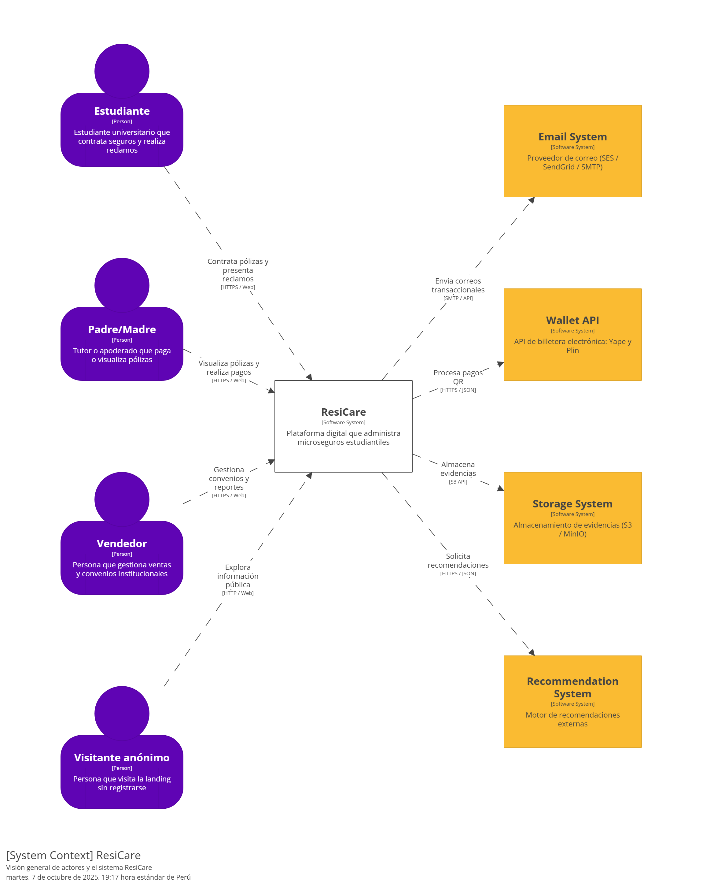

#### 4.6.2. Software Architecture Container Diagrams

En este diagrama se descompone a ResiCare en aplicaciones, bases de datos y bounded contexts. Se enfatiza la separación en contextos delimitados, lo que facilita la evolución independiente de cada módulo, minimiza el acoplamiento y refleja el lenguaje ubicuo del dominio.
API Gateway centraliza las solicitudes y distribuye el tráfico hacia los Bounded Contexts.
Cada bounded context se apoya en una base de datos independiente, promoviendo un diseño desacoplado y escalable.

  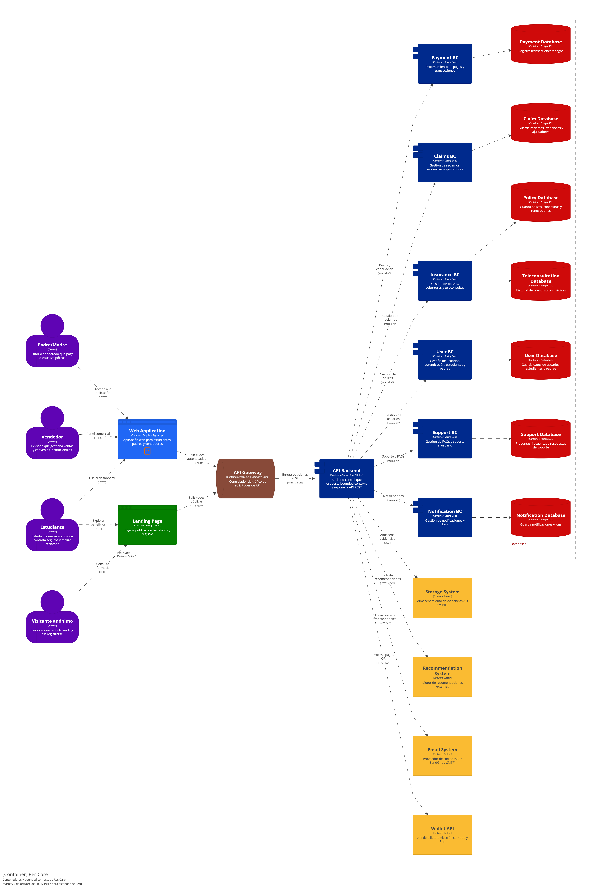

#### 4.6.3. Software Architecture Components Diagrams

En estos diagramas se muestran el desglose interno de cada bounded context.
La arquitectura interna sigue principios de arquitectura hexagonal (Adaptadores de entrada, Lógica de negocio, Adaptadores de salida)
Esto asegura una separación clara de responsabilidades, fomenta la reutilización y permite la sustitución de proveedores externos con bajo impacto en la lógica central.

  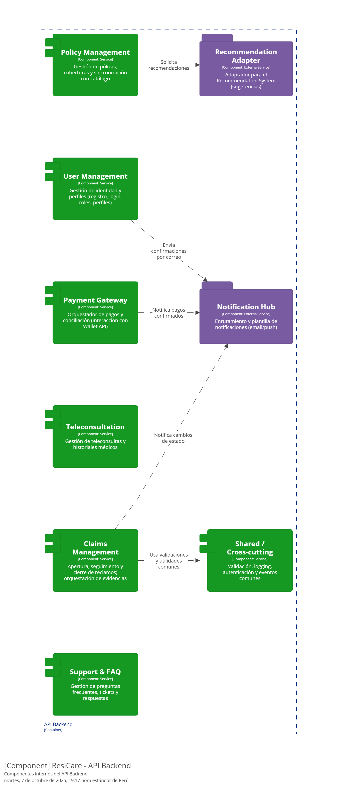

### 4.7. Software Object-Oriented Design

#### 4.7.1. Class Diagrams

  

#### 4.7.2. Class Dictionary

### User
| Elemento        | Descripción                                                                 |
|-----------------|-----------------------------------------------------------------------------|
| **Responsabilidad** | Representa a un usuario genérico de la plataforma (base para Student y Parent). |
| **Atributos**       | `id: int`, `name: String`, `email: String`, `password: String`          |
| **Métodos**         | `login()`, `logout()`                                                   |
| **Relaciones**      | Clase padre de **Student** y **Parent**; se asocia con Policy, Claim y Support. |

---

### Student
| Elemento        | Descripción                                                                 |
|-----------------|-----------------------------------------------------------------------------|
| **Responsabilidad** | Usuario principal (estudiante) que contrata pólizas, presenta reclamos y accede a servicios médicos. |
| **Atributos**       | `universityId: String`                                                  |
| **Métodos**         | `register()`, `startClaim()`                                            |
| **Relaciones**      | Hereda de **User**, se relaciona con **Teleconsultation**.              |

---

### Parent
| Elemento        | Descripción                                                                 |
|-----------------|-----------------------------------------------------------------------------|
| **Responsabilidad** | Usuario secundario (padre/tutor) que supervisa y paga pólizas de los estudiantes. |
| **Atributos**       | `relation: String`                                                      |
| **Métodos**         | `viewPolicy()`, `payPolicy()`                                           |
| **Relaciones**      | Hereda de **User**, se relaciona con **Payment**.                       |

---

### Policy
| Elemento        | Descripción                                                                 |
|-----------------|-----------------------------------------------------------------------------|
| **Responsabilidad** | Representa la póliza de seguro adquirida por el usuario.                |
| **Atributos**       | `policyId: int`, `type: String`, `startDate: String`, `endDate: String` |
| **Métodos**         | `renew()`, `cancel()`                                                   |
| **Relaciones**      | Se asocia con **User**, incluye **Coverage**, y se relaciona con **Payment**. |

---

### Coverage
| Elemento        | Descripción                                                                 |
|-----------------|-----------------------------------------------------------------------------|
| **Responsabilidad** | Define cada cobertura incluida en una póliza (ej. gadgets, viaje, salud).|
| **Atributos**       | `coverageId: int`, `description: String`, `amount: int`                 |
| **Métodos**         | —                                                                       |
| **Relaciones**      | Pertenece a una **Policy**.                                             |

---

### Claim
| Elemento        | Descripción                                                                 |
|-----------------|-----------------------------------------------------------------------------|
| **Responsabilidad** | Reclamo iniciado por un usuario para solicitar compensación.             |
| **Atributos**       | `claimId: int`, `status: String`, `date: String`                        |
| **Métodos**         | `submit()`, `updateStatus()`                                            |
| **Relaciones**      | Se asocia con **User**, **Evidence**, **Adjuster** y **Notification**.  |

---

### Evidence
| Elemento        | Descripción                                                                 |
|-----------------|-----------------------------------------------------------------------------|
| **Responsabilidad** | Documentos o fotos que respaldan un reclamo.                            |
| **Atributos**       | `evidenceId: int`, `fileUrl: String`, `type: String`                    |
| **Métodos**         | —                                                                       |
| **Relaciones**      | Pertenece a un **Claim**.                                               |

---

### Adjuster
| Elemento        | Descripción                                                                 |
|-----------------|-----------------------------------------------------------------------------|
| **Responsabilidad** | Profesional que revisa reclamos complejos.                              |
| **Atributos**       | `adjusterId: int`, `name: String`                                       |
| **Métodos**         | `reviewClaim()`                                                         |
| **Relaciones**      | Interviene en **Claim**.                                                |

---

### Notification
| Elemento        | Descripción                                                                 |
|-----------------|-----------------------------------------------------------------------------|
| **Responsabilidad** | Notificaciones automáticas enviadas a los usuarios.                     |
| **Atributos**       | `notifId: int`, `message: String`, `date: String`                       |
| **Métodos**         | `send()`                                                                |
| **Relaciones**      | Generadas desde **Claim**, **Teleconsultation** y otros eventos.        |

---

### Teleconsultation
| Elemento        | Descripción                                                                 |
|-----------------|-----------------------------------------------------------------------------|
| **Responsabilidad** | Servicio de consulta médica virtual.                                    |
| **Atributos**       | `teleId: int`, `date: String`, `doctor: String`                         |
| **Métodos**         | `schedule()`, `viewHistory()`                                           |
| **Relaciones**      | Solicitadas por **Student**, generan **Notification**.                  |

---

### Payment
| Elemento        | Descripción                                                                 |
|-----------------|-----------------------------------------------------------------------------|
| **Responsabilidad** | Registro de pagos de pólizas o cambios de plan.                         |
| **Atributos**       | `paymentId: int`, `amount: int`, `date: String`                         |
| **Métodos**         | `process()`                                                             |
| **Relaciones**      | Realizados por **Parent**, asociados a **Policy**.                      |

---

### Support
| Elemento        | Descripción                                                                 |
|-----------------|-----------------------------------------------------------------------------|
| **Responsabilidad** | Módulo de soporte (FAQ, contacto).                                      |
| **Atributos**       | `faqId: int`, `question: String`, `answer: String`                      |
| **Métodos**         | —                                                                       |
| **Relaciones**      | Consultado por **User**.                                                |

### 4.8. Database Design

#### 4.8.1. Database Diagram

  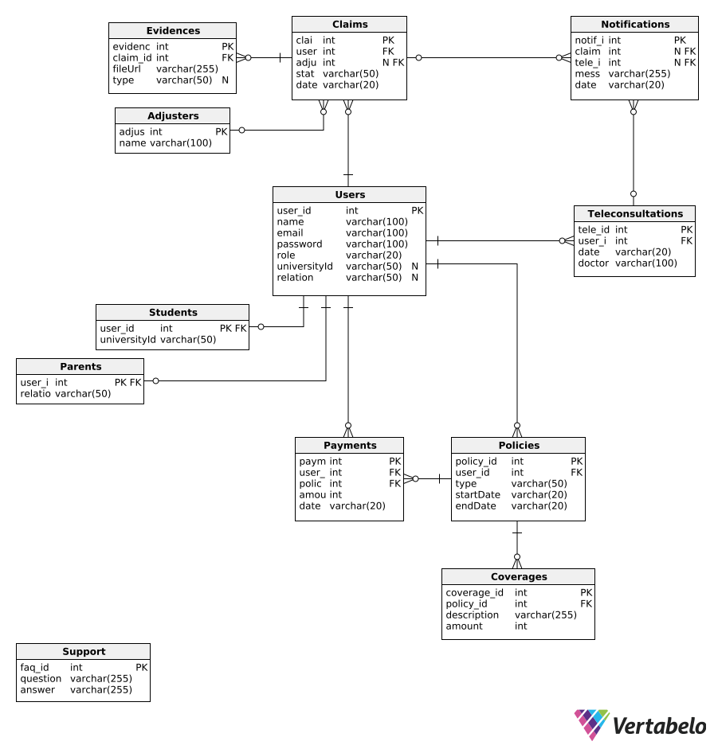

## Capítulo V: Product Implementation, Validation & Deployment

### 5.1. Software Configuration Management

La gestión de configuración de software asegura que todos los componentes del proyecto ResiCare (Landing Page, Aplicación Web y Servicios Web) se mantengan organizados, controlados y consistentes en todo su ciclo de vida. Permite a los miembros del equipo trabajar de manera distribuida con trazabilidad en cada cambio, garantizando calidad, escalabilidad y facilidad de despliegue.

En este proyecto se desarrollan tres artefactos principales:

Landing Page: sitio promocional e informativo.

Frontend Web Application: aplicación web interactiva para los usuarios.

Web Services: servicios backend con lógica de negocio y base de datos.

La gestión de configuración abarca la definición del entorno de desarrollo, la administración del código fuente, la adopción de convenciones de estilo y la configuración de despliegue en Render.
#### 5.1.1. Software Development Environment Configuration

**Gestión del Proyecto**

GitHub (https://github.com/Grupo-2-Aplicaciones-Web-ResiSeguro
)
Organización con repositorios para: Informe, Landing Page, Frontend y Backend. Centraliza código, issues y colaboración.

**Gestión de Requisitos**

Trello / Pivotal Tracker
Gestión del product backlog, historias de usuario y tareas.

**Diseño UX/UI del Producto**

UXPressia: elaboración de User Personas, Empathy Maps, Journey Maps e Impact Maps.

LucidChart / Miro: diagramas As-Is y To-Be Scenario Maps.

Figma / Adobe XD: wireframes, mockups y prototipos.

LucidChart / Overflow: wireflows y user flows.

Structurizr, LucidChart, Vertabelo: diagramas de arquitectura (C4 Model, UML, diseño de base de datos).

PlantUML / Structurizr DSL: Diagram-as-Code para UML o C4 Model.

**Desarrollo de Software**

Landing Page: HTML5, CSS3 y JavaScript.

Frontend Web Application: Vue Framework, con HTML5, CSS3 y JavaScript para los templates, siguiendo Material Design y utilizando PrimeVue como librería de componentes UI.

Backend / Web Services: ASP.NET Core Framework, bajo estilo arquitectónico RESTful API, usando C# como lenguaje de programación.

Documentación de Web Services: OpenAPI Specification mediante Swagger.

Base de datos: MySQL para gestión de usuarios, pólizas y reclamos.

**Control de proyectos y colaboración**

Trello / Pivotal Tracker / YouTrack / Jira: planificación y seguimiento.

VS Code: editor de código fuente.

Postman: pruebas de endpoints.

Git: control de versiones distribuido.

**Despliegue de Software**

Render: plataforma de despliegue para Landing Page, Frontend y Backend.

Ngrok: túneles seguros para pruebas locales de frontend y backend.

#### 5.1.2. Source Code Management

El código fuente es gestionado con Git y hospedado en GitHub, con repositorios separados para: Informe, Landing Page, Frontend y Backend.

Se aplica el flujo de trabajo GitFlow Workflow:

main: versiones estables.

develop: rama de integración de nuevas funcionalidades.

feature/*: ramas temporales para funcionalidades específicas.

hotfix: correcciones urgentes en producción.

Convenciones de versionado y commits

Versionado Semántico (SemVer 2.0.0):

MAJOR → cambios incompatibles.

MINOR → nuevas funcionalidades compatibles.

PATCH → correcciones menores.

Commits Convencionales:

Formato: <type>[scope]: <description>

Ejemplo: feat(simulator): add premium calculation module.

#### 5.1.3. Source Code Style Guide & Conventions

HTML5

Sintaxis estricta de HTML5.

Etiquetas semánticas.

Comillas obligatorias en atributos.

Atributos alt en imágenes.

Indentación de 2 espacios.

CSS3

Variables globales en :root.

Clases en kebab-case.

Notación hexadecimal para colores.

Comentarios por sección (/* Hero Section */).

Evitar !important, usar especificidad.

JavaScript (Landing Page y Vue)

camelCase para variables y funciones.

PascalCase para clases y componentes Vue.

Constantes en UPPERCASE.

Uso de === y !==.

Documentación JSDoc.

Punto y coma obligatorio.

C# (ASP.NET Core)

PascalCase para clases y métodos.

camelCase para variables y parámetros.

Uso de anotaciones como [HttpGet], [HttpPost], [ApiController].

Buenas prácticas con inyección de dependencias.

Documentación XML para métodos públicos.
#### 5.1.4. Software Deployment Configuration

Landing Page

Repositorio: landing-page.

Despliegue como servicio estático en Render.

URL pública generada automáticamente.

Frontend (Vue Application)

Repositorio: frontend.

Despliegue como aplicación web en Render.

Build con npm run build.

URL pública: https://resicare-frontend.onrender.com.

Backend (ASP.NET Core Web Services)

Repositorio: backend.

Despliegue como servicio web en Render.

Integración con base de datos MySQL.

Documentación accesible vía Swagger UI.

URL pública: https://resicare-backend.onrender.com/api.

Pipeline CI/CD

Integración con GitHub.

Cada push a develop: despliegue en entorno de staging.

Cada push a main: despliegue automático en producción.

Validación de código, pruebas unitarias y revisión de dependencias antes de despliegue.
### 5.2. Landing Page, Services & Applications Implementation

#### 5.2.1. Sprint 1

##### 5.2.1.1. Sprint Planning 1
En el Sprint 1, el equipo se enfocó en establecer las bases de nuestra presencia digital construyendo la Landing Page de ResiCare. Durante este ciclo de dos semanas, definimos y entregamos las secciones clave (hero, características, formulario de contacto, navegación fija y diseño responsive). 

| Campo                                 | Detalle                                                                                                                                                                                      |
|---------------------------------------|----------------------------------------------------------------------------------------------------------------------------------------------------------------------------------------------|
| **Sprint #**                          | Sprint 1                                                                                                                                                                                     |
| **Date**                              | 08-09-2025                                                                                                                                                                                   |
| **Time**                              | 12:00 PM                                                                                                                                                                                     |
| **Location**                          | Virtual – Discord                                                                                                                                                                            |
| **Prepared By**                       |  Carlo Ramirez , José Pariona, Vanessa Choy, Héctor Ríos, Jude Hermoza                                                                                                                                                                            | 
| **Attendees (to planning meeting)**   | Carlo Ramirez , José Pariona, Vanessa Choy, Héctor Ríos, Jude Hermoza                                                                                     |
| **Sprint n-1 Review Summary**         | Este es el primer Sprint, por lo que este campo aún no es aplicable                                                                                                                         |
| **Sprint n-1 Retrospective Summary**  | Este es el primer Sprint, por lo que este campo aún no es aplicable                                                                                                                         |
| **Sprint 1 Goal**                     | Nuestro enfoque está en desarrollar e implementar una landing page responsiva y accesible que presente nuestra solución de forma clara a usuarios potenciales. Creemos que aporta confianza de nuestro producto y mejora la experiencia de los visitantes, facilitando su primer contacto con nuestra propuesta de solución. Se confirmará cuando la página esté publicada en producción y validemos el interés mediante el análisis de visitas al cierre del Sprint. |
| **Sprint 1 Velocity**                 | Nuestro equipo puede aceptar hasta 19 story points          |
| **Sum of Story Points**               | La suma de Story Points es 27 |

##### 5.2.1.2. Aspect Leaders and Collaborators

En este Sprint el equipo se enfocó en construir la Landing Page de ResiCare, cubriendo desde el encabezado inicial hasta la lógica de navegación y la adaptabilidad móvil. Para garantizar responsabilidad clara y comunicación efectiva, cada User Story fue asignada a un líder y a colaboradores clave, basados en el análisis de los commits realizados.

| Team Member (Last Name, First Name)          | GitHub Username | Diseño visual y UX del Hero Section | Desarrollo del Formulario de contacto | Adaptación responsive para dispositivos móviles | Diseño y funcionalidad del Header fijo | Implementación de la sección de Características principales |
|----------------------------------------------|-----------------|---------------------------------------|-----------------------------------------|-------------------------------------------------|----------------------------------------|----------------------------------------------------------------|
| Hermoza Quispe, Jude Alessandro            | JvynnDev     |  C                                    |      L                                  |                                                |                                       |                                                               |
| Choy Robles, Vanessa May Lang                | VMLCR        |                                      |        C                                |                L                                |                                       |                                                               |
| Ramirez Escalante, Carlo Patricio               | Carlo211       | L                                     |                                        |                                                |                                       |                                                               |
| Pariona Lucas, Jose Manuel    | parionalucasjosemanuel           |                                      |                                        |                                                |        L                               |                                                               |
| Rios Pacheco, Hector Javier                  | Khafna09        |                                      |                                        |                                                |                C                       |                                                       L        |

##### 5.2.1.3. Sprint Backlog 1

El objetivo principal del Sprint 1 es desarrollar y desplegar una landing page que permita mostrar los aspectos clave del proyecto a los usuarios, garantizando una experiencia de navegación básica y funcionalidades esenciales como la visualización de beneficios, planes de suscripción y reseñas. Para este sprint, el equipo se ha organizado en tareas detalladas, siguiendo las historias de usuario, y se ha asignado el trabajo de forma equitativa para cumplir con los tiempos estimados.

| **User Story** | **Work-Item / Task** |        |                                   |                                                                          | **Estimation (Hours)** | **Assigned to** | **Status** |
| -------------- | -------------------- | ------ | --------------------------------- | ------------------------------------------------------------------------ | ---------------------- | --------------- | ---------- |
| **ID**         | **Title**            | **Id** | **Title**                         | **Description**                                                          |                        |                 |            |
| US-20          | Ver resumen de beneficios (Landing) | W-01   | Diseñar sección de beneficios     | Crear el layout de la sección "Beneficios" con cards y jerarquía visual. | 2                      | Vanessa         | Done       |
| US-20          | Ver resumen de beneficios (Landing) | W-02   | Implementar contenido y CTAs      | Añadir textos, iconografía (ej. "Conoce más") en la sección.      | 2                      | Héctor          | Done       |
| US-21          | Visualizar testimonios (Landing)   | W-03   | Diseñar cards de testimonios      | Diseñar componente de tarjetas de testimonio. | 1.5                    | Jude            | Done       |
| US-21          | Visualizar testimonios (Landing)   | W-04   | Integrar testimonios  | Mostrar los testimonmios | 1.5                  | Carlo           | Done       |
| US-22          | Acceder desde distintos dispositivos (responsive) | W-05 | Maquetar responsive (breakpoints) | Definir y maquetar breakpoints mobile/tablet/desktop para landing.       | 2                      | José            | Done       |
| US-23          | Conocer la propuesta de valor (Hero) | W-07   | Diseñar hero principal            | Crear headline, subhead, imagen.             | 1                      | Héctor          | Done       |
| US-25          | Barra de navegación con anclas | W-11   | Diseñar navbar con anclas          | Diseñar barra superior con logo, links ancla y versión móvil.            | 1                      | Vanessa         | Done       |
| US-25          | Barra de navegación con anclas | W-12   | Implementar comportamiento sticky/responsive | Hacer navbar sticky, transición al hacer scroll y menú mobile (hamburger). | 1                   | Carlo          | Done       |
| US-27          | Navegar desde el footer           | W-13   | Diseñar footer con enlaces        | Crear pie de página con secciones, enlaces y microcopy legal.            | 1                      | Jude            | Done       |
| US-28          | Selector de idioma en landing     | W-15   | Diseñar selector de idioma UI     | Diseñar selector (icono).         | 1.5                    | José            | Done       |
| US-28          | Selector de idioma en landing     | W-16   | Implementar cambio de idioma      | Conectar textos (i18n) y hacer pruebas de cambio instantáneo.            | 1.5                    | Jude         | Done       |

  

Link: https://trello.com/invite/b/68c60b3efa155e0e9894f3ac/ATTI6482172f02c299d15f2851befede5ae8F410C17A/sprint-backlog 

##### 5.2.1.4. Development Evidence for Sprint Review
| Repository        | Branch   | Commit Id | Commit Message                                           | Commit Message Body                                                      | Commited on (Date) |
|-------------------|----------|-----------|----------------------------------------------------------|---------------------------------------------------------------------------|--------------------|
| Landing-Page      | main     | 7b988c32  | fix: update contact phone numbers and team member descriptions | Actualización de los números de contacto y descripciones de miembros del equipo. | 17/09/2025         |
| Landing-Page      | main     | e92e13bc  | feat: REWORK landing page                                | Reestructuración de la página principal (landing page).                   | 17/09/2025         |
| Landing-Page      | develop  | 7f605751  | Add files via upload                                     | Archivos agregados al repositorio mediante carga directa.                 | 10/09/2025         |
| Landing-Page      | develop  | 035bf3eb  | Add files via upload                                     | Archivos agregados al repositorio mediante carga directa.                 | 10/09/2025         |
| Landing-Page      | develop  | 33c56a5b  | Add files via upload                                     | Archivos agregados al repositorio mediante carga directa.                 | 10/09/2025         |
| Repository        | Branch   | Commit Id | Commit Message                                           | Commit Message Body                                                      | Commited on (Date) |
|-------------------|----------|-----------|----------------------------------------------------------|---------------------------------------------------------------------------|--------------------|
| Landing-Page      | main     | 7b988c32  | fix: update contact phone numbers and team member descriptions | Actualización de los números de contacto y descripciones de miembros del equipo. | 17/09/2025         |
| Landing-Page      | main     | e92e13bc  | feat: REWORK landing page                                | Reestructuración de la página principal (landing page).                   | 17/09/2025         |
| Landing-Page      | develop  | 7f605751  | Add files via upload                                     | Archivos agregados al repositorio mediante carga directa.                 | 10/09/2025         |
| Landing-Page      | develop  | 035bf3eb  | Add files via upload                                     | Archivos agregados al repositorio mediante carga directa.                 | 10/09/2025         |
| Landing-Page      | develop  | 33c56a5b  | Add files via upload                                     | Archivos agregados al repositorio mediante carga directa.                 | 10/09/2025         |

##### 5.2.1.5. Execution Evidence for Sprint Review
En este Sprint, nuestro equipo ha conseguido completar y desplegar la Landing Page. A continuación, se mostrará los screens sacasdos desde la web: https://grupo-2-aplicaciones-web-resiseguro.github.io/Landing-Page/

  

  

  

  

  

  

  

##### 5.2.1.6. Services Documentation Evidence for Sprint Review

Durante el Sprint no se integraron servicios a través de APIs, por lo que no fue necesaria la generación de documentación técnica relacionada a este aspecto.

##### 5.2.1.7. Software Deployment Evidence for Sprint Review
**Design**
Para realizar el diseño de los wireframes y mockups de la Landing Page de ResiSeguro, se hizo uso de la plataforma Figma. Para utilizar la plataforma seguimos los siguientes pasos:
1. Accedemos a la plataforma para iniciar sesión: https://www.figma.com/login
    
     

3. Creamos un **Draft**, el cual nos servirá de base para el proyecto colaborativo:
      

**Deployment**
Para despegar la landing page, se utiliza GitHub Pages:
  
   
Para crear la Organización en Github seguimos los siguientes pasos:
  
  
  
  
  

Para nuestro proyecto se creo 1 repositorio de nombre **Landing-Page**, el cual usamos para subir la landing page y desarrollar continuamente el informe del proyecto.
Link de la Landing Page desplegada: https://grupo-2-aplicaciones-web-resiseguro.github.io/resicare-landing-page/
##### 5.2.1.8. Team Collaboration Insights during Sprint

  

#### 5.2.2. Sprint 2
##### 5.2.2.1. Sprint Planning 2
El propósito de este segundo sprint es consolidar las mejoras realizadas al reporte inicial, respondiendo a las observaciones del profesor, y avanzar con la construcción funcional de la aplicación. Nos enfocaremos en ajustar y optimizar la landing page desarrollada en el sprint anterior, así como en implementar la primera versión del Front End, incorporando funcionalidades CRUD básicas. Esto permitirá comenzar a visualizar la interacción del usuario con la propuesta y validar aspectos clave del diseño y la experiencia de uso.

| **Sprint #**                   | Sprint 2                                                                                                                                                                                                                                          |
| ------------------------------ | ------------------------------------------------------------------------------------------------------------------------------------------------------------------------------------------------------------------------------------------------- |
| **Sprint Planning Background** |                                                                                                                                                                                                                                                   |
| **Date**                       | 02/10/2025                                                                                                                                                                                                                                        |
| **Location**                   | El desarrollo de la reunión se realizó virtualmente por medio de Discord                                                                                                                                                                          |
| **Prepared By**                |  Carlo Ramirez , José Pariona, Vanessa Choy, Héctor Ríos, Jude Hermoza                                                                                                                                                                  |
| **Sprint 1 Review Summary**    | Se ha mejorado varios puntos con respecto al reporte según las observaciones que mencionó el profesor. Además, se creó la nueva versión de nuestra landing page y la primera version de Front End.                                                                                 |
| **Sprint 1 Retrospective Summary** | Hubo un correcto progreso, aunque con algunas correcciones por realizar se avanzó como se esperaba. Consideramos que la landing page realizada y la primera version de Front End cumple con lo esperado.                      |
| **Sprint 2 Goal**              | Nuestra prioridad en este sprint es el mejoramiento de la información del reporte y añadir pequeñas adaptaciones a nuestra landing page. Además, implementar la primera versión de la aplicación Front End mediante el uso de CRUDS. Creemos que esto podrá dar una mejor presentación de las funcionalidades que posee nuestra propuesta y dar una mejor idea del diseño. Esto se confirmará cuando los usuarios destinarios puedan interactuar sin problema con la interfaz y generar una buena opinión. |
| **Sprint 2 Velocity**          |   Se estimarón un total de 38                                                                                                                                                                                                                                                |
| **Sum of Story Points**        |      Nuestro equipo puedo alcanzó 38         |

##### 5.2.2.2. Aspect Leaders and Collaborators

En este Sprint, el equipo se enfocó en el desarrollo y despliegue de las vistas principales de la aplicación web frontend, así como en la integración con una Fake API para simular la interacción con el backend. Los aspectos principales considerados en este Sprint incluyen el diseño e implementación de componentes del frontend y la integración de las vistas con la Fake API. A continuación, se presenta la matriz Leadership-and-Collaboration Matrix (LACX), que detalla los roles de liderazgo y colaboración asignados a cada miembro del equipo para los aspectos clave del Sprint.

| Team Member (Ríos Pacheco, Héctor)          | GitHub Username | Pantalla principal (Dashboard) | Proceso de nuevo reclamo | Registro de objetos | Visualización de reclamos | Visualización de historial de reclamos | Visualización de recordatorios | Simulador de reembolso | Cita por teleconsulta |
|----------------------------------------------|-----------------|--------------------------------|--------------------------|---------------------|----------------------------|----------------------------------------|--------------------------------|------------------------|-----------------------|
| Hermoza Quispe, Jude Alessandro              | JvynnDev        | C                              | L                        |        L             |                            |                                        |                                |                        |                       |
| Choy Robles, Vanessa May Lang                | VMLCR           |                                | C                        |                    |                            |    L                                    |                                |                        |                       |
| Ramirez Escalante, Carlo Patricio            | Carlo211        |      L                         |                          |                     |      L                      |                                        |                                |                        |                       |
| Pariona Lucas, Jose Manuel                   | parionalucasjosemanuel |                                |                          |                     |               C            |          L                              |     C                           |                        |                       |
| Rios Pacheco, Hector Javier                  | Khafna09        |                                |                          |                     | C                          |                                       |                                |              L          |    L                   |

En esta matriz, se asignaron roles de liderazgo y colaboración para garantizar una comunicación clara y efectiva dentro del equipo, promoviendo la eficiencia en la ejecución de las tareas relacionadas con el alcance del Sprint.

##### 5.2.2.3 Sprint Backlog 2

Esta sección describe de forma resumida el objetivo principal del sprint, resaltando las metas propuestas y las funcionalidades que se planean desarrollar. A continuación, se incluye una captura del tablero del sprint gestionado en la herramienta Trello, junto con el enlace público correspondiente. También se presenta una tabla que detalla las User Stories asignadas al sprint, los Work-items o tareas asociadas, y las actividades adicionales requeridas para cumplir con los objetivos establecidos.

Este es nuestro link de invitación a nuestro Trello:

Link: https://trello.com/invite/b/68c60b3efa155e0e9894f3ac/ATTI6482172f02c299d15f2851befede5ae8F410C17A/sprint-backlog 

  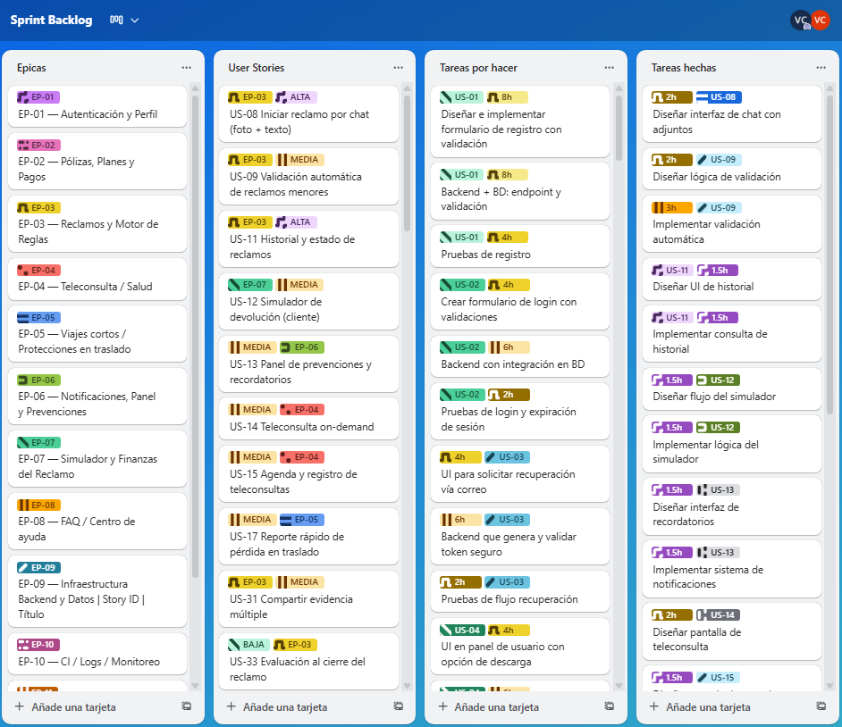

| **User Story** | **Work-Item / Task** |        | **Title**                          | **Description**                                                                 | **Estimation (Hours)** | **Assigned to** | **Status** |
| -------------- | -------------------- | ------ | ---------------------------------- | ------------------------------------------------------------------------------- | ---------------------- | --------------- | ---------- |
| US-08          | Iniciar reclamo por chat (foto + texto) | W-17   | Diseñar interfaz de chat con adjuntos | Crear diseño de UI para chat que permita adjuntar foto y texto.                 | 2                      | Carlo           | Done       |
| US-09          | Validación de reclamos  | W-19   | Diseñar lógica de validación         | Definir reglas y flujo de validación para reclamos simples.           | 2                      | Jude         | Done       |
| US-09          | Validación automática de reclamos menores | W-20   | Implementar validación automática    | Programar verificación automática con respuestas predefinidas.                  | 3                      | Jude            | Done       |
| US-11          | Historial y estado de reclamos           | W-21   | Diseñar UI de historial              | Crear diseño de lista de reclamos con estados y fechas.                         | 1.5                    | José         | Done       |
| US-11          | Historial y estado de reclamos           | W-22   | Implementar consulta de historial    | Programar la recuperación y visualización del historial de reclamos.            | 1.5                    | José            | Done       |
| US-12          | Simulador de devolución (cliente)        | W-23   | Diseñar flujo del simulador          | Diseñar interfaz que muestre valores de reembolso con inputs del cliente.       | 1.5                    | Héctor          | Done       |
| US-12          | Simulador de devolución (cliente)        | W-24   | Implementar lógica del simulador     | Programar cálculo de montos y mostrar resultado dinámico.                       | 1.5                    | Héctor            | Done       |
| US-13          | Panel de prevenciones y recordatorios    | W-25   | Diseñar interfaz de recordatorios    | Crear panel para mostrar recordatorios y alertas preventivas.                   | 1.5                    | José         | Done       |
| US-13          | Panel de prevenciones y recordatorios    | W-26   | Implementar sistema de notificaciones | Programar recordatorios y alertas con persistencia en el sistema.               | 1.5                    | José          | Done       |
| US-14          | Teleconsulta on-demand                   | W-27   | Diseñar pantalla de teleconsulta     | Crear UI de teleconsulta rápida con botón de acceso inmediato.                  | 2                      | Héctor            | Done       |
| US-15          | Agenda y registro de teleconsultas       | W-29   | Diseñar agenda de consultas          | Diseñar pantalla con calendario/lista de citas médicas.                         | 1.5                    | Carlo           | Done       |
| US-15          | Agenda y registro de teleconsultas       | W-30   | Implementar registro de citas        | Programar almacenamiento y visualización de citas.                      | 1.5                    | Jude            | Done       |
| US-17          | Reporte rápido de pérdida en traslado    | W-31   | Diseñar formulario de reporte rápido | Diseñar UI simple con campos de prueba + ubicación.                             | 1.5                    | Jude           | Done       |
| US-17          | Reporte rápido de pérdida en traslado    | W-32   | Implementar carga de evidencia       | Programar carga de prueba (foto) y geolocalización aproximada.                  | 1.5                    | Jude            | Done       |
| US-31          | Compartir evidencia múltiple             | W-33   | Diseñar flujo de adjuntar múltiples archivos | Definir UI/UX para subir varias fotos o archivos.                        | 1.5                    | Jude         | Done       |
| US-33          | Evaluación al cierre del reclamo         | W-35   | Diseñar encuesta de satisfacción     | Crear interfaz con opciones de calificación y comentarios.                      | 1                      | Vanessa           | Done       |
| US-33          | Evaluación al cierre del reclamo         | W-36   | Implementar registro de feedback     | Programar almacenamiento de evaluación en la base de datos.                     | 1                      | Carlo          | Done       |
| US-34 | Registro de objeto para ser asegurado|W-37|Implementar el registro del objeto asegurado  |Programar un formulario para registrar el objeto que se desea asegurar |1|Jude|Done|
| US-34 | Registro de objeto para ser asegurado|W-37| Vincular el registro del objeto a un nuevo reclamo realizado |Vincular un boton que permita redirigir a la opciónde registro del objeto|1|Jude|Done|

##### 5.2.2.4 Development Evidence for Sprint Review
| Repository | Branch                | Commit ID                                | Commit Message                                                                                                                 | Commit Message Body      | Committed on (Date) |
| ---------- | --------------------- | ---------------------------------------- | ------------------------------------------------------------------------------------------------------------------------------ | ------------------------ | ------------------- |
| ResiSeguro | feature/myclaims      | 09884fb87628591a8288a28019b4f96f5d373105 | Merge branch 'develop' into feature/myclaims                                                                                   | No description provided. | 2025-10-07          |
| ResiSeguro | feature/myclaims      | 55942b1815653af3122b4678547c150c2c56fcce | feat: add myclaims                                                                                                             | No description provided. | 2025-10-07          |
| ResiSeguro | teleconsultations     | 9b71e71c659ff476a34c9735a47e82333cb66c6c | fix: improve user ID extraction from localStorage and token                                                                    | No description provided. | 2025-10-07          |
| ResiSeguro | iam                   | 93328f057fbbe44fe2c8200ad968525beb55f83e | fix: fixing login, register an profiles-page with vue components                                                               | No description provided. | 2025-10-07          |
| ResiSeguro | feature/historyclaims | 07805a722b030622e585016a668761c426aae0c3 | feat: add list of history claims and details more download list                                                                | No description provided. | 2025-10-06          |
| ResiSeguro | feature/historyclaims | b9286a57fc4f1b7ae107bf122c55477b1d1953a6 | feat: adding routes for claims history                                                                                         | No description provided. | 2025-10-06          |
| ResiSeguro | feature/historyclaims | 4ff78013605846b6d14d4e2784ec7249a7b27bfd | feat: adding languages data for claims history                                                                                 | No description provided. | 2025-10-06          |
| ResiSeguro | feature/historyclaims | 18d50262f46f23cbc1049884d7e59781a14efde0 | feat: adding images for history claims and details                                                                             | No description provided. | 2025-10-06          |
| ResiSeguro | feature/historyclaims | d35d34d84bf67ef304f80bf62cfdac2781aee018 | feat: adding data for historyclaims and details                                                                                | No description provided. | 2025-10-06          |
| ResiSeguro | feature/simulator     | 821c5514f8e1f12ffdb659c4e11a421fdba846ba | feat: add reimbursement-simulator                                                                                              | No description provided. | 2025-10-06          |
| ResiSeguro | profiles              | 5625dff16de8a18af93a2faf39598cd7a75c72e1 | fix: reorder of db.json                                                                                                        | No description provided. | 2025-10-05          |
| ResiSeguro | feature/NewClaim      | c2ccd3cfb98ff7ec2329bcfde5774f49fd39f35d | feat: add claim and registered object forms with related components and API integration; fix routes, i18n, and UI registration | No description provided. | 2025-10-05          |
| ResiSeguro | main                  | bc0e944f5c7ba1ecaa5c00a759b93b6f073aa3e8 | Initial commit: setup Vue project with Vite, PrimeVue, i18n and general components                                             | No description provided. | 2025-10-03          |

##### 5.2.2.5 Execution Evidence for Sprint Review.
Durante la realización de este sprint se logró elaborar los CRUDS correspondientes a las vistas correspondientes a las stories. Donde se incluyen opciones de creación y edición de elementos, así como sus información correspondiente, brindando así una nueva perspectiva del producto que se está desarrollando. En este Sprint, nuestro equipo ha conseguido completar y desplegar la Landing Page y el Front End. A continuación, se mostrará los screens sacasdos desde la web: 
Link de la Landing Page desplegada: https://grupo-2-aplicaciones-web-resiseguro.github.io/resicare-landing-page/
 
Link del Front End desplegada: https://resicare-frontend-psi.vercel.app/
 
**Landing  Page:**

  

  

  

  

  

  

  

**Front End:**

  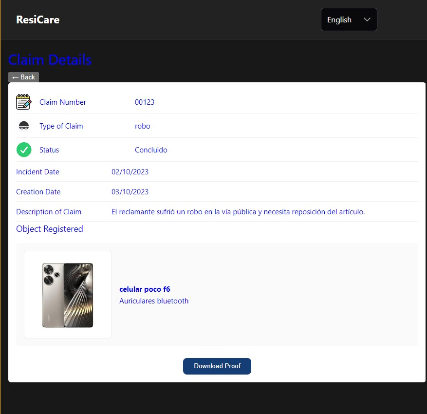

  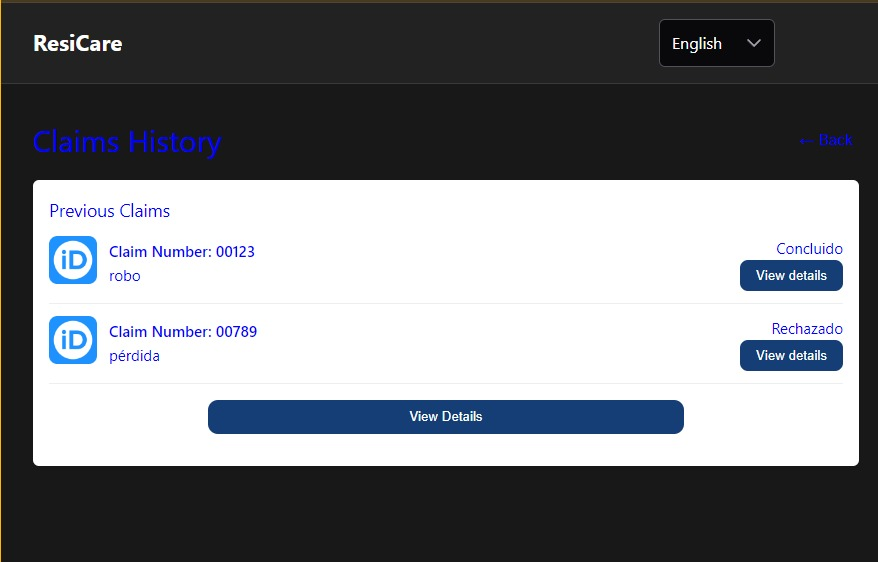

  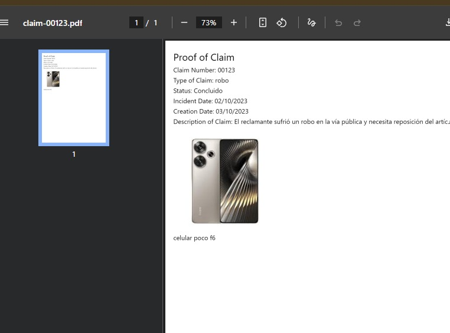

  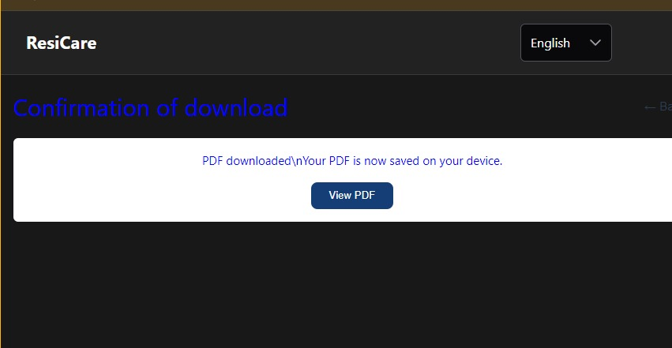

  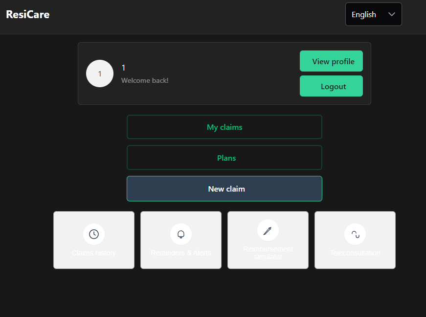

  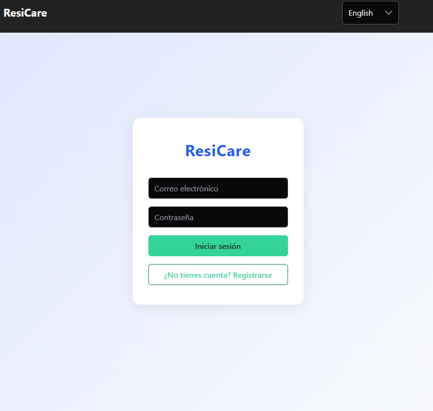

  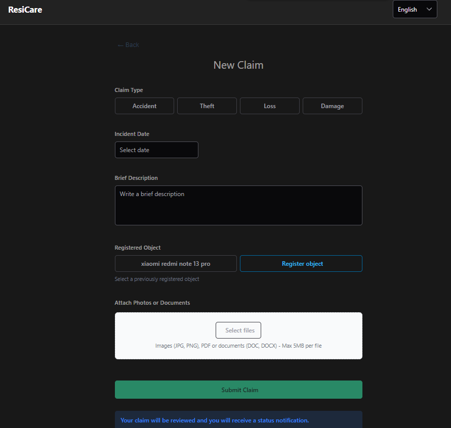

  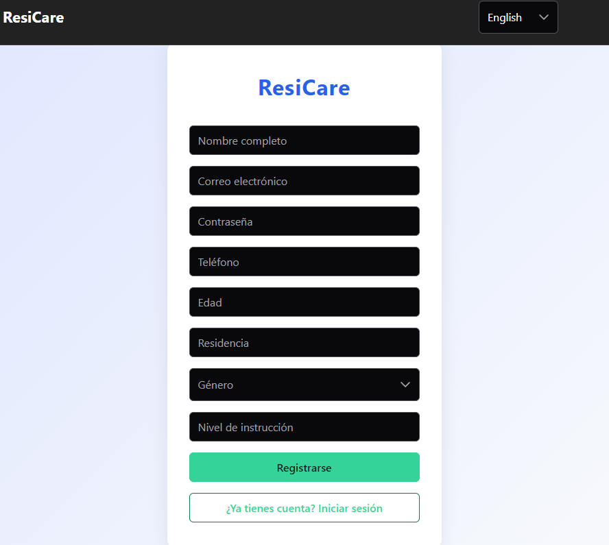

  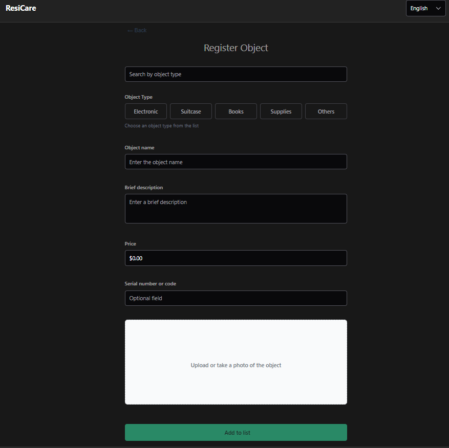

  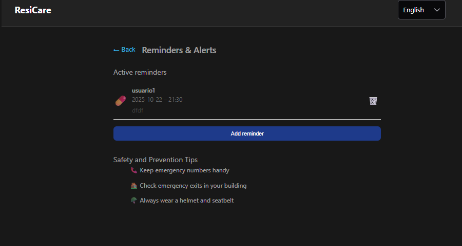

  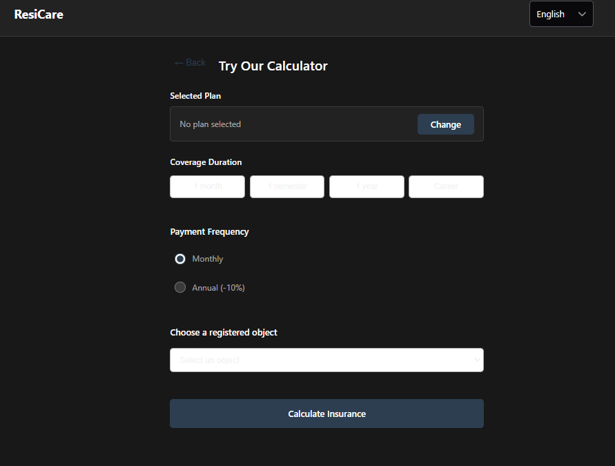

  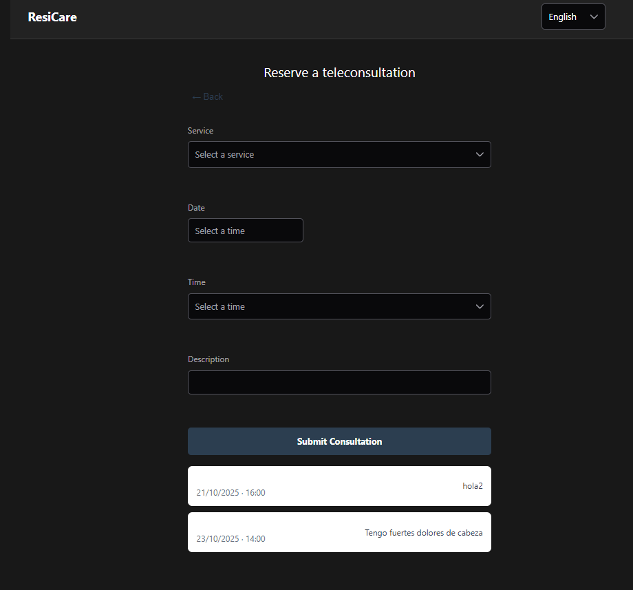

##### 5.2.2.6. Services Documentation Evidence for Sprint Review

Durante este sprint, se avanzó significativamente en la implementación de los primeros servicios web necesarios para la funcionalidad básica del Front End. Se desarrollaron e integraron operaciones CRUD que permiten la interacción con los datos de manera dinámica. Esta sección resume los logros alcanzados en relación con la documentación técnica de estos servicios, detallando su estructura, endpoints, métodos utilizados y la forma en que se conectan con la interfaz de usuario. Estos avances marcan un paso importante en la transición desde una interfaz estática hacia una aplicación funcional y orientada al usuario.

**Tabla de Endpoints Documentados (Sprint 2)**
| **Endpoint**               | **Acción**                               | **Método HTTP**   | **Sintaxis de llamada**   | **Parámetros**                                 | **Ejemplo de Response**                                      | **URL Documentación**                                                                          |
| -------------------------- | ---------------------------------------- | ----------------- | ------------------------- | ---------------------------------------------- | ------------------------------------------------------------ | ---------------------------------------------------------------------------------------------- |
| **/auth/login**            | Iniciar sesión de usuario                | `POST`            | `/auth/login`             | email (string), password (string)              | `{ "token": "abc123", "user": { "id": 1, "role": "admin" }}` | `/src/contexts/iam/infraestructure/auth-api.service.js`                                        |
| **/auth/refresh**          | Renovar token JWT                        | `POST`            | `/auth/refresh`           | refresh_token (string)                         | `{ "token": "nuevo_token" }`                                 | `/src/contexts/iam/infraestructure/token.service.js`                                           |
| **/profiles**              | Obtener lista de perfiles                | `GET`             | `/profiles`               | Ninguno                                        | `[{"id":1,"name":"Paciente Demo"}]`                          | `/src/contexts/profiles/infraestructure/profile-api.service.js`                                |
| **/profiles/:id**          | Actualizar datos de perfil               | `PUT`             | `/profiles/{id}`          | id (int), name (string), email (string)        | `{ "status": "updated" }`                                    | `/src/contexts/profiles/infraestructure/profile-api.service.js`                                |
| **/claims**                | Registrar nuevo reclamo                  | `POST`            | `/claims`                 | userId (int), reason (string), file (objeto)   | `{ "id":5,"status":"received" }`                             | `/src/contexts/claims/infraestructure/claim-api.service.js`                                    |
| **/claims/:id**            | Consultar detalle de reclamo             | `GET`             | `/claims/{id}`            | id (int)                                       | `{ "id":5,"status":"in_review" }`                            | `/src/contexts/claims/infraestructure/claim-api.service.js`                                    |
| **/myclaims**              | Obtener reclamos del usuario autenticado | `GET`             | `/myclaims`               | userId (int)                                   | `[{"id":3,"status":"in_review"}]`                            | `/src/contexts/myclaims`                                                                       |
| **/registered-objects**    | Listar objetos registrados               | `GET`             | `/registered-objects`     | Ninguno                                        | `[{"id":10,"type":"Device","serial":"XYZ-101"}]`             | `/src/contexts/registered-objects/infraestructure/registered-object-api.service.js`            |
| **/registered-objects**    | Crear objeto registrado                  | `POST`            | `/registered-objects`     | name (string), type (string), serial (string)  | `{ "id":11,"status":"created" }`                             | `/src/contexts/registered-objects/infraestructure/registered-object-api.service.js`            |
| **/simulator/calculate**   | Calcular monto estimado de reembolso     | `POST`            | `/simulator/calculate`    | amount (float), type (string)                  | `{ "reimbursement": 250.50 }`                                | `/src/contexts/reimbursement-simulator/infraestructure/reimbursement-simulator-api.service.js` |
| **/teleconsultations**     | Crear nueva teleconsulta                 | `POST`            | `/teleconsultations`      | patientId (int), doctorId (int), date (string) | `{ "id":3,"status":"scheduled" }`                            | `/src/contexts/teleconsultations/infraestructure/teleconsultation-api.service.js`              |
| **/teleconsultations/:id** | Obtener detalle de teleconsulta          | `GET`             | `/teleconsultations/{id}` | id (int)                                       | `{ "id":3,"status":"completed" }`                            | `/src/contexts/teleconsultations/infraestructure/teleconsultation-api.service.js`              |
| **(localStorage)**         | Guardar recordatorio local               | `POST` (simulado) | `reminders.save()`        | title (string), date (string), note (string)   | `{ "status":"saved" }`                                       | `/src/contexts/reminders/infrastructure/reminder-storage.service.js`                           |
| **/public/info**           | Obtener información pública de la app    | `GET`             | `/public/info`            | Ninguno                                        | `{ "appName":"ResiCare","version":"1.0.0" }`                 | `/src/contexts/public`                                                                         |

##### 5.2.2.7 Software Deployment Evidence for Sprint Review

Link de la Landing Page desplegada: https://grupo-2-aplicaciones-web-resiseguro.github.io/resicare-landing-page/ 
 
Link del Front End desplegada: https://resicare-frontend-psi.vercel.app/
 

  

  

  

  

  

  

  

  

##### 5.2.2.8. Team Collaboration Insights during Sprint
Durante el Sprint 2, el equipo de desarrollo trabajó de manera colaborativa para implementar las funcionalidades clave de la nueva Landing Page y la primera version del Front End. A través de reuniones periódicas en Discord, se lograron coordinar de manera eficiente las tareas asignadas a cada miembro del equipo. A continuación, se presenta un resumen de las actividades y la colaboración del equipo.

Informe:

  

Landing Page:

  

Front-End: 

  

#### 5.2.3. Sprint 3
##### 5.2.3.1. Sprint Planning 3

En el Sprint 3, el equipo se centró en refinar y optimizar el frontend según el feedback recibido, actualizar la landing page, producir los videos “About the Team” y “About the Product” y desplegar el backend en un entorno operativo, asegurando así una experiencia más sólida y completa para los usuarios.

| Campo                               | Detalle                                                                                                                                                                                                                                                      |
|-------------------------------------|--------------------------------------------------------------------------------------------------------------------------------------------------------------------------------------------------------------------------------------------------------------|
| **Sprint #**                        | Sprint 3                                                                                                                                                                                                                                                     |
| **Fecha**                           | 06/11/2025                                                                                                                                                                                                                                                  |
| **Hora**                            | 19:00                                                                                                                                                                                                                                                        |
| **Location**                   | El desarrollo de la reunión se realizó virtualmente por medio de Discord                                                                                                                                                                          |
| **Prepared By**                |  Carlo Ramirez , José Pariona, Héctor Ríos, Jude Hermoza                                                                                                                                                                  |
| **Asistentes (planning meeting)**   | Carlo Ramirez , José Pariona, Héctor Ríos, Jude Hermoza                                                                                                                                                                         |
| **Sprint 2 Review Summary**       | En el Sprint 2 corregimos y validamos el reporte original, implementamos los CRUDs de los bounded contexts y desplegamos la estructura navegable básica del frontend con contenidos iniciales.                                                               |
| **Sprint 2 Retrospective Summary**| En el Sprint 2 resolvimos los problemas de despliegue del frontend que quedaron pendientes; estas tareas pasaron a este sprint donde ya fueron completamente solucionadas e implementadas.                                                                   |
| **Sprint Goal**             | Nuestro enfoque es refinar y optimizar el frontend según el feedback recibido, ajustar la landing page, producir y presentar los videos “About the Team” y “About the Product” y crear y desplegar nuestro backend en un entorno operativo. Creemos que esto permitirá una correcta aceptación y difusión de nuestro producto, así como una buena gestión de datos, proporcionando comodidad y funcionalidad a los usuarios.Esto se confirmará cuando los usuarios vean los videos y se sientan atraídos a probar nuestro producto. |
| **Sprint Velocity**                 |     Para este sprint velocity se han estimado 51  story points                                                                                                                                                                                                   |
| **Sum of Story Points**             |        La suma de history points a llevar a cabo es 51 story points                                                                                                                                                                                                      |

##### 5.2.3.2. Aspect Leaders and Collaborators

En este Sprint, el equipo se enfocó en desarrollar los módulos clave del sistema ResiCare, abordando funcionalidades centrales como gestión de perfiles, reclamos, recordatorios, teleconsultas y simulación por calculadora. Para asegurar una asignación eficiente y una ejecución organizada, cada módulo fue liderado por un miembro del equipo, acompañado por uno o dos colaboradores, distribuidos según los análisis de participación reflejados en los commits.

| Team Member (Ríos Pacheco, Héctor) | GitHub Username        | Proceso de nuevo reclamo | Registro de objetos | Visualización de reclamos | Visualización de historial de reclamos | Visualización de recordatorios | Simulador de reembolso | Cita por teleconsulta |
| ---------------------------------- | ---------------------- | ------------------------ | ------------------- | ------------------------- | -------------------------------------- | ------------------------------ | ---------------------- | --------------------- |
| Hermoza Quispe, Jude Alessandro    | JvynnDev               | L                        | L                   |                           |                                        |                                |                        |                       |
| Ramirez Escalante, Carlo Patricio  | Carlo211               |                          |                     | L                         |                    C                    |           L                     |                        |                       |
| Pariona Lucas, Jose Manuel         | parionalucasjosemanuel |                          |                     | C                         | L                                      | C                              |                        |                       |
| Rios Pacheco, Hector Javier        | Khafna09               |                          |                     | C                         |                                        |                                | L                      | L                     |

##### 5.2.3.3 Sprint Backlog 3

En este sprint estamos encargardos y propuestos de realizar un API Restful mediante la implementación del backend en C# & .Net.
A continuación se listara la tabla con las stories relacionadas y llevadas a cabo para completar en este tercer sprint.

| Story ID  | Story Title                          | Task ID | Task Title                                           | Description                                                                            | Estimation (Hrs) | Assigned To   | Status |
| --------- | ------------------------------------ | ------- | ---------------------------------------------------- | -------------------------------------------------------------------------------------- | ---------------: | ------------- | ------ |
| **US-04** | CRUD Users API                       | W-101   | Implementación GET/POST/GET{id}/ALL                  | Desarrollo de endpoints Users con retorno JSON y validación mínima.                    |                4 | Héctor Ríos   | Done   |
|           |                                      | W-102   | Integración de modelo User + respuesta REST          | Mapeo DTO, estructura request/response y pruebas de estados HTTP.                      |                3 | Jude Hermoza  | Done   |
| **US-05** | CRUD Claims (Reclamos)               | W-103   | Implementación POST/GET/LIST/DELETE                  | Creación del módulo Claims incluyendo adjuntos, userId y estados.                      |                5 | Jude Hermoza  | Done   |
|           |                                      | W-104   | Serialización + validaciones de Claim en Swagger     | Definición de JSON Schema, incidentDate, documentos y estado inicial.                  |                3 | José Pariona  | Done   |
| **US-06** | CRUD Profiles                        | W-105   | Endpoints Profiles GET/POST/GET{id}/PATCH/DELETE     | Creación de perfil con bio, dni, teléfono, foto credencial y residencia.               |                4 | Carlo Ramírez | Done   |
|           |                                      | W-106   | Gestión JSON Schema + documentación API              | Definición de campos, respuestas esperadas y ejemplos en Swagger.                      |                2 | Héctor Ríos   | Done   |
| **US-07** | CRUD Registered Objects              | W-107   | Implementación POST/GET{id}/LIST + delete/patch      | Registro de objetos asegurados con precio, numeroSerie, fotos.                         |                5 | Héctor Ríos   | Done   |
|           |                                      | W-108   | Validaciones + persistencia con created/updated date | JSON Schema + timestamps + testing de integración.                                     |                3 | Jude Hermoza  | Done   |
| **US-08** | CRUD Reminders (Recordatorios)       | W-109   | Endpoints GET/POST/PATCH/DELETE                      | Registro de recordatorios con fecha, notas, tipo, userId.                              |                4 | José Pariona  | Done   |
|           |                                      | W-110   | Integración Upcoming Reminders + documentación       | GET /api/reminders/upcoming y definición paramétrica.                                  |                3 | Carlo Ramírez | Done   |
| **US-09** | CRUD Teleconsultas                   | W-111   | Implementación POST/GET/PUT/DELETE                   | Reserva de teleconsultas con fecha, hora, descripción y service.                       |                5 | Jude Hermoza  | Done   |
|           |                                      | W-112   | Endpoint GET by service + pruebas con filtros        | Búsqueda por categoría médica, validación de datos.                                    |                3 | Héctor Ríos   | Done   |
| **US-10** | Backend desplegado en producción     | W-113   | Docker + hosting + variables de entorno              | Contenerización, derpliegue y conexión con base de datos remota.                       |                6 | Héctor Ríos   | Done   |
|           |                                      | W-114   | Pipeline + verificación uptime                       | Pruebas post-deploy, logs, tiempos de respuesta, integración DNS.                      |                4 | Carlo Ramírez | Done   |
| **TS-06** | Swagger 3.0 completo + documentación | W-115   | Definición de Schemas + Ejemplos request/response    | Estructura OpenAPI con Claims, Users, Objects, Teleconsultations, Reminders, Profiles. |                4 | José Pariona  | Done   |
|           |                                      | W-116   | Activación UI Swagger + pruebas endpoints reales     | Testing con TryItOut, responses 200/201/400/409 visibles y auditadas.                  |                3 | Héctor Ríos   | Done   |

##### 5.2.3.4 Development Evidence for Sprint Review
| Repository       | Branch                     | Commit ID                                | Commit Message                                    | Commit Message Body     | Committed on (Date) |
| ---------------- | -------------------------- | ---------------------------------------- | ------------------------------------------------- | ----------------------- | ------------------- |
| resicare-backend | develop                    | 9118bb2280d54a5802abd4cb11c915fe87eacbe8 | feat: adding configurations                       | No description provided | 2025-11-06          |
| resicare-backend | develop                    | d0896d7e7de3521d69392585c580c316ef4a9cb8 | fix: fixing cors                                  | No description provided | 2025-11-06          |
| resicare-backend | feature/teleconsultations  | 6e72b734d07b1b695ac16d8c32879f527f505171 | feat: adding interfaces of teleconsultations      | No description provided | 2025-11-06          |
| resicare-backend | feature/teleconsultations  | ffbd7ac5f718e3a3171f40bd517a61fc281c5d04 | feat: adding infrastructure of tleeconsultations  | No description provided | 2025-11-06          |
| resicare-backend | feature/teleconsultations  | 455d714acfd81c64096e7a46118ad09b9c388a65 | feat: adding domain of teleconsultations          | No description provided | 2025-11-06          |
| resicare-backend | feature/teleconsultations  | 1c1962577ccf5df020479b2b5f25bf06efc5f04b | feat: adding aplications of teleconsultations     | No description provided | 2025-11-06          |
| resicare-backend | feature/IAM                | 7a2e90d72178d08fd2e364efa50d2c8cac94624e | feat: adding interfaces of iam                    | No description provided | 2025-11-06          |
| resicare-backend | feature/IAM                | 584605619c712c4cc130a8c9e394a0c7dc79c86e | feat: adding infrastructure of iam                | No description provided | 2025-11-06          |
| resicare-backend | feature/IAM                | 685b9c72de8efdb9727b120fb689c01f23fc73eb | feat: adding domain of iam                        | No description provided | 2025-11-06          |
| resicare-backend | feature/IAM                | a5f424af7f4938efedfd748d2d54120284c54f29 | feat: addinf aplication of Iam                    | No description provided | 2025-11-06          |
| resicare-backend | develop                    | 41fb7df9d9471ed59ec73cddd8e1625135bb373c | feat: adding shared files                         | No description provided | 2025-11-06          |
| resicare-backend | feature/reminders          | c6a590c45d070691d067a02ea56e287f27f0a900 | feat: adding interfaces of reminders              | No description provided | 2025-11-06          |
| resicare-backend | feature/reminders          | 4da02ff16343acdccd56a8506e745ab2b1651456 | feat: adding infrastructure of reminders          | No description provided | 2025-11-06          |
| resicare-backend | feature/reminders          | 3d79fe981fe4a51c7315d74085aab1b8bcf1707f | feat: adding domain of reminders                  | No description provided | 2025-11-06          |
| resicare-backend | feature/reminders          | 16c7ffcd270aa680ed8a6dec106f76177d75e5ba | feat: adding aplication of reminders              | No description provided | 2025-11-06          |
| resicare-backend | develop                    | a5b6a0bc75fc6cc25c759e4a0007211b930f0673 | fix: changing name context file objects           | No description provided | 2025-11-06          |
| resicare-backend | feature/registered-objects | 946121b1b7ce09a31c4f7da83b9453b5eedd65b0 | feat: adding interfaces of registered objects     | No description provided | 2025-11-06          |
| resicare-backend | feature/registered-objects | 0d8a9ddfe42748168b726514e8776b39a09ed632 | feat: adding infrastructure of registered objects | No description provided | 2025-11-06          |
| resicare-backend | feature/registered-objects | d6fce2ceeeeff9a675229d3afea5416dc144fae4 | feat: adding domain of registered objects         | No description provided | 2025-11-06          |
| resicare-backend | feature/registered-objects | f482355e9cd7db425bd0aa96540a8416b053935e | feat: adding aplication of register objets        | No description provided | 2025-11-06          |
| resicare-backend | feature/profiles           | 15d917487fef1fb1367fe74def2940ee87e6da75 | feat: adding interfaces of profiles               | No description provided | 2025-11-06          |
| resicare-backend | feature/profiles           | 9e848399cf8247524aa5ec96a593552e2c7d4c31 | feat: adding infrastructure in profiles           | No description provided | 2025-11-06          |
| resicare-backend | feature/profiles           | 97cc09f5d25a3582947798c4ae5ae9987ee0e75b | feat: adding domain of profiles                   | No description provided | 2025-11-06          |
| resicare-backend | feature/profiles           | b642f1a90a383014ad3585e70c10aa141ad1ed1e | feat: adding aplication in profiles               | No description provided | 2025-11-06          |
| resicare-backend | feature/claims             | 0135c4b4f641f4cb6f3bf72c087e54fc9311b175 | feat: add interfaces of claims                    | No description provided | 2025-11-06          |
| resicare-backend | feature/claims             | d7c6e68459b4ee5ff430ea910e0334478e5e52c3 | feat: adding infrastructure of claims             | No description provided | 2025-11-06          |
| resicare-backend | feature/claims             | 236051dd2387754bbc17fb6dd9c8c6571b448434 | feat: adding aplication's claims                  | No description provided | 2025-11-06          |
| resicare-backend | feature/claims             | 2ae7fefe81ba07427b4b6952d66b05906cc23ef7 | feat: adding domain's claims                      | No description provided | 2025-11-06          |
| resicare-backend | develop                    | d4b02ce2f16d4e8bc5b4e0c9266c519a39d48e83 | feat: configuring the project                     | No description provided | 2025-11-06          |
| resicare-backend | main                       | 82e0a2b987a2dd4f72e04ce4aa927c547bd7c431 | Initial commit                                    | No description provided | 2025-11-06          |

##### 5.2.3.5 Execution Evidence for Sprint Review.
En la realización de este sprint se logró la implementación de la base de datos del backend y su deploy; lo cual incluye el desarrollo de varios endponts e ingreso de datos.
### Auth – Gestión de usuarios
| Método | Endpoint             | Descripción                          |
|-------|-----------------------|--------------------------------------|
| GET   | `/api/users`         | Listar usuarios (general/paginado).  |
| POST  | `/api/users`         | Crear un nuevo usuario.              |
| GET   | `/api/users/{id}`    | Obtener un usuario por ID.           |
| GET   | `/api/users/all`     | Listar **todos** los usuarios.       |

---

### Claim – Gestión de reclamos
| Método | Endpoint                         | Descripción                         |
|-------|-----------------------------------|-------------------------------------|
| GET   | `/api/claims`                     | Listar reclamos.                    |
| POST  | `/api/claims`                     | Crear un reclamo.                   |
| GET   | `/api/claims/user/{userId}`       | Reclamos de un usuario.             |
| GET   | `/api/claims/{id}`                | Obtener un reclamo por ID.          |
| PATCH | `/api/claims/{id}`                | Actualizar parcialmente un reclamo. |
| DELETE| `/api/claims/{id}`                | Eliminar un reclamo.                |

---

### Profile – Gestión de perfiles
| Método | Endpoint              | Descripción                             |
|-------|------------------------|-----------------------------------------|
| GET   | `/api/profiles`       | Listar perfiles.                        |
| POST  | `/api/profiles`       | Crear un perfil.                        |
| GET   | `/api/profiles/{id}`  | Obtener un perfil por ID.               |
| PATCH | `/api/profiles/{id}`  | Actualización parcial de un perfil.     |
| DELETE| `/api/profiles/{id}`  | Eliminar un perfil.                     |

---

### RegisteredObject – Objetos registrados
| Método | Endpoint                               | Descripción                               |
|-------|-----------------------------------------|-------------------------------------------|
| GET   | `/api/registered-objects`               | Listar objetos registrados.               |
| POST  | `/api/registered-objects`               | Registrar un nuevo objeto.                |
| GET   | `/api/registered-objects/user/{userId}` | Objetos registrados por un usuario.       |
| GET   | `/api/registered-objects/{id}`          | Obtener un objeto por ID.                 |
| PATCH | `/api/registered-objects/{id}`          | Actualización parcial de un objeto.       |
| DELETE| `/api/registered-objects/{id}`          | Eliminar un objeto registrado.            |

---

### Reminder – Recordatorios
| Método | Endpoint                   | Descripción                                  |
|-------|-----------------------------|----------------------------------------------|
| GET   | `/api/reminders`           | Listar recordatorios.                        |
| POST  | `/api/reminders`           | Crear un recordatorio.                       |
| GET   | `/api/reminders/{id}`      | Obtener un recordatorio por ID.              |
| PATCH | `/api/reminders/{id}`      | Actualización parcial de un recordatorio.    |
| DELETE| `/api/reminders/{id}`      | Eliminar un recordatorio.                    |
| GET   | `/api/reminders/upcoming`  | Próximos recordatorios (filtro por fecha).   |

---

### Teleconsultation – Teleconsultas
| Método | Endpoint                                   | Descripción                             |
|-------|---------------------------------------------|-----------------------------------------|
| GET   | `/api/teleconsultations`                    | Listar teleconsultas.                   |
| POST  | `/api/teleconsultations`                    | Crear una teleconsulta.                 |
| GET   | `/api/teleconsultations/{id}`               | Obtener una teleconsulta por ID.        |
| PUT   | `/api/teleconsultations/{id}`               | Actualizar una teleconsulta (reemplazo).|
| DELETE| `/api/teleconsultations/{id}`               | Eliminar una teleconsulta.              |
| GET   | `/api/teleconsultations/service/{service}`  | Filtrar por tipo/servicio.              |

  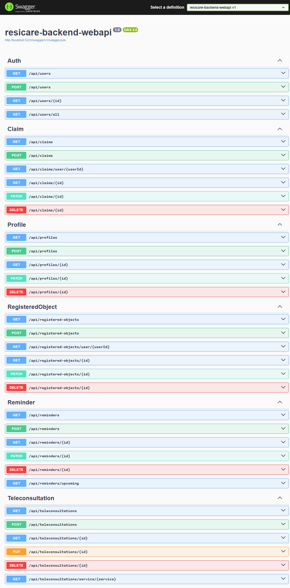

##### 5.2.3.6. Services Documentation Evidence for Sprint Review

Se ha desarrollado una API RESTful para el Backend de la aplicación. A continuación se muestra la documentación de los servicios implementados.

| Endpoint            | Action                               | HTTP Method | Call Syntax                                       |
|---------------------|--------------------------------------|-------------|---------------------------------------------------|
| **Auth**            | Get all users                        | GET         | `/api/users`                                      |
|                     | Create user                          | POST        | `/api/users`                                      |
|                     | Get user by ID                       | GET         | `/api/users/{id}`                                 |
|                     | Get all users (no paging)            | GET         | `/api/users/all`                                  |
| **Claim**           | List claims                          | GET         | `/api/claims`                                     |
|                     | Create claim                         | POST        | `/api/claims`                                     |
|                     | Get claims by user                   | GET         | `/api/claims/user/{userId}`                       |
|                     | Get claim by ID                      | GET         | `/api/claims/{id}`                                |
|                     | Update claim (partial)               | PATCH       | `/api/claims/{id}`                                |
|                     | Delete claim                         | DELETE      | `/api/claims/{id}`                                |
| **Profile**         | List profiles                        | GET         | `/api/profiles`                                   |
|                     | Create profile                       | POST        | `/api/profiles`                                   |
|                     | Get profile by ID                    | GET         | `/api/profiles/{id}`                              |
|                     | Update profile (partial)             | PATCH       | `/api/profiles/{id}`                              |
|                     | Delete profile                       | DELETE      | `/api/profiles/{id}`                              |
| **RegisteredObject**| List registered objects              | GET         | `/api/registered-objects`                         |
|                     | Create registered object             | POST        | `/api/registered-objects`                         |
|                     | Get objects by user                  | GET         | `/api/registered-objects/user/{userId}`           |
|                     | Get object by ID                     | GET         | `/api/registered-objects/{id}`                    |
|                     | Update registered object (partial)   | PATCH       | `/api/registered-objects/{id}`                    |
|                     | Delete registered object             | DELETE      | `/api/registered-objects/{id}`                    |
| **Reminder**        | List reminders                       | GET         | `/api/reminders`                                  |
|                     | Create reminder                      | POST        | `/api/reminders`                                  |
|                     | Get reminder by ID                   | GET         | `/api/reminders/{id}`                             |
|                     | Update reminder (partial)            | PATCH       | `/api/reminders/{id}`                             |
|                     | Delete reminder                      | DELETE      | `/api/reminders/{id}`                             |
|                     | Upcoming reminders                   | GET         | `/api/reminders/upcoming`                         |
| **Teleconsultation**| List teleconsultations               | GET         | `/api/teleconsultations`                          |
|                     | Create teleconsultation              | POST        | `/api/teleconsultations`                          |
|                     | Get teleconsultation by ID           | GET         | `/api/teleconsultations/{id}`                     |
|                     | Update teleconsultation (replace)    | PUT         | `/api/teleconsultations/{id}`                     |
|                     | Delete teleconsultation              | DELETE      | `/api/teleconsultations/{id}`                     |
|                     | Get by service                       | GET         | `/api/teleconsultations/service/{service}`        |

##### 5.2.3.7 Software Deployment Evidence for Sprint Review

**Backend Deployment**
 
Para el despliegue del backend de nuestro proyecto ResiCare, realizamos el proceso mediante la plataforma Render, configurando un servicio web con Docker. A continuación, se detalla el procedimiento seguido:
 
**1)Acceso y Configuración del Servicio**
 
Iniciamos sesión en Render y accedimos a nuestro panel principal. Desde allí, creamos un nuevo Web Service denominado resicare-backend, asociado a nuestro repositorio de GitHub:
https://github.com/Grupo-2-Aplicaciones-Web-ResiSeguro/resicare-backend.
 
**2)Configuración General del Servicio**
 
En la sección Settings, verificamos y establecimos los siguientes parámetros:

Name: resicare-backend

Region: Oregon (US West), para asegurar una comunicación óptima dentro de la red privada.

Instance Type: Plan Free, con una asignación de 0.1 CPU y 512 MB de RAM, suficientes para entornos de desarrollo y pruebas iniciales.
 
**3)Configuración del Repositorio y Rama**
 
En el apartado Build & Deploy, vinculamos correctamente el repositorio de GitHub del grupo, seleccionando la rama develop como fuente de construcción y despliegue automático.
Esto garantiza que cualquier cambio realizado y confirmado en dicha rama pueda ser actualizado mediante un despliegue manual o automatizado.
 
**4)Configuración del Docker y Entorno**
Previamente, incluimos en el repositorio el archivo Dockerfile, necesario para que Render pueda construir el entorno del contenedor y ejecutar la aplicación de backend correctamente.
Además, configuramos las variables de entorno necesarias para la conexión con la base de datos, asegurando que las credenciales y direcciones fueran compatibles con el servicio externo utilizado.
 

**5)Conexión con la Base de Datos**
Creamos una base de datos en FreeSQLDatabase.com, donde generamos el host, puerto, usuario, contraseña y nombre de base de datos.
Estos datos fueron integrados en las variables de entorno de Render para establecer la conexión directa entre el backend y la base de datos remota.
 
**6)Despliegue del Servicio Web**
Tras completar la configuración, realizamos el despliegue seleccionando la opción Manual Deploy → Deploy Web Service.
Durante el proceso, Render compiló la imagen Docker y ejecutó el contenedor de manera automática, habilitando así el backend.
 
**Verificación del Despliegue**
Finalmente, una vez completado el proceso, el sistema generó un enlace público de acceso al servicio web:
https://resicare-backend.onrender.com
https://resicare-backend.onrender.com/swagger/index.html
 
A través de esta URL se puede verificar el correcto funcionamiento del backend y su disponibilidad para el consumo desde el frontend o pruebas con herramientas externas (como Postman).
 
Backend:

  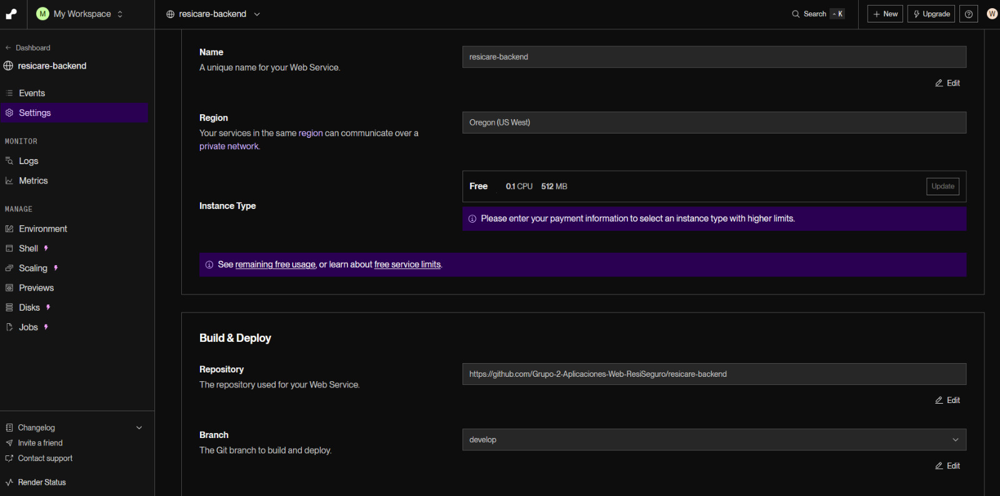

  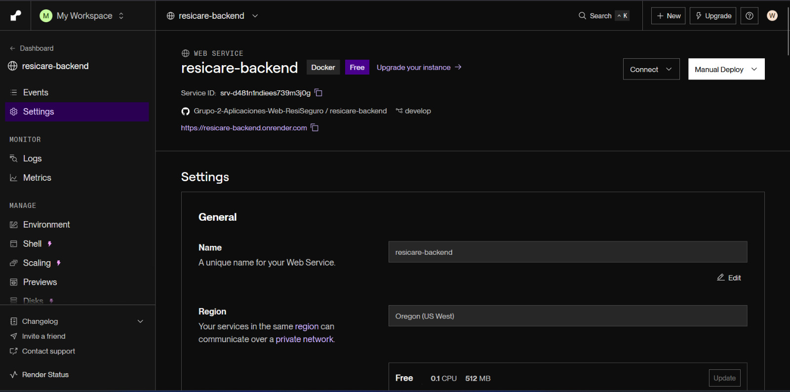

##### 5.2.3.8. Team Collaboration Insights during Sprint
Durante el Sprint 3, el equipo de desarrollo trabajó de manera colaborativa para implementar las funcionalidades clave de la nueva Landing Page y la primera version nueva version del Front End ademas de la primera version del Backend. A través de reuniones periódicas en Discord, se lograron coordinar de manera eficiente las tareas asignadas a cada miembro del equipo. A continuación, se presenta un resumen de las actividades y la colaboración del equipo.
Front End: 

  

Informe: 

  

Landing Page: 

  

Backend:

  

#### 5.2.4 Sprint 4

##### 5.2.4.1 Sprint Planning 4

El propósito de este cuarto sprint es consolidar y solucionar las observaciones pendientes que nos comentó el profesor, y concluir con la construcción funcional de la aplicación. Nos enfocaremos en implementar los ajustes finales y optimizar nuestro frontend desarrollado durante todo el proyecto, así como conectar el backend con el frontend, incorporandolo mediante un despligue. Esto permitirá terminar la implementación de la aplicación en su totalidad.

| **Sprint #**                   | Sprint 4                                                                                                                                                                                                                                        |
| ------------------------------ | ------------------------------------------------------------------------------------------------------------------------------------------------------------------------------------------------------------------------------------------------- |
| **Sprint Planning Background** |                                                                                                                                                                                                                                                   |
| **Date**                       | 26/11/2025                                                                                                                                                                                                                                        |
| **Location**                   | El desarrollo de la reunión se realizó virtualmente por medio de Discord                                                                                                                                                                          |
| **Prepared By**                | Carlo Ramirez , José Pariona, Héctor Ríos, Jude Hermoza                                                                                                                                                       |
| **Asistentes (planning meeting)**   | Carlo Ramirez , José Pariona, Héctor Ríos, Jude Hermoza                                                                                                                                                                         |
| **Sprint 3 Review Summary**    | Se ha mejorado varios puntos con respecto al reporte según las observaciones que mencionó el profesor. Además, se concretaron los últimos ajustes al frontend y backend, logrando su unión y despliegue total.                                                                               |
| **Sprint 3 Retrospective Summary** | Hubo un correcto progreso respecto al proyecto y de manera grupal, aunque con algunas posibles mejoras posteriores se avanzó como se esperaba. Consideramos que nuestro frontend y backend cumple con lo esperado.                      |
| **Sprint 4 Goal**              | Nuestra prioridad en este sprint es la culminación del reporte, frontend y backend. Añadiendo validaciones entre bounded context y desplegando el backend y frontend unidos. Creemos que esto podrá brindar la totalidad de funcionalidades que posee nuestra propuesta. Esto se confirmará cuando nuestro frontend y backend estén desplegados y conectados. |
| **Sprint 4 Velocity**          |   Se estimarón un total de  34 story points                                                                                                                                                                                                                                        |
| **Sum of Story Points**        |      Nuestro equipo alcanzó      34 story points                                                                                                                                                                                                                                            |

##### 5.2.4.2 Aspect Leaders and Collaborators

Durante este Sprint, el equipo se centró en consolidar las observaciones realizadas previamente, conectar de forma definitiva el frontend con el backend y concluir con el despliegue funcional de la aplicación. Como parte de esta etapa final, se realizó la integración total del frontend en una sola vista principal, se mejoró visualmente la interfaz, y se fortaleció el diseño del backend mediante la aplicación del enfoque DDD (Domain-Driven Design) con sus respectivos bounded contexts. Además, se ejecutó la conexión efectiva entre el backend y frontend a través del despliegue.

| Integrante                        | GitHub                 | Excepciones de Claims | Excepciones de Telecommunications | Excepciones de Reminders | Excepciones de Profile & IAM | Excepciones de Registered Objects | Internacionalización | Corrección del Frontend |
| --------------------------------- | ---------------------- | --------------------- | --------------------------------- | ------------------------ | ---------------------------- | --------------------------------- | -------------------- | ----------------------- |
| Hermoza Quispe, Jude Alessandro   | JvynnDev               | **L**                 | C                                 |                          | C                            |                                   |                      |                         |
| Ramírez Escalante, Carlo Patricio | Carlo211               | C                     | **L**                             | C                        |                              |                                   |                      |                         |
| Pariona Lucas, Jose Manuel        | parionalucasjosemanuel |                       | C                                 | **L**                    |                              | C                                 | **L**                |                         |
| Ríos Pacheco, Héctor Javier       | Khafna09               |                       |                                   | C                        |                              | **L**                             |                      | **L**                   |

##### 5.2.4.3 Sprint Backlog 4

## 5.2.4.3 Sprint Backlog 4
Esta sección describe de forma resumida el objetivo principal del sprint, resaltando las metas propuestas y las funcionalidades que se planean desarrollar. A continuación, se incluye una captura del tablero del sprint gestionado en la herramienta Trello, junto con el enlace público correspondiente. También se presenta una tabla que detalla las User Stories asignadas al sprint, los Work-items o tareas asociadas, y las actividades adicionales requeridas para cumplir con los objetivos establecidos. Este es nuestro link de invitación a nuestro Trello:
 
https://trello.com/b/c2UoXoEI/sprint-backlog-4
 

  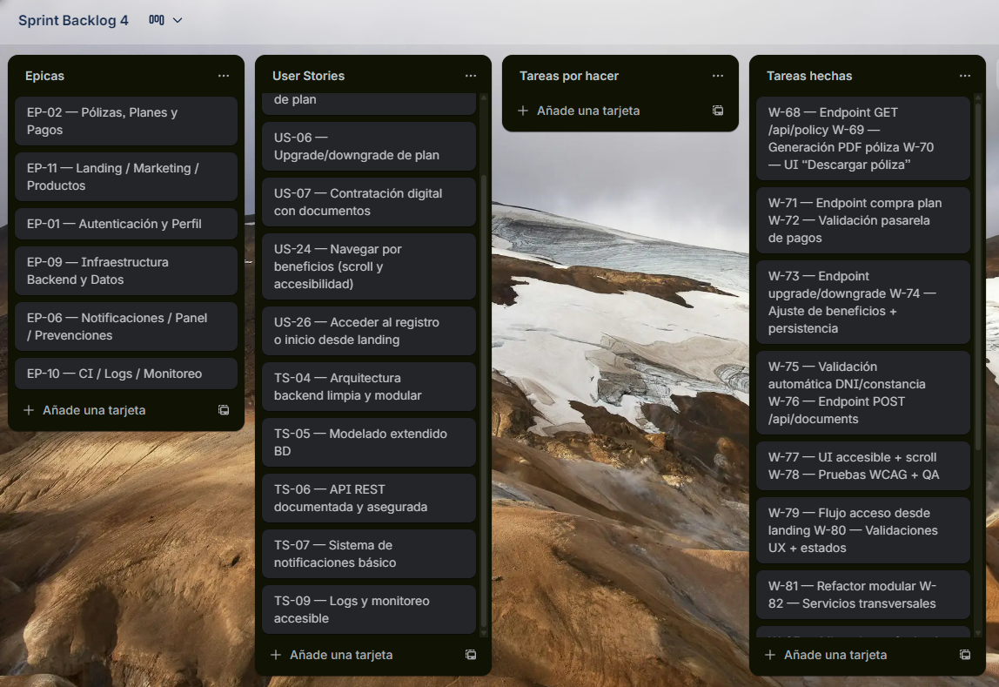

En este sprint se implementaron funcionales relacionadas a pólizas, planes, validación documental y mejoras técnicas de backend.  
A continuación se detalla la tabla con las User Stories y Technical Stories completadas durante el sprint.

| Story ID  | Story Title                                     | Task ID | Task Title                                              | Description                                                     | Estimation (Hrs) | Assigned To    | Status |
| --------- | ----------------------------------------------- | ------- | ------------------------------------------------------- | --------------------------------------------------------------- | ---------------- | -------------- | ------ |
| **US-24** | Navegar por beneficios (scroll y accesibilidad) | W-77    | Implementación UI de navegación accesible en beneficios | Scroll fluido, foco accesible y mejoras visuales en beneficios. | 4                | Equipo Backend | Done   |
| US-24     | Navegar por beneficios (scroll y accesibilidad) | W-78    | Pruebas de accesibilidad + QA de navegación             | Pruebas WCAG, contraste, tabulación y navegación por teclado.   | 2                | Héctor Ríos    | Done   |
| US-24     | Navegar por beneficios (scroll y accesibilidad) | W-89    | Adición de atributos ARIA en componentes                | Roles, labels y ARIA para accesibilidad en tarjetas y UI.       | 2                | Jude Hermoza   | Done   |
| **US-26** | Acceder al registro o inicio desde landing      | W-79    | Implementación del flujo de acceso                      | Conectar botones desde landing hacia login/registro.            | 3                | José Pariona   | Done   |
| US-26     | Acceder al registro o inicio desde landing      | W-80    | Validaciones UX + manejo de estados                     | Manejo de loading, errores y retorno post login/registro.       | 2                | Jude Hermoza   | Done   |
| US-26     | Acceder al registro o inicio desde landing      | W-90    | Actualización/redirección Landing page                  | Ajuste de contenido y routing posterior al login.               | 2                | Carlo Patricio | Done   |
| **TS-04** | Arquitectura backend limpia y modular           | W-81    | Refactorización modular avanzada                        | Separación en controllers, services, repositories y DTOs.       | 3                | Héctor Ríos    | Done   |
| TS-04     | Arquitectura backend limpia y modular           | W-82    | Optimización de servicios transversales                 | Unificación de lógica compartida (archivos, auth, logs).        | 2                | Héctor Ríos    | Done   |
| **TS-06** | API REST documentada y asegurada                | W-85    | Documentación en Swagger Sprint 4                       | Incorporar endpoints (policies, plans, documents).              | 2                | Héctor Ríos    | Done   |
| TS-06     | API REST documentada y asegurada                | W-86    | Protección de rutas + JWT testing                       | Roles, expiración, refresh y códigos 401/403.                   | 2                | Carlo Patricio | Done   |
| **TS-08** | Implementación de ACL y autorización            | W-91    | Implementación sistema ACL                              | Roles, permisos y control de acceso en endpoints críticos.      | 4                | Héctor Ríos    | Done   |
| TS-08     | Implementación de ACL y autorización            | W-92    | Middleware de autorización y excepciones                | Validación de permisos + manejo centralizado de errores.        | 3                | Carlo Patricio | Done   |
| **TS-09** | Calculadora de reembolso mejorada               | W-93    | Mejora del algoritmo de reembolso                       | Optimización para planes, topes y coaseguros.                   | 3                | José Pariona   | Done   |
| TS-09     | Calculadora de reembolso mejorada               | W-94    | Validación y testing edge cases                         | Pruebas unitarias para montos máximos y casos límite.           | 2.5              | Héctor Ríos    | Done   |
| **TS-10** | Globalización y traducciones backend            | W-95    | Implementación i18n en backend                          | Soporte para mensajes ES/EN en API.                             | 3                | José Pariona y Carlo Ramirez  | Done   |
| TS-10     | Globalización y traducciones backend            | W-96    | Adición de traducciones y validaciones                  | Traducciones para errores y responses.                          | 2                | Jude Hermoza   | Done   |

##### 5.2.4.4 Development Evidence for Sprint Review

| Repository          | Branch                       | Commit ID                                | Commit Message                                                                  | Commit Message Body (Interpretado)                                  | Committed on |
| ------------------- | ---------------------------- | ---------------------------------------- | ------------------------------------------------------------------------------- | ------------------------------------------------------------------- | ------------ |
| resiseguro-resicare | feature/rios                 | cce96aa2b95e797c079a51e1ed8379f6196e790c | feat: adding outcome TF1                                                        | Se registra TF1 dentro de la documentación del sprint               | 2025-11-30   |
| resiseguro-resicare | feature/rios                 | c1e3c305d11358d22b55eaba3c8f3205c527ee0c | fix: sprint planning story points                                               | Ajuste de estimaciones del Sprint Planning 4                        | 2025-11-30   |
| resiseguro-resicare | feature/rios                 | 5df6ddc7723010a9dcaf6b25af7a840d654f5277 | fix: sprint backlog 4                                                           | Corrección de histórico y Story Points                              | 2025-11-30   |
| resiseguro-resicare | feature/pariona              | 4cdeeb672d3abd9d87eed19deea5fae1c99f7148 | docs: add Software Deployment Evidence for Sprint Review 5.2.4.7                | Evidencia de despliegue para revisión del Sprint                    | 2025-11-28   |
| resiseguro-resicare | feature/pariona              | e07133cb10a0f94086b5f55a276e2f302aaa91fe | docs: update README.md → (Reasignado: 5.2.4.4 Development Evidence)             | Se agrega evidencia de avance en desarrollo Sprint 4                | 2025-11-27   |
| resiseguro-resicare | feature/hermoza *(asignado)* | ed18c70d6f82627925a700d9bc2029def833ad9f | docs: update README.md → (Reasignado: 5.2.4.5 Execution Evidence)               | Evidencia de ejecución de tareas implementadas                      | 2025-11-27   |
| resiseguro-resicare | feature/pariona              | 192662700d6d84b798db45eb950c47dcb5ce5542 | Add files via upload                                                            | Se añaden documentos del Sprint 4                                   | 2025-11-27   |
| resiseguro-resicare | feature/pariona              | 351729ca08395262d394895a223277c46449dc5a | docs: update README.md → (Reasignado: 5.2.4.6 Services Documentation)           | Documentación técnica de servicios Sprint 4                         | 2025-11-27   |
| resiseguro-resicare | feature/ramirez              | 473364af0569b754dd39dc7fec7d85c8f1b85531 | Merge pull request #28 from Grupo-2-Aplicaciones-Web-ResiSeguro/feature/Ramirez | Merge de documentación de servicios (Sprint Review)                 | 2025-11-27   |
| resiseguro-resicare | feature/ramirez              | 4706f29d81f2c1d36505cad70ae32a7ad1eeac57 | feat: add services documentation evidence for sprint 4 review                   | Evidencia de documentación de servicios para la revisión del sprint | 2025-11-27   |
| resiseguro-resicare | feature/rios                 | 06505250c69a4b23d3a9d5a14b3e9af52878ae65 | feat: adding sprint planning 4, aspect leaders and collaborators                | Sprint Planning 4 + Líderes y colaboradores definidos               | 2025-11-26   |
| resiseguro-resicare | feature/rios                 | c051983f4bd17abe548ce5f63aec1a5d4ebbd4f7 | docs: updating index for sprint 4                                               | Actualización de índice Sprint 4 (Sprint Backlog 5.2.4.3)           | 2025-11-26   |

##### 5.2.4.5 Execution Evidence for Sprint Review

**FrontEnd:**
 
Uso de atributos aria y conrrección de la calculadora
 

  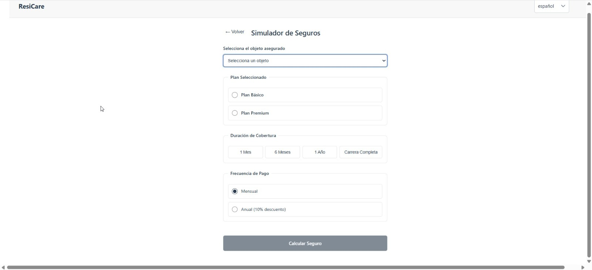

  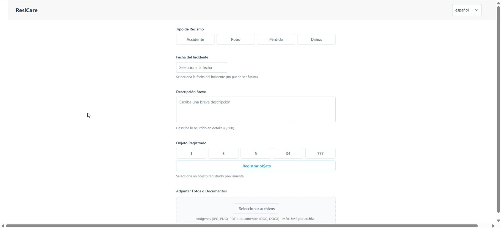

  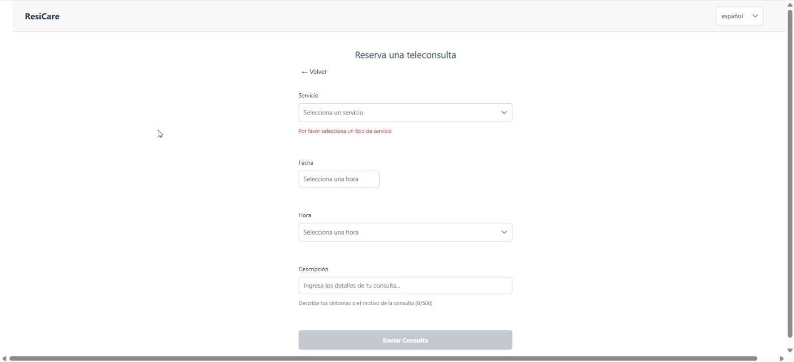

 

**BackEnd:**
 
Uso actualizado de excepciones por middelware
 

  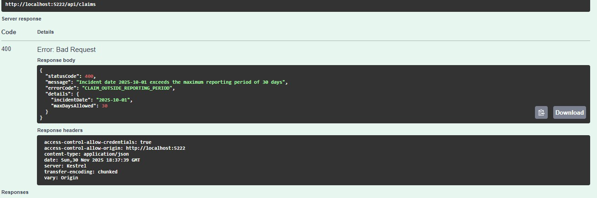

  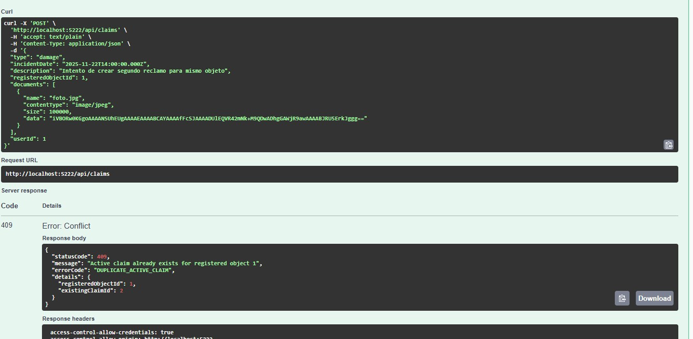

  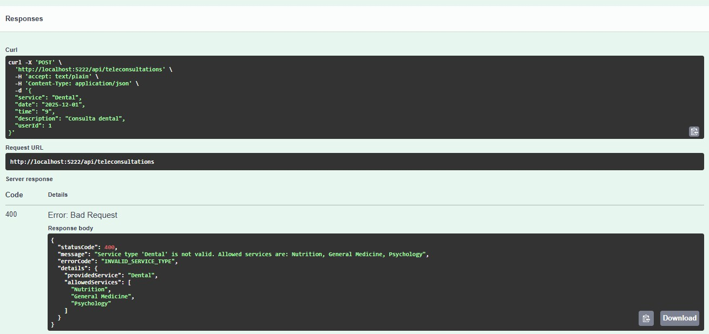

  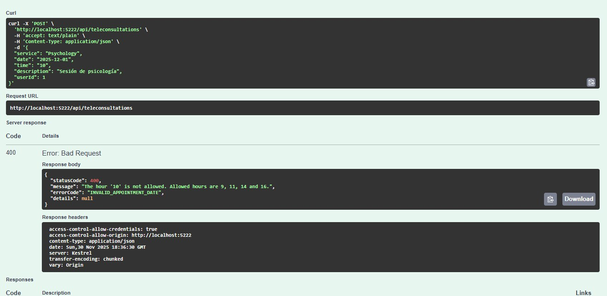

 

**Landing:**
 
Ingreso al registro desde la landing page:

  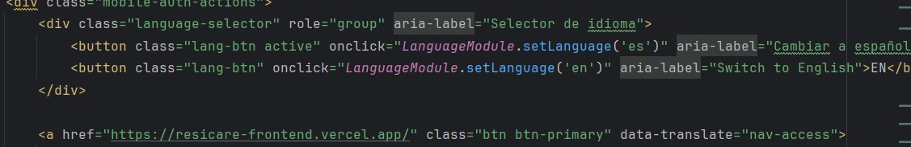

  

##### 5.2.4.6 Services Documentation Evidence for Sprint Review

### Auth / Users

| Endpoint            | Acción                                | Método HTTP | Sintaxis de llamada    | Parámetros                                                                 |
|---------------------|----------------------------------------|------------|------------------------|----------------------------------------------------------------------------|
| `/api/users`        | Autenticar usuario (login)            | GET        | `/api/users`           | `email` (query, string), `password` (query, string)                        |
| `/api/users`        | Crear nuevo usuario                   | POST       | `/api/users`           | **Body (JSON):** `name`, `email`, `password`, `rol`                        |
| `/api/users/{id}`   | Obtener usuario por ID                | GET        | `/api/users/{id}`      | `id` (path, int)                                                           |
| `/api/users/all`    | Obtener todos los usuarios            | GET        | `/api/users/all`       | Ninguno                                                                    |

  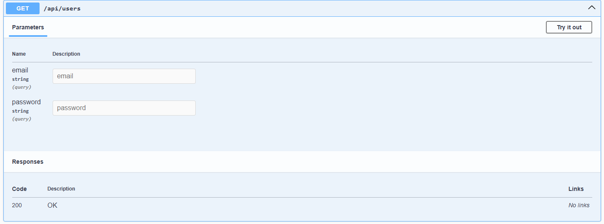

  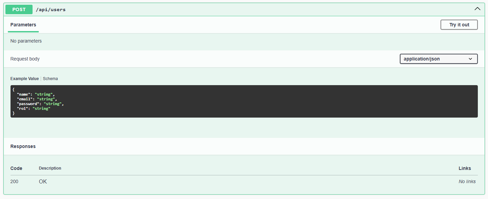

  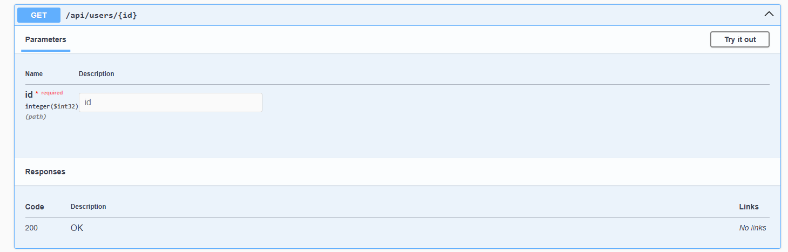

  

### Claims

| Endpoint                         | Acción                                           | Método HTTP | Sintaxis de llamada              | Parámetros                                                                                                       |
|----------------------------------|--------------------------------------------------|------------|----------------------------------|------------------------------------------------------------------------------------------------------------------|
| `/api/claims`                    | Listar reclamos (con filtros opcionales)        | GET        | `/api/claims`                    | `status` (query, string), `userId` (query, int)                                                                  |
| `/api/claims`                    | Crear un nuevo reclamo                          | POST       | `/api/claims`                    | **Body (JSON):** `type`, `incidentDate`, `description`, `registeredObjectId`, `documents[]`, `userId`           |
| `/api/claims/user/{userId}`      | Listar reclamos de un usuario                   | GET        | `/api/claims/user/{userId}`      | `userId` (path, int)                                                                                             |
| `/api/claims/{id}`               | Obtener un reclamo por ID                       | GET        | `/api/claims/{id}`               | `id` (path, int)                                                                                                 |
| `/api/claims/{id}`               | Actualizar un reclamo por ID                    | PATCH      | `/api/claims/{id}`               | `id` (path, int). **Body (JSON):** `status`, `description`, `registeredObjectId`, `rating`                      |
| `/api/claims/{id}`               | Eliminar un reclamo por ID                      | DELETE     | `/api/claims/{id}`               | `id` (path, int)                                                                                                 |

  

  

  

  

  

  

### Profiles

| Endpoint               | Acción                                      | Método HTTP | Sintaxis de llamada       | Parámetros                                                                                                                                    |
|------------------------|---------------------------------------------|------------|---------------------------|-----------------------------------------------------------------------------------------------------------------------------------------------|
| `/api/profiles`        | Obtener perfil por ID de usuario            | GET        | `/api/profiles`           | `userId` (query, int)                                                                                                                         |
| `/api/profiles`        | Crear un nuevo perfil                       | POST       | `/api/profiles`           | **Body (JSON):** `userId`, `nombre`, `correo`, `edad`, `residencia`, `telefono`, `genero`, `nivelInstruccion`, `photoDni`, `photoCredential`, `bio` |
| `/api/profiles/{id}`   | Obtener un perfil por ID de perfil          | GET        | `/api/profiles/{id}`      | `id` (path, int)                                                                                                                              |
| `/api/profiles/{id}`   | Actualizar un perfil por ID                 | PATCH      | `/api/profiles/{id}`      | `id` (path, int). **Body (JSON):** `nombre`, `correo`, `edad`, `residencia`, `telefono`, `genero`, `nivelInstruccion`, `photoDni`, `photoCredential`, `bio` |
| `/api/profiles/{id}`   | Eliminar un perfil por ID                   | DELETE     | `/api/profiles/{id}`      | `id` (path, int)                                                                                                                              |

  

  

  

  

  

### Registered Objects

| Endpoint                                  | Acción                                              | Método HTTP | Sintaxis de llamada                        | Parámetros                                                                                                           |
|-------------------------------------------|-----------------------------------------------------|------------|--------------------------------------------|----------------------------------------------------------------------------------------------------------------------|
| `/api/registered-objects`                 | Listar objetos registrados (con búsqueda/filtros)   | GET        | `/api/registered-objects`                 | `q` (query, string), `userId` (query, int)                                                                           |
| `/api/registered-objects`                 | Registrar un nuevo objeto                           | POST       | `/api/registered-objects`                 | **Body (JSON):** `tipo`, `nombre`, `descripcionBreve`, `precio`, `numeroSerie`, `foto`, `fechaRegistro`, `userId`   |
| `/api/registered-objects/user/{userId}`   | Listar objetos registrados de un usuario            | GET        | `/api/registered-objects/user/{userId}`   | `userId` (path, int)                                                                                                 |
| `/api/registered-objects/{id}`            | Obtener un objeto registrado por ID                 | GET        | `/api/registered-objects/{id}`            | `id` (path, int)                                                                                                     |
| `/api/registered-objects/{id}`            | Actualizar un objeto registrado por ID              | PATCH      | `/api/registered-objects/{id}`            | `id` (path, int). **Body (JSON):** `tipo`, `nombre`, `descripcionBreve`, `precio`, `numeroSerie`, `foto`, `fechaRegistro` |
| `/api/registered-objects/{id}`            | Eliminar un objeto registrado por ID                | DELETE     | `/api/registered-objects/{id}`            | `id` (path, int)                                                                                                     |

  

  

  

  

  

  

### Reminders

| Endpoint                      | Acción                                          | Método HTTP | Sintaxis de llamada              | Parámetros                                                                                   |
|-------------------------------|-------------------------------------------------|------------|----------------------------------|----------------------------------------------------------------------------------------------|
| `/api/reminders`              | Listar recordatorios de un usuario              | GET        | `/api/reminders`                 | `userId` (query, int)                                                                        |
| `/api/reminders`              | Crear un nuevo recordatorio                     | POST       | `/api/reminders`                 | **Body (JSON):** `userId`, `title`, `type`, `date`, `time`, `notes`                          |
| `/api/reminders/{id}`         | Obtener un recordatorio por ID                  | GET        | `/api/reminders/{id}`            | `id` (path, int)                                                                             |
| `/api/reminders/{id}`         | Actualizar un recordatorio por ID               | PATCH      | `/api/reminders/{id}`            | `id` (path, int). **Body (JSON):** `title`, `type`, `date`, `time`, `notes`                 |
| `/api/reminders/{id}`         | Eliminar un recordatorio por ID                 | DELETE     | `/api/reminders/{id}`            | `id` (path, int)                                                                             |
| `/api/reminders/upcoming`     | Listar próximos recordatorios de un usuario     | GET        | `/api/reminders/upcoming`        | `userId` (query, int)                                                                        |

  

  

  

  

  

  

### Teleconsultations

| Endpoint                                        | Acción                                         | Método HTTP | Sintaxis de llamada                           | Parámetros                                                                                  |
|------------------------------------------------|-----------------------------------------------|------------|-----------------------------------------------|---------------------------------------------------------------------------------------------|
| `/api/teleconsultations`                       | Obtener las teleconsultas de un usuario       | GET        | `/api/teleconsultations`                      | `userId` (query, int)                                                                       |
| `/api/teleconsultations`                       | Crear una nueva teleconsulta                  | POST       | `/api/teleconsultations`                      | **Body (JSON):** `service`, `date`, `time`, `description`, `userId`                         |
| `/api/teleconsultations/{id}`                  | Obtener una teleconsulta por ID               | GET        | `/api/teleconsultations/{id}`                 | `id` (path, int)                                                                            |
| `/api/teleconsultations/{id}`                  | Actualizar una teleconsulta por ID            | PUT        | `/api/teleconsultations/{id}`                 | `id` (path, int). **Body (JSON):** `service`, `date`, `time`, `description`                |
| `/api/teleconsultations/{id}`                  | Eliminar una teleconsulta por ID              | DELETE     | `/api/teleconsultations/{id}`                 | `id` (path, int)                                                                            |
| `/api/teleconsultations/service/{service}`     | Obtener teleconsultas por tipo de servicio    | GET        | `/api/teleconsultations/service/{service}`    | `service` (path, string)                                                                    |

  

  

  

  

  

  

##### 5.2.4.7 Software Deployment Evidence for Sprint Review

**Deployment**
**LANDING PAGE**
 
Para despegar la landing page, se utiliza GitHub Pages:
  
   
Para crear la Organización en Github seguimos los siguientes pasos:
  
  
  
  
  

  

  

Para nuestro proyecto se creo 1 repositorio de nombre **Landing-Page**, el cual usamos para subir la landing page y desarrollar continuamente el informe del proyecto.
Link de la Landing Page desplegada:  https://grupo-2-aplicaciones-web-resiseguro.github.io/resicare-landing-page/

 

**FRONTEND**
 
Link del Front End desplegada: https://resicare-frontend-psi.vercel.app/
 

  

  

  

  

  

  

  

  

 

  

**BACKEND**
 
**Backend Deployment**
 
Para el despliegue del backend de nuestro proyecto ResiCare, realizamos el proceso mediante la plataforma Render, configurando un servicio web con Docker. A continuación, se detalla el procedimiento seguido:
 
**1)Acceso y Configuración del Servicio**
 
Iniciamos sesión en Render y accedimos a nuestro panel principal. Desde allí, creamos un nuevo Web Service denominado resicare-backend, asociado a nuestro repositorio de GitHub:
https://github.com/Grupo-2-Aplicaciones-Web-ResiSeguro/resicare-backend.
 
**2)Configuración General del Servicio**
 
En la sección Settings, verificamos y establecimos los siguientes parámetros:

Name: resicare-backend

Region: Oregon (US West), para asegurar una comunicación óptima dentro de la red privada.

Instance Type: Plan Free, con una asignación de 0.1 CPU y 512 MB de RAM, suficientes para entornos de desarrollo y pruebas iniciales.
 
**3)Configuración del Repositorio y Rama**
 
En el apartado Build & Deploy, vinculamos correctamente el repositorio de GitHub del grupo, seleccionando la rama develop como fuente de construcción y despliegue automático.
Esto garantiza que cualquier cambio realizado y confirmado en dicha rama pueda ser actualizado mediante un despliegue manual o automatizado.
 
**4)Configuración del Docker y Entorno**
Previamente, incluimos en el repositorio el archivo Dockerfile, necesario para que Render pueda construir el entorno del contenedor y ejecutar la aplicación de backend correctamente.
Además, configuramos las variables de entorno necesarias para la conexión con la base de datos, asegurando que las credenciales y direcciones fueran compatibles con el servicio externo utilizado.
 

**5)Conexión con la Base de Datos**
Creamos una base de datos en FreeSQLDatabase.com, donde generamos el host, puerto, usuario, contraseña y nombre de base de datos.
Estos datos fueron integrados en las variables de entorno de Render para establecer la conexión directa entre el backend y la base de datos remota.
 
**6)Despliegue del Servicio Web**
Tras completar la configuración, realizamos el despliegue seleccionando la opción Manual Deploy → Deploy Web Service.
Durante el proceso, Render compiló la imagen Docker y ejecutó el contenedor de manera automática, habilitando así el backend.
 
**Verificación del Despliegue**
Finalmente, una vez completado el proceso, el sistema generó un enlace público de acceso al servicio web:
https://resicare-backend.onrender.com
 
https://resicare-backend.onrender.com/swagger/index.html
 
A través de esta URL se puede verificar el correcto funcionamiento del backend y su disponibilidad para el consumo desde el frontend o pruebas con herramientas externas (como Postman).
 
Backend:

  

  

  

##### 5.2.4.8 Team Collaboration Insights during Sprint
 
Durante el Sprint 4, el equipo de desarrollo trabajó de manera colaborativa para implementar las funcionalidades clave de las versiones finales tanto Landing Page, Informe, Frontend y Backend. A través de reuniones periódicas en Discord, se lograron coordinar de manera eficiente las tareas asignadas a cada miembro del equipo. A continuación, se presenta un resumen de las actividades y la colaboración del equipo. 
 

**Informe:**
 

  

 

**Landing:**
 

  

 

**Frontend:**
 

  

 

**Backend:**
 

  

 

## 5.3 Validation interviews

### 5.3.1 Diseño de Entrevistas
Con el objetivo de validar la interfaz desarrollada hasta el momento, se realizaron entrevistas y sesiones de revisión con usuarios para obtener retroalimentación sobre el diseño, usabilidad y funcionalidades del frontend.

#### Preguntas generales:

1. ¿Cúal es tu nombre y cuantos años tienes?

2. ¿Tienes experiencia previa usando aplicaciones web similares?

3. ¿Cuál es tu nivel de familiaridad con aplicaciones de tipo gestión o administración de contenido?

#### Preguntas sobre el frontend:

1. ¿Qué te parece en general el diseño y la presentación del frontend?

2. ¿La navegación entre las secciones te pareció clara y fácil de usar?

3. ¿Los textos, botones e íconos son comprensibles y cumplen su función?

4. ¿Te pareció intuitiva la interfaz? ¿Pudiste entender fácilmente cómo interactuar con ella sin ayuda externa?

5. ¿Hay elementos que consideras innecesarios o que no aportan valor a la experiencia?

6. ¿Sientes que el diseño responde bien a diferentes tamaños de pantalla?

7. ¿Qué mejorarías o agregarías a este frontend para que sea más completo o útil?

8. ¿Cambiarías algo en la distribución, colores, tipografías o iconografía del sitio?

9. ¿Te gustaría ver más animaciones, confirmaciones visuales u otros elementos interactivos al realizar acciones?

10. ¿Hubo algún momento en que te sentiste confundido o no sabías qué hacer a continuación?
### 5.3.2 Registro de Entrevistas
### Entrevista #1

  

Gabriel Gordon (21 años) prueba una aplicación web para estudiantes y comparte una opinión muy positiva. Le gustó el diseño visual, destacando la armonía de los colores y la buena organización de los elementos. Mencionó que la navegación es clara y sencilla, y que los textos, botones e íconos son fácilmente comprensibles. Consideró que la interfaz es intuitiva, ya que pudo usarla sin ayuda, y valoró su adaptabilidad a diferentes dispositivos. Como mejora, sugirió añadir imágenes o pequeños elementos interactivos para hacer la experiencia más dinámica. En general, calificó la aplicación como simple, funcional y agradable de usar, sin presentar dificultades ni confusiones.

| Detalle          | Información                                |
|------------------|--------------------------------------------|
| **Entrevistador** | Héctor Javier Rios Pacheco            |
| **Entrevistado**  | Gabriel Fernando Gordon                |
| **Edad**          | 21 años                                    |
| **Duración**      | 3:52 minutos                               |
| **Enlace**        | https://upcedupe-my.sharepoint.com/:v:/g/personal/u20231c540_upc_edu_pe/EWqBfSsPg39ItbHrGTRtuosB0cUUe7XD_hzZ-rARqQ8_qQ?e=pVhdAb&nav=eyJyZWZlcnJhbEluZm8iOnsicmVmZXJyYWxBcHAiOiJTdHJlYW1XZWJBcHAiLCJyZWZlcnJhbFZpZXciOiJTaGFyZURpYWxvZy1MaW5rIiwicmVmZXJyYWxBcHBQbGF0Zm9ybSI6IldlYiIsInJlZmVycmFsTW9kZSI6InZpZXcifX0%3D |

### Entrevista #2

  

Leonardo Prieto, quien evalúa una plataforma web para estudiantes enfocada en seguros o ayuda estudiantil. Leonardo considera que el diseño es limpio, profesional y bien organizado, con una navegación clara e intuitiva. Destaca que los textos, íconos y botones son comprensibles, y que la interfaz funciona correctamente tanto en computadora como en dispositivos móviles. Sugiere mejorar el aprovechamiento del espacio y propone incorporar notificaciones, contrastes más marcados en botones principales y pequeñas animaciones para hacer la experiencia más dinámica. Aunque no encontró dificultades al usar la aplicación, recomienda clarificar la diferencia entre “My Claims” y “CL History”. En general, califica la plataforma como funcional, accesible y centrada en el usuario.

| Detalle          | Información                                |
|------------------|--------------------------------------------|
| **Entrevistador** | Héctor Javier Rios Pacheco            |
| **Entrevistado**  | Leonardo Prieto Mantari                |
| **Edad**          | 20 años                                    |
| **Duración**      | 3:31 minutos                               |
| **Enlace**        | https://upcedupe-my.sharepoint.com/:v:/g/personal/u20231c540_upc_edu_pe/IQB0rfAKo5zRQagP6OHtOdK8AeLx9LSG3RIVv09uy5jvAiw?e=FCjbQe&nav=eyJyZWZlcnJhbEluZm8iOnsicmVmZXJyYWxBcHAiOiJTdHJlYW1XZWJBcHAiLCJyZWZlcnJhbFZpZXciOiJTaGFyZURpYWxvZy1MaW5rIiwicmVmZXJyYWxBcHBQbGF0Zm9ybSI6IldlYiIsInJlZmVycmFsTW9kZSI6InZpZXcifX0%3D |

### Entrevista #3

  

Marcia Melgarejo comparte una evaluación positiva de su experiencia. Aunque no tenía experiencia previa con aplicaciones similares, considera que la plataforma es clara, intuitiva e innovadora, destacando que el diseño es limpio y fácil de usar. Valoró especialmente la claridad de los botones, textos e íconos, así como la facilidad de navegación sin necesidad de ayuda externa, lo que confirma una buena usabilidad. Además, resaltó la adaptabilidad del diseño a distintos dispositivos, manteniendo su funcionalidad y estabilidad visual. Como sugerencias, propuso incorporar notificaciones sobre el estado de las solicitudes, más opciones de color y pequeñas animaciones que brinden retroalimentación visual y mejoren la interactividad. En conclusión, describió la aplicación como intuitiva, funcional y bien desarrollada, con espacio para añadir elementos que hagan la experiencia más dinámica y personalizada.

| Detalle          | Información                                |
|------------------|--------------------------------------------|
| **Entrevistador** | Héctor Javier Rios Pacheco            |
| **Entrevistado**  | Marcial Melgarejo Gomez                |
| **Edad**          | 20 años                                    |
| **Duración**      | 4:10 minutos                               |
| **Enlace**        | https://upcedupe-my.sharepoint.com/:v:/g/personal/u20231c540_upc_edu_pe/IQA5xX5hqCnbR5hb3_EbDRxPAez-gFAVGms2bD33fBgqg9I?e=F9QHkg&nav=eyJyZWZlcnJhbEluZm8iOnsicmVmZXJyYWxBcHAiOiJTdHJlYW1XZWJBcHAiLCJyZWZlcnJhbFZpZXciOiJTaGFyZURpYWxvZy1MaW5rIiwicmVmZXJyYWxBcHBQbGF0Zm9ybSI6IldlYiIsInJlZmVycmFsTW9kZSI6InZpZXcifX0%3D |

### Entrevista #4

  

Nataly Sandoval Sulca comparte su experiencia evaluando la plataforma web ResiCare. Considera que el diseño general es limpio, moderno y bien estructurado, con una paleta de colores que transmite confianza y profesionalismo. Destacó que la navegación entre las diferentes secciones es clara e intuitiva, permitiéndole moverse fácilmente por el menú lateral sin confusiones. Los textos, botones e íconos le parecieron comprensibles y funcionales, cumpliendo adecuadamente su propósito dentro de la interfaz. Nataly resaltó que la plataforma es intuitiva y pudo interactuar con ella sin necesidad de ayuda externa, lo que demuestra una buena experiencia de usuario. Además, observó que el diseño responde correctamente a diferentes tamaños de pantalla, adaptándose bien tanto en dispositivos móviles como en computadoras. Como sugerencias de mejora, propuso incorporar notificaciones más visibles para mantener informados a los usuarios sobre el estado de sus solicitudes, agregar más confirmaciones visuales al completar acciones importantes, y considerar pequeñas animaciones que hagan la experiencia más dinámica e interactiva. También sugirió mejorar los contrastes en algunos botones secundarios para facilitar su identificación. En general, calificó la aplicación como funcional, accesible y bien diseñada, con potencial para convertirse en una herramienta valiosa para estudiantes que necesitan gestionar seguros y reclamos de manera eficiente.

| Detalle          | Información                                |
|------------------|--------------------------------------------|
| **Entrevistador** | Jude Hermoza Quispe                       |
| **Entrevistado**  | Nataly Sandoval Sulca                     |
| **Edad**          | 19 años                                    |
| **Duración**      | 4:51 minutos                               |
| **Enlace**        | https://upcedupe-my.sharepoint.com/:v:/g/personal/u202318220_upc_edu_pe/IQDwC0gyYC7SQqdqu3GDIKgzAc_1PRj56e3PTUq8IGjqVuo?e=tmlJOK&nav=eyJyZWZlcnJhbEluZm8iOnsicmVmZXJyYWxBcHAiOiJTdHJlYW1XZWJBcHAiLCJyZWZlcnJhbFZpZXciOiJTaGFyZURpYWxvZy1MaW5rIiwicmVmZXJyYWxBcHBQbGF0Zm9ybSI6IldlYiIsInJlZmVycmFsTW9kZSI6InZpZXcifX0%3D |

### Entrevista #5

  

Victor William Gabi Berrospe ofrece una evaluación detallada de la plataforma web ResiCare. Destaca que el diseño general es profesional y ordenado, con una estructura visual que facilita la comprensión de las diferentes funcionalidades del sistema. Considera que la navegación es fluida y bien organizada, permitiéndole acceder a las distintas secciones sin dificultad. Los elementos de la interfaz como textos, botones e íconos le parecieron claros y descriptivos, cumpliendo eficazmente su función comunicativa. Victor señala que la plataforma demuestra un buen nivel de intuitividad, ya que pudo explorar y utilizar las funcionalidades principales sin requerir instrucciones adicionales. Además, observó que el diseño responsive funciona correctamente, adaptándose de manera eficiente tanto a pantallas grandes como a dispositivos móviles. Como recomendaciones de mejora, sugiere implementar un sistema de notificaciones más robusto que mantenga a los usuarios informados sobre actualizaciones importantes en tiempo real. También propone mejorar el contraste visual en algunos elementos secundarios para facilitar su identificación, incorporar micro-interacciones y animaciones sutiles que proporcionen feedback inmediato al usuario, y considerar la adición de tutoriales contextuales o tooltips para usuarios nuevos. Menciona que sería beneficioso incluir más opciones de personalización en la interfaz y expandir la sección de ayuda con ejemplos prácticos. En conclusión, valora positivamente la aplicación como una herramienta bien concebida y funcional, con un gran potencial para satisfacer las necesidades de estudiantes que requieren gestionar seguros y reclamos de manera digital y eficiente.

| Detalle          | Información                                |
|------------------|--------------------------------------------|
| **Entrevistador** | Jude Hermoza Quispe                       |
| **Entrevistado**  | Victor William Gabi Berrospe              |
| **Edad**          | 25 años                                    |
| **Duración**      | 6:04 minutos                               |
| **Enlace**        | https://upcedupe-my.sharepoint.com/:v:/g/personal/u202318220_upc_edu_pe/IQBZwIXxPzcDToNciGMUDrdHAYYQsW7Y4nMAP87Rs8DtSvo?e=rJhHDK&nav=eyJyZWZlcnJhbEluZm8iOnsicmVmZXJyYWxBcHAiOiJTdHJlYW1XZWJBcHAiLCJyZWZlcnJhbFZpZXciOiJTaGFyZURpYWxvZy1MaW5rIiwicmVmZXJyYWxBcHBQbGF0Zm9ybSI6IldlYiIsInJlZmVycmFsTW9kZSI6InZpZXcifX0%3D |

### Entrevista #6

  

Arleth Alessandra Pantoja brinda su perspectiva sobre la plataforma web ResiCare. Considera que el diseño es atractivo, limpio y profesional, con una presentación visual que facilita la comprensión de las funcionalidades disponibles. Destaca que la navegación entre secciones es clara y bien estructurada, permitiéndole acceder fácilmente a las diferentes opciones del sistema mediante el menú lateral. Los textos, botones e íconos le parecieron claros y funcionales, cumpliendo efectivamente su propósito comunicativo dentro de la interfaz. Arleth señala que la plataforma es intuitiva y pudo explorar las funcionalidades sin necesitar instrucciones adicionales, lo que evidencia una buena experiencia de usuario. Además, observó que el diseño responsive funciona correctamente, adaptándose de manera eficiente a diferentes dispositivos, tanto móviles como de escritorio. Como sugerencias de mejora, propone implementar notificaciones más prominentes que mantengan a los usuarios informados sobre el estado de sus reclamos y actualizaciones importantes. También recomienda agregar animaciones sutiles y confirmaciones visuales al completar acciones clave, lo que haría la experiencia más dinámica e interactiva. Sugiere mejorar el contraste en algunos elementos para facilitar su identificación visual y considera que sería beneficioso incluir más opciones de ayuda contextual para usuarios nuevos. En conclusión, valora positivamente la aplicación como una herramienta bien diseñada, funcional y con gran potencial para ayudar a estudiantes en la gestión de seguros y reclamos de manera eficiente y accesible.

| Detalle          | Información                                |
|------------------|--------------------------------------------|
| **Entrevistador** | Jude Hermoza Quispe                       |
| **Entrevistado**  | Arleth Alessandra Pantoja                 |
| **Edad**          | 19 años                                    |
| **Duración**      | 3:58 minutos                               |
| **Enlace**        | https://upcedupe-my.sharepoint.com/:v:/g/personal/u202318220_upc_edu_pe/IQBhz_Z6bX4kQYCrTbvZ8E47AQUiOOzQL44eXVR8xLavv3k?e=8wTCxp&nav=eyJyZWZlcnJhbEluZm8iOnsicmVmZXJyYWxBcHAiOiJTdHJlYW1XZWJBcHAiLCJyZWZlcnJhbFZpZXciOiJTaGFyZURpYWxvZy1MaW5rIiwicmVmZXJyYWxBcHBQbGF0Zm9ybSI6IldlYiIsInJlZmVycmFsTW9kZSI6InZpZXcifX0%3D |

### 5.3.3 Evaluaciones según heurísticas

## Site o App a Evaluar

**Nombre:** ResiCare  
**Objetivo:** Identificar problemas de usabilidad en el sistema web de gestión residencial usando la **Lista Heurística de Nielsen**.

---

## Tareas a Evaluar

1. Inicio de sesión y navegación general.
2. Creación de reclamos (Claims) y teleconsultas.
3. Visualización y edición de perfiles, objetos y recordatorios.

---

## Problemas Detectados (Versión Reducida)

| # | Problema Detectado | Heurística Violada | Severidad |
|---|---|---|---|
| 1 | **Falta de orientación en formularios** (Claims, Teleconsultas): no se indica qué información se espera ni qué sucede al enviarlos. | **Coincidencia con el mundo real / Ayuda y documentación** | **3** |
| 2 | **Interfaz poco dinámica y sin elementos interactivos** que mantengan el interés del usuario. | **Estética y diseño minimalista / Flexibilidad y eficiencia de uso** | **2** |
| 3 | **Dificultad para reconocer la sección activa** en el panel lateral, lo que genera desorientación. | **Visibilidad del estado del sistema** | **2** |

---

## Escala de Severidad

| Nivel | Descripción |
|---|---|
| **1** | Problema superficial, poco frecuente. No prioritario. |
| **2** | Problema menor; confuso o frecuente. Resolver en próxima versión. |
| **3** | Problema mayor; afecta el uso normal. **Alta prioridad.** |
| **4** | Muy grave; impide el uso del sistema. Corregir antes del lanzamiento. |

---

## Análisis Heurístico Detallado

###  Problema #01: Falta de orientación en formularios (Claims y Teleconsultas)
**Severidad:** 3  
**Heurística violada:** Coincidencia con el mundo real / Ayuda y documentación

**Descripción:**  
Los formularios no brindan ejemplos ni aclaraciones sobre el tipo de información esperada, ni muestran mensajes claros al completar o enviar. Esto puede generar incertidumbre y errores de ingreso.

**Recomendación:**  
Agregar placeholders con ejemplos (“Describe el incidente…”), marcar campos obligatorios, mostrar validaciones en tiempo real y mensajes claros tras el envío.

---

### Problema #02: Interfaz poco dinámica e interacción limitada
**Severidad:** 2  
**Heurística violada:** Estética y diseño minimalista / Flexibilidad y eficiencia de uso

**Descripción:**  
El entrevistado destacó que la interfaz es clara y funcional, pero **sugirió incorporar elementos visuales o interactivos** que hagan la experiencia más dinámica (por ejemplo, animaciones suaves o imágenes complementarias). Esto indica que la aplicación cumple con la funcionalidad, pero carece de estímulos visuales que mejoren la percepción de modernidad y fluidez.

**Recomendación:**  
Incluir **pequeñas animaciones o microinteracciones** (feedback visual en botones, transiciones suaves), así como **imágenes o íconos ilustrativos** que acompañen las acciones principales sin sobrecargar la interfaz. Esto mantiene la claridad visual mientras aumenta el compromiso del usuario.

---

###  Problema #03: Dificultad para reconocer la sección activa
**Severidad:** 2  
**Heurística violada:** Visibilidad del estado del sistema

**Descripción:**  
El menú lateral no resalta con suficiente contraste la sección donde se encuentra el usuario, lo que genera confusión durante la navegación.

**Recomendación:**  
Usar un color o marcador activo, título de sección visible y breadcrumbs simples para orientar al usuario.

## 5.4 Video About-the-Product

  

**Link del Video About-the-Product:**
 
https://upcedupe-my.sharepoint.com/:v:/g/personal/u202119257_upc_edu_pe/IQCWWAU44HdDTb1oefYNjzKDAW3eLLM37EQ4Y3zP0X1mp1Y?nav=eyJyZWZlcnJhbEluZm8iOnsicmVmZXJyYWxBcHAiOiJTdHJlYW1XZWJBcHAiLCJyZWZlcnJhbFZpZXciOiJTaGFyZURpYWxvZy1MaW5rIiwicmVmZXJyYWxBcHBQbGF0Zm9ybSI6IldlYiIsInJlZmVycmFsTW9kZSI6InZpZXcifX0%3D&e=ut4FgR

 

**Link de Youtube incrustado en la Landing Page:**
 
https://youtu.be/GFTJlxqyARo
Duracion: 7 minutos con 4 segundos 

## 6. Conclusiones y Recomendaciones
#### Conclusiones
- El desarrollo de ResiCare confirma la existencia de una necesidad real en el segmento universitario, donde los estudiantes y sus familias buscan soluciones de protección simples, digitales y accesibles. Las pruebas con usuarios, encuestas y prototipos permitieron validar la hipótesis inicial y refinar la propuesta de valor de manera iterativa.

- La metodología aplicada (Lean UX, pruebas con usuarios y definición de hipótesis SMART) permite reducir incertidumbre y enfocar esfuerzos en lo que realmente aporta valor.

- La aplicación disciplinada del marco ágil SCRUM facilitó la planificación y seguimiento de avances en cada sprint, logrando una evolución constante del producto. El uso de herramientas colaborativas (GitHub, Trello, Figma, Render) permitió mantener trazabilidad, sincronización entre tareas y revisión continua del código.

- La adopción de una arquitectura basada en Domain-Driven Design y el uso del modelo C4 posibilitaron un diseño técnico modular, mantenible y alineado con los procesos del dominio del seguro.
Esta estructura permitirá escalar los bounded contexts de forma independiente (Claims, Policies, Users, Payments) sin afectar la integridad del sistema.

- El éxito depende de un equipo multidisciplinario y colaborativo con ciclos de trabajo iterativos, medición continua y toma de decisiones basada en datos.

- La adopción de buenas prácticas de versionado, estilos de código, integración continua y despliegue en Render garantiza mantenibilidad, control de versiones y reducción de errores en producción.

- El proyecto no solo aporta una solución tecnológica, sino también un modelo replicable de innovación universitaria aplicada, que combina investigación, diseño centrado en el usuario y desarrollo ágil de software con propósito social.

#### Recomendaciones

- El trabajo realizado evidencia un buen nivel de análisis y alineación metodológica; recomendamos seguir documentando cada hallazgo y validación de manera estructurada para que sirva como base sólida en las siguientes fases del proyecto.

- Mejorar la carga inicial de la Single Page Application mediante lazy loading y compresión de recursos, con el fin de optimizar la experiencia y reducir el tiempo de respuesta.

- Adoptar buenas prácticas de accesibilidad (contraste de colores, etiquetas, navegación con teclado). Añadir feedback visual en acciones críticas (confirmaciones, loaders, toasts).

## 7. Bibliografía

Insurama. (s. f.). Todos tus dispositivos protegidos. https://insurama.pe/
Rímac Seguros. (s. f.). Cotiza tu seguro – Vehicular, Salud, Vida, Inversión, Viajes. https://www.rimac.com/
Pacífico Seguros. (s. f.). Seguros : Pacífico Perú. Recuperado de https://www.pacifico.com.pe/?from=google_-search-2024-
03_PAC_BRANDTERMS_AON_CON_SEARCH-BRAND-CON_TODOS_CPC_PAL_BRAND_PXCC-_TXT_NULL_SEGURO-
PAC&ds_rl=1273039&ds_rl=1275782&gad_campaignid=1618912959

## 8. Anexos
